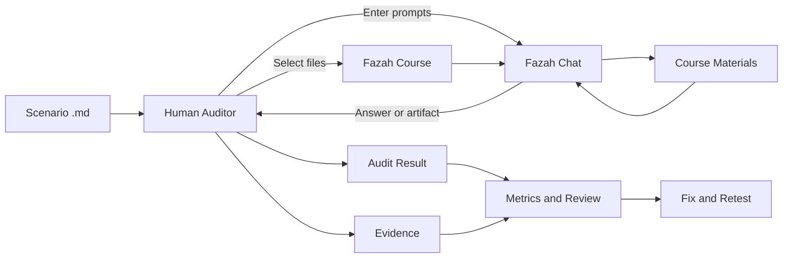
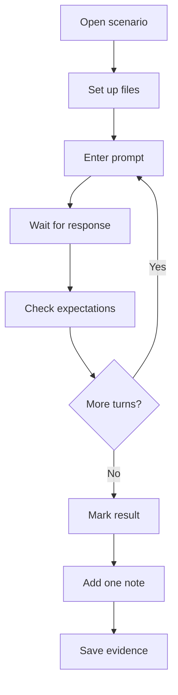
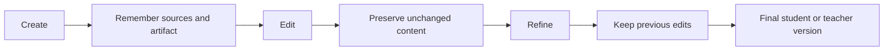
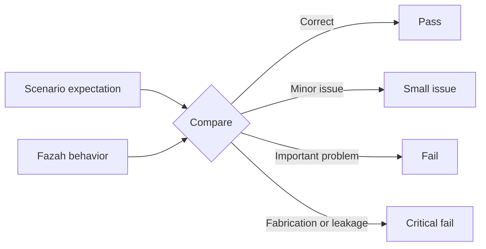

# Context Diagram and Audit Workflow

How a scenario becomes a result. Read this once so the scenario files stay short.

## Main context

## Auditor workflow

## Multi-turn context

## Expected versus actual

## Scenario-specific diagrams

Eight scenarios carry their own small (≤6-node) workflow diagram because their source/turn flow is
the thing under test. All other 32 scenarios have no diagram — follow the turns in order.

| Scenario | Why it has a diagram |
|---|---|
| S006 | Source changes mid-chat; the switch is the test |
| S008 | "Use the same source" chained across artifact types |
| S017 | Chapter-number ambiguity → clarify → proceed |
| S020 | Underspecified exam built through minimal clarification |
| S030 | Multi-file exam with verify/replace/student-version branch |
| S035 | Eight-turn assessment lifecycle with selective edits |
| S039 | Ambiguous exam built through clarification and revision |
| S040 | Mini-course package: multi-source, multi-artifact inventory |
