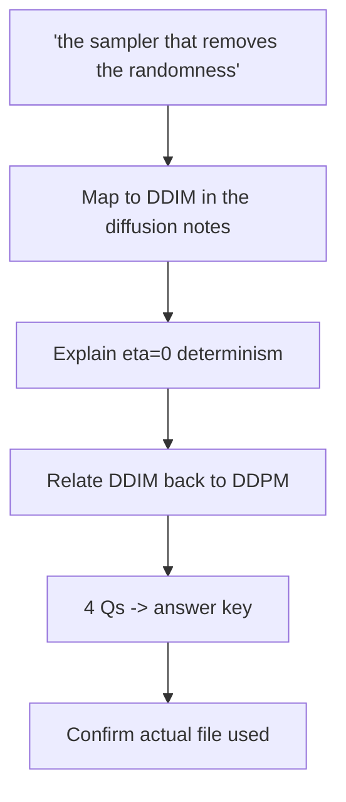

# S018 — Clear topic, indirect source name

## Tests

Fazah resolves an indirect description of a source — "the notes about the sampler that removes
the randomness" — to DDIM in `06_diffusion_ddpm_ddim_notes.pdf` without a filename ever being
given, then explains the η mechanism correctly and carries the resolved source through a short
quiz build.

## Setup

- Start: New chat
- Select files: none
- Do not select: any file (the indirect reference must be resolved by Fazah)
- Turns: 6
- Auditor variation: Not allowed

## Workflow



---

## Turn 1

### Enter

```text
can u pull up the notes about the sampler that removes the randomness n summarize that part
```

### Expect

- Maps the description to DDIM in `06_diffusion_ddpm_ddim_notes.pdf` (deterministic sampling
  when η=0) — not to NCSN, flow matching, or any other file.
- Either states the interpretation ("you mean DDIM in the diffusion notes") or asks a single
  confirming question — no long interrogation.
- Any summary given is grounded in the diffusion notes (η parameter, σ_t = 0, step skipping); no
  fabricated content.

### Record

- Actual prompt entered:
- Files selected:
- Files Fazah used:
- Result: Pass / Small Issue / Fail / Critical Fail
- Short note:

---

## Turn 2   (continue the same chat)

### Enter

```text
yes ddim exactly. explain how it removes the randomness
```

### Expect

- Explains via the η (stochasticity) parameter: setting η=0 makes σ_t = 0, so the random noise
  term z disappears from the DDIM step and sampling becomes deterministic (the notes call it
  "perfectly reversible", tied to ODE-solver/deterministic-generation keywords).
- Content matches the diffusion notes; no invented mechanism.
- Stays on `06_diffusion_ddpm_ddim_notes.pdf` as the source.

### Record

- Actual prompt entered:
- Files selected:
- Files Fazah used:
- Result: Pass / Small Issue / Fail / Critical Fail
- Short note:

---

## Turn 3   (continue the same chat)

### Enter

```text
and how does it relate to normal ddpm sampling
```

### Expect

- States the DDIM-to-DDPM connection from the notes: with t′ = t−1 (no step skipping) and η=1,
  the DDIM formula collapses into the standard DDPM step.
- Notes the contrast: DDPM is the Markovian one-step-back denoiser; DDIM allows non-Markovian
  jumps from t to t′ (step skipping).
- No facts invented beyond the diffusion notes.

### Record

- Actual prompt entered:
- Files selected:
- Files Fazah used:
- Result: Pass / Small Issue / Fail / Critical Fail
- Short note:

---

## Turn 4   (continue the same chat)

### Enter

```text
ok make 4 quiz questions on ddpm vs ddim sampling
```

### Expect

- Exactly four questions, grounded in the diffusion notes (e.g. what η controls, when sampling is
  deterministic, the DDPM denoising step, step skipping, the η=1 / t′=t−1 collapse).
- The diffusion file (`06_diffusion_ddpm_ddim_notes.pdf`) is shown as the used source.
- No content pulled from other files (NCSN, flow matching) that were never chosen.

### Record

- Actual prompt entered:
- Files selected:
- Files Fazah used:
- Result: Pass / Small Issue / Fail / Critical Fail
- Short note:

---

## Turn 5   (continue the same chat)

### Enter

```text
add an answer key
```

### Expect

- Adds a correct answer for each of the same four questions; questions unchanged.
- Answers consistent with the notes (η=0 → deterministic; η=1 + no skipping → DDPM; DDIM predicts
  an intermediate clean image x̂_0).
- Still exactly four questions.

### Record

- Actual prompt entered:
- Files selected:
- Files Fazah used:
- Result: Pass / Small Issue / Fail / Critical Fail
- Short note:

---

## Turn 6   (continue the same chat)

### Enter

```text
which file was all this from again
```

### Expect

- Names `06_diffusion_ddpm_ddim_notes.pdf` (the diffusion cheat sheet) as the source.
- Does NOT claim any other file was used; the answer is consistent with the used-sources shown
  across Turns 1–5.

### Record

- Actual prompt entered:
- Files selected:
- Files Fazah used:
- Result: Pass / Small Issue / Fail / Critical Fail
- Short note:

---

## Final Check

- Understood the request: Yes / Mostly / No
- Used the correct source: Yes / Partly / No / N/A
- Output is usable: Yes / Needs editing / No
- Conversation handled correctly: Yes / Mostly / No / N/A

## Overall

- [ ] Pass
- [ ] Pass with small issue
- [ ] Fail
- [ ] Critical fail

## Main issue

- [ ] None
- [ ] Misunderstood request
- [ ] Wrong source
- [ ] Ignored selected file
- [ ] Incorrect content
- [ ] Missed instruction
- [ ] Clarification problem
- [ ] Lost previous work
- [ ] Changed unrelated content
- [ ] Exposed student answers
- [ ] Error or timeout
- [ ] Other

## One-line note

Fazah should improve:
