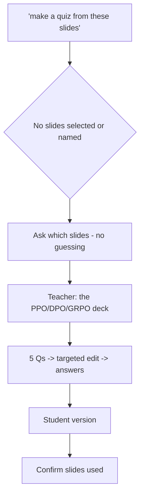

# S019 — "Use these slides" with no active source

## Tests

Fazah handles a deictic reference with no referent: "make a quiz from these slides" arrives with
nothing selected and no slides mentioned earlier in the chat. It must ask which slides rather
than guess or fabricate; the teacher then names the PPO/DPO/GRPO deck and Fazah must carry that
resolved source through a quiz build, a targeted edit, and answer separation.

## Setup

- Start: New chat
- Select files: none
- Do not select: any file (there must be no plausible referent for "these slides")
- Turns: 7
- Auditor variation: Not allowed

## Workflow



---

## Turn 1

### Enter

```text
make a quiz from these slides
```

### Expect

- Recognizes "these slides" has no referent: no file is selected and none was mentioned in this
  chat.
- Asks which slides the teacher means (or asks them to select a file) instead of guessing a deck.
- Does NOT generate a quiz from an arbitrary or invented source (fabricated slide content =
  Critical fail).

### Record

- Actual prompt entered:
- Files selected:
- Files Fazah used:
- Result: Pass / Small Issue / Fail / Critical Fail
- Short note:

---

## Turn 2   (continue the same chat)

### Enter

```text
oh right lol, the ppo dpo grpo deck
```

### Expect

- Resolves the reference to `11_ppo_dpo_grpo_alignment.pptx` (the PA2 alignment deck).
- Does not re-ask which slides are meant or drift to the AR/alignment notes file instead.
- May confirm briefly and wait, or proceed if the teacher's intent is treated as "go".

### Record

- Actual prompt entered:
- Files selected:
- Files Fazah used:
- Result: Pass / Small Issue / Fail / Critical Fail
- Short note:

---

## Turn 3   (continue the same chat)

### Enter

```text
ok 5 questions
```

### Expect

- Exactly five questions, grounded in the deck: alignment = making LLMs helpful/harmless/honest;
  pipeline (base model → preference data → reward model → policy optimization, KL constrains
  drift); PPO as the most complex setup; DPO uses pairwise preferences with no separate reward
  model; GRPO samples a group per prompt and normalizes rewards relative to the group.
- `11_ppo_dpo_grpo_alignment.pptx` is shown as the used source.
- No fabricated facts beyond the six slides.

### Record

- Actual prompt entered:
- Files selected:
- Files Fazah used:
- Result: Pass / Small Issue / Fail / Critical Fail
- Short note:

---

## Turn 4   (continue the same chat)

### Enter

```text
make one of them specifically about which models each method needs
```

### Expect

- Exactly one question is changed (or retargeted) to cover the model requirements: PPO needs
  policy, reference, reward, and critic models; DPO drops the separate reward model; GRPO drops
  the critic; all three keep a reference model for KL control.
- The other four questions are preserved; still exactly five total.
- Content matches the deck's slides 4–6; no invented model requirements.

### Record

- Actual prompt entered:
- Files selected:
- Files Fazah used:
- Result: Pass / Small Issue / Fail / Critical Fail
- Short note:

---

## Turn 5   (continue the same chat)

### Enter

```text
add answers
```

### Expect

- Adds a correct answer to each of the same five questions; questions unchanged.
- The model-requirements answer matches the deck exactly (PPO = 4 models; DPO no reward model;
  GRPO no critic; all keep the reference model).
- Still five questions — none added or dropped.

### Record

- Actual prompt entered:
- Files selected:
- Files Fazah used:
- Result: Pass / Small Issue / Fail / Critical Fail
- Short note:

---

## Turn 6   (continue the same chat)

### Enter

```text
student version without the answers pls
```

### Expect

- Produces a student version of the same five questions with NO answers shown.
- No correct answers or answer key leak into the student version (leakage = Critical fail).
- Question set unchanged in count and topic.

### Record

- Actual prompt entered:
- Files selected:
- Files Fazah used:
- Result: Pass / Small Issue / Fail / Critical Fail
- Short note:

---

## Turn 7   (continue the same chat)

### Enter

```text
confirm which slides u used for this quiz
```

### Expect

- States `11_ppo_dpo_grpo_alignment.pptx` (the PPO/DPO/GRPO deck) as the only source.
- Does NOT claim `09_ar_alignment_rlhf_notes.pdf` or any other file was used; consistent with
  Turns 2–6.

### Record

- Actual prompt entered:
- Files selected:
- Files Fazah used:
- Result: Pass / Small Issue / Fail / Critical Fail
- Short note:

---

## Final Check

- Understood the request: Yes / Mostly / No
- Used the correct source: Yes / Partly / No / N/A
- Output is usable: Yes / Needs editing / No
- Conversation handled correctly: Yes / Mostly / No / N/A

## Overall

- [ ] Pass
- [ ] Pass with small issue
- [ ] Fail
- [ ] Critical fail

## Main issue

- [ ] None
- [ ] Misunderstood request
- [ ] Wrong source
- [ ] Ignored selected file
- [ ] Incorrect content
- [ ] Missed instruction
- [ ] Clarification problem
- [ ] Lost previous work
- [ ] Changed unrelated content
- [ ] Exposed student answers
- [ ] Error or timeout
- [ ] Other

## One-line note

Fazah should improve:
