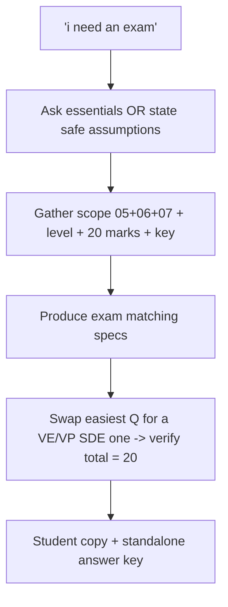

# S020 — Underspecified exam request

## Tests

Fazah handles an underspecified "i need an exam" request efficiently — clarifying only the
essentials (scope? length? question types?) or stating safe assumptions without over-questioning
— then builds a multi-source exam from the NCSN (05), diffusion (06), and flow-matching (07)
notes, replaces a question on request, and verifies the marks total honestly.

## Setup

- Start: New chat
- Select files: none
- Do not select: any file (scope is supplied in the conversation)
- Turns: 9
- Auditor variation: Allowed — see the Auditor variation section

## Workflow



---

## Turn 1

### Enter

```text
i need an exam
```

### Expect

- Recognizes the request is underspecified (no scope, level, length, or question types given).
- Asks only the essential questions (scope? length/marks? question types?) OR states safe
  assumptions — a short clarification, not a long interrogation.
- Does not fabricate an exam grounded in files it was never pointed at.

### Record

- Actual prompt entered:
- Files selected:
- Files Fazah used:
- Result: Pass / Small Issue / Fail / Critical Fail
- Short note:

---

## Turn 2   (continue the same chat)

### Enter

```text
cover score based models, diffusion, and flow matching
```

### Expect

- Accepts the scope and maps it to the right sources: `05_ncsn_score_based_models_notes.pdf`,
  `06_diffusion_ddpm_ddim_notes.pdf`, `07_flow_matching_notes.pdf`.
- Does not re-ask about scope; moves toward remaining essentials (length / types) if still
  needed.

### Record

- Actual prompt entered:
- Files selected:
- Files Fazah used:
- Result: Pass / Small Issue / Fail / Critical Fail
- Short note:

---

## Turn 3   (continue the same chat)

### Enter

```text
its for my MS students
```

### Expect

- Accepts the level (MS / graduate) and retains the scope from Turn 2.
- Does not re-ask about level or scope.

### Record

- Actual prompt entered:
- Files selected:
- Files Fazah used:
- Result: Pass / Small Issue / Fail / Critical Fail
- Short note:

---

## Turn 4   (continue the same chat)

### Enter

```text
20 marks total, mix of short answer n derivation style, and include a teacher answer key
```

### Expect

- Captures the remaining specs: 20 marks total, mixed short-answer + derivation questions, and a
  teacher answer key.
- Retains scope (score-based + diffusion + flow matching) and level (MS) from earlier turns.
- Does not re-ask anything already provided.

### Record

- Actual prompt entered:
- Files selected:
- Files Fazah used:
- Result: Pass / Small Issue / Fail / Critical Fail
- Short note:

---

## Turn 5   (continue the same chat)

### Enter

```text
ok build it
```

### Expect

- Produces an exam matching the accumulated specs: MS level, ~20 marks, mixed types, with a key,
  and coverage across all three sources — e.g. true Gaussian score S_true = −ε/σ and annealed
  Langevin dynamics (05); closed-form jump x_t = √ᾱ_t·x_0 + √(1−ᾱ_t)·ε, SNR_t = ᾱ_t/(1−ᾱ_t),
  DDIM η (06); VE vs VP SDE, Euler–Maruyama predictor, linear interpolant velocity v = x_1 − x_0
  (07).
- Marks are distributed across questions and shown per question.
- No fabricated formulas; all three files appear as used sources, none of the others.

### Record

- Actual prompt entered:
- Files selected:
- Files Fazah used:
- Result: Pass / Small Issue / Fail / Critical Fail
- Short note:

---

## Turn 6   (continue the same chat)

### Enter

```text
the easiest one is too soft, swap it for something on the VE vs VP SDEs
```

### Expect

- Replaces a single question with one on VE vs VP SDEs, grounded in the flow-matching notes
  (VE-SDE has zero drift, f=0; VP-SDE drift is −½β(t)x_t); the other questions are preserved.
- Marks are re-balanced so the total stays 20; the answer key is updated for the new question.
- Updates the active exam as a new version rather than starting a fresh exam.

### Record

- Actual prompt entered:
- Files selected:
- Files Fazah used:
- Result: Pass / Small Issue / Fail / Critical Fail
- Short note:

---

## Turn 7   (continue the same chat)

### Enter

```text
double check the total is still 20 marks
```

### Expect

- Sums the per-question marks and confirms the total (adjusting if the replacement in Turn 6
  threw it off) so it lands at 20.
- Reports the actual total honestly rather than just asserting "20"; no silent mismatch.

### Record

- Actual prompt entered:
- Files selected:
- Files Fazah used:
- Result: Pass / Small Issue / Fail / Critical Fail
- Short note:

---

## Turn 8   (continue the same chat)

### Enter

```text
gimme a student copy w no answers
```

### Expect

- Produces a student version of the same exam (same questions and marks) with NO answers and no
  key.
- No correct answers leak into the student version (leakage = Critical fail).

### Record

- Actual prompt entered:
- Files selected:
- Files Fazah used:
- Result: Pass / Small Issue / Fail / Critical Fail
- Short note:

---

## Turn 9   (continue the same chat)

### Enter

```text
and the teacher answer key on its own
```

### Expect

- Produces a teacher answer key matching the current exam's questions one-to-one, with marks.
- Grounded in the NCSN / diffusion / flow-matching notes; no new questions invented; consistent
  with the student version.

### Record

- Actual prompt entered:
- Files selected:
- Files Fazah used:
- Result: Pass / Small Issue / Fail / Critical Fail
- Short note:

---

## Auditor variation

Add or change one realistic instruction. Record exactly what you entered. Do not change the
scenario's main goal.

Examples:

- Change the marks total (e.g. "make it 30 marks instead of 20") and re-verify the total.
- Add a time limit (e.g. "students get 90 minutes for this").
- Restrict to two of the three topics (e.g. "drop flow matching") and check that source drops.
- Ask for one numeric question checkable against the worked problems file
  (`08_diffusion_score_flow_worked_problems.md`).

---

## Final Check

- Understood the request: Yes / Mostly / No
- Used the correct source: Yes / Partly / No / N/A
- Output is usable: Yes / Needs editing / No
- Conversation handled correctly: Yes / Mostly / No / N/A

## Overall

- [ ] Pass
- [ ] Pass with small issue
- [ ] Fail
- [ ] Critical fail

## Main issue

- [ ] None
- [ ] Misunderstood request
- [ ] Wrong source
- [ ] Ignored selected file
- [ ] Incorrect content
- [ ] Missed instruction
- [ ] Clarification problem
- [ ] Lost previous work
- [ ] Changed unrelated content
- [ ] Exposed student answers
- [ ] Error or timeout
- [ ] Other

## One-line note

Fazah should improve:
