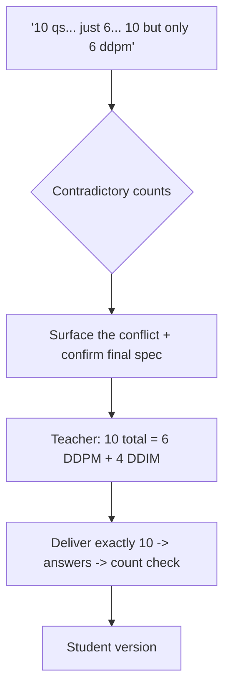

# S021 — Directly conflicting item counts

## Tests

Fazah handles a single prompt that contradicts itself on item counts ("10 questions… actually
just 6… no wait 10 but only 6 about ddpm"), detects the contradiction instead of silently
picking one reading, confirms the final spec (10 total, 6 DDPM), and then delivers exactly that
spec through answers, an honest count check, and a student version.

## Setup

- Start: New chat
- Select files: none
- Do not select: any file (topic arrives in the prompt; the count conflict must reach Fazah raw)
- Turns: 6
- Auditor variation: Not allowed

## Workflow



---

## Turn 1

### Enter

```text
make a 10 question quiz on diffusion, actually just 6, no wait make it 10 but only 6 about ddpm
```

### Expect

- Detects that the prompt revises itself and lands on the last stated spec: 10 questions total,
  of which 6 are about DDPM.
- Confirms that reading with the teacher (or clearly states it, including what the other 4 will
  cover) rather than silently delivering 6 total or 10 with no split.
- Maps "diffusion" to `06_diffusion_ddpm_ddim_notes.pdf`; no content fabricated yet.

### Record

- Actual prompt entered:
- Files selected:
- Files Fazah used:
- Result: Pass / Small Issue / Fail / Critical Fail
- Short note:

---

## Turn 2   (continue the same chat)

### Enter

```text
yes 10 total, 6 on ddpm and the other 4 on ddim
```

### Expect

- Locks the final spec: 10 questions = 6 DDPM + 4 DDIM.
- Does not re-ask about counts or reopen the earlier contradictory numbers.
- Keeps the diffusion notes (`06_diffusion_ddpm_ddim_notes.pdf`) as the source.

### Record

- Actual prompt entered:
- Files selected:
- Files Fazah used:
- Result: Pass / Small Issue / Fail / Critical Fail
- Short note:

---

## Turn 3   (continue the same chat)

### Enter

```text
go
```

### Expect

- Exactly ten questions: six on DDPM (e.g. α_t = 1−β_t and the schedules, closed-form jump
  x_t = √ᾱ_t·x_0 + √(1−ᾱ_t)·ε, SNR_t = ᾱ_t/(1−ᾱ_t), true posterior mean/variance, simplified
  loss ||ε−ε_θ||², DDPM denoising step) and four on DDIM (η parameter, η=0 deterministic, step
  skipping t→t′, the η=1 / t′=t−1 collapse to DDPM).
- The split is exactly 6 + 4 — not 5+5, not 10 all-DDPM.
- Grounded in the diffusion notes; `06_diffusion_ddpm_ddim_notes.pdf` shown as the used source.

### Record

- Actual prompt entered:
- Files selected:
- Files Fazah used:
- Result: Pass / Small Issue / Fail / Critical Fail
- Short note:

---

## Turn 4   (continue the same chat)

### Enter

```text
add answers
```

### Expect

- Adds a correct answer to each of the same ten questions; questions unchanged.
- Answers match the notes' formulas exactly; no invented variants.
- Still exactly ten questions with the 6 DDPM / 4 DDIM split intact.

### Record

- Actual prompt entered:
- Files selected:
- Files Fazah used:
- Result: Pass / Small Issue / Fail / Critical Fail
- Short note:

---

## Turn 5   (continue the same chat)

### Enter

```text
count them for me — how many total and how many are ddpm
```

### Expect

- Counts honestly: 10 total, 6 DDPM, 4 DDIM — and the count matches what is actually in the
  quiz.
- If anything drifted from the spec, says so and fixes it rather than asserting the right
  numbers over a wrong artifact.

### Record

- Actual prompt entered:
- Files selected:
- Files Fazah used:
- Result: Pass / Small Issue / Fail / Critical Fail
- Short note:

---

## Turn 6   (continue the same chat)

### Enter

```text
student version, no answers
```

### Expect

- Produces a student version of the same ten questions (same 6/4 split) with NO answers shown.
- No correct answers or answer key leak into the student version (leakage = Critical fail).
- Still grounded in the diffusion notes; no questions added or dropped.

### Record

- Actual prompt entered:
- Files selected:
- Files Fazah used:
- Result: Pass / Small Issue / Fail / Critical Fail
- Short note:

---

## Final Check

- Understood the request: Yes / Mostly / No
- Used the correct source: Yes / Partly / No / N/A
- Output is usable: Yes / Needs editing / No
- Conversation handled correctly: Yes / Mostly / No / N/A

## Overall

- [ ] Pass
- [ ] Pass with small issue
- [ ] Fail
- [ ] Critical fail

## Main issue

- [ ] None
- [ ] Misunderstood request
- [ ] Wrong source
- [ ] Ignored selected file
- [ ] Incorrect content
- [ ] Missed instruction
- [ ] Clarification problem
- [ ] Lost previous work
- [ ] Changed unrelated content
- [ ] Exposed student answers
- [ ] Error or timeout
- [ ] Other

## One-line note

Fazah should improve:
