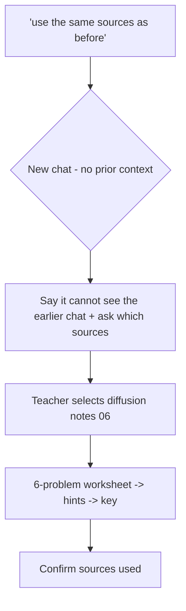

# S022 — "Same sources as before" in a new chat

## Tests

In a brand-new chat with no history visible to it, Fazah is told to "use the same sources as
before". It must not invent or guess prior context — it should say it can't see the earlier
conversation and ask which sources are meant. The teacher then selects the diffusion notes, and
Fazah must continue cleanly on that source through a worksheet build.

## Setup

- Start: New chat (opened right after a previous conversation on this course — the point is that
  Fazah cannot see it)
- Select files: none at the start (the teacher selects `06_diffusion_ddpm_ddim_notes.pdf` in
  Turn 2)
- Do not select: any file before Turn 2
- Turns: 6
- Auditor variation: Not allowed

## Workflow



---

## Turn 1

### Enter

```text
use the same sources as before and make me a worksheet
```

### Expect

- Recognizes this is a new chat: it has no record of which sources "before" refers to.
- Says so honestly and asks the teacher to name or select the sources (inventing a "previous"
  source or silently picking a file = Fail; fabricating remembered content = Critical fail).
- Does not generate the worksheet yet.

### Record

- Actual prompt entered:
- Files selected:
- Files Fazah used:
- Result: Pass / Small Issue / Fail / Critical Fail
- Short note:

---

## Turn 2   (continue the same chat; NOW select `06_diffusion_ddpm_ddim_notes.pdf`)

### Enter

```text
it was the diffusion notes — i just selected them for u
```

### Expect

- Acknowledges the selection and targets `06_diffusion_ddpm_ddim_notes.pdf` as the source.
- Does not re-ask which sources are meant or claim it now remembers the earlier chat.
- Ready to build the worksheet (may confirm scope briefly or await the go-ahead).

### Record

- Actual prompt entered:
- Files selected:
- Files Fazah used:
- Result: Pass / Small Issue / Fail / Critical Fail
- Short note:

---

## Turn 3   (continue the same chat; keep `06_diffusion_ddpm_ddim_notes.pdf` selected)

### Enter

```text
ok worksheet time, 6 problems on the forward process
```

### Expect

- Exactly six problems, all on the diffusion forward process from the notes: the iterative
  Markov step, the closed-form jump x_t = √ᾱ_t·x_0 + √(1−ᾱ_t)·ε, α_t = 1−β_t and ᾱ_t = ∏α_i,
  SNR_t = ᾱ_t/(1−ᾱ_t), isolating x_0, boundary behavior (ᾱ_T ≈ 0 so x_T ∼ N(0, I)).
- No reverse-process/sampling content smuggled in against the stated scope.
- `06_diffusion_ddpm_ddim_notes.pdf` shown as the used source; no fabricated formulas.

### Record

- Actual prompt entered:
- Files selected:
- Files Fazah used:
- Result: Pass / Small Issue / Fail / Critical Fail
- Short note:

---

## Turn 4   (continue the same chat; keep `06_diffusion_ddpm_ddim_notes.pdf` selected)

### Enter

```text
add a small hint under each problem
```

### Expect

- Adds one short hint per problem; the six problems themselves are unchanged.
- Hints point at the right formula (e.g. "use the closed-form jump") without giving the full
  worked answer away.
- Still exactly six problems; updates the active worksheet rather than starting over.

### Record

- Actual prompt entered:
- Files selected:
- Files Fazah used:
- Result: Pass / Small Issue / Fail / Critical Fail
- Short note:

---

## Turn 5   (continue the same chat; keep `06_diffusion_ddpm_ddim_notes.pdf` selected)

### Enter

```text
now an answer key
```

### Expect

- Produces a key with a correct answer for each of the same six problems, one-to-one.
- Answers match the diffusion notes' formulas; no new problems invented.
- The worksheet (problems + hints) is not lost or reworded in the process.

### Record

- Actual prompt entered:
- Files selected:
- Files Fazah used:
- Result: Pass / Small Issue / Fail / Critical Fail
- Short note:

---

## Turn 6   (continue the same chat; keep `06_diffusion_ddpm_ddim_notes.pdf` selected)

### Enter

```text
which sources did u use in the end
```

### Expect

- Names `06_diffusion_ddpm_ddim_notes.pdf` (the diffusion notes) as the only source.
- Does NOT claim any source carried over from the earlier conversation; consistent with Turn 1's
  honest "can't see the previous chat".

### Record

- Actual prompt entered:
- Files selected:
- Files Fazah used:
- Result: Pass / Small Issue / Fail / Critical Fail
- Short note:

---

## Final Check

- Understood the request: Yes / Mostly / No
- Used the correct source: Yes / Partly / No / N/A
- Output is usable: Yes / Needs editing / No
- Conversation handled correctly: Yes / Mostly / No / N/A

## Overall

- [ ] Pass
- [ ] Pass with small issue
- [ ] Fail
- [ ] Critical fail

## Main issue

- [ ] None
- [ ] Misunderstood request
- [ ] Wrong source
- [ ] Ignored selected file
- [ ] Incorrect content
- [ ] Missed instruction
- [ ] Clarification problem
- [ ] Lost previous work
- [ ] Changed unrelated content
- [ ] Exposed student answers
- [ ] Error or timeout
- [ ] Other

## One-line note

Fazah should improve:
