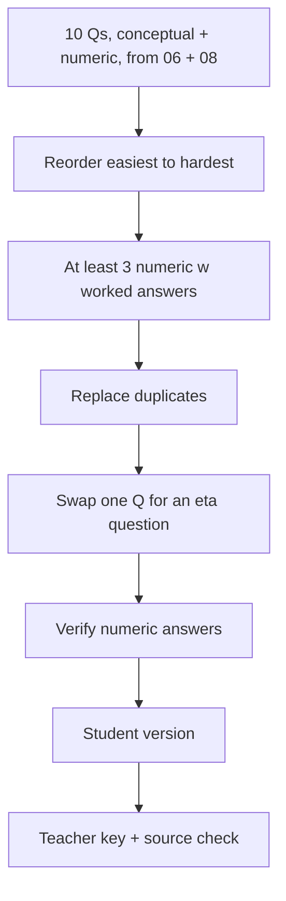

# S029 — Ten-question diffusion quiz refined without losing count

## Tests

Sustained multi-turn workflow on ONE diffusion quiz built from the cheat sheet plus the worked
problems: Fazah creates exactly ten questions mixing conceptual and numeric items, then reorders,
strengthens the numeric coverage, de-duplicates, swaps one question, verifies arithmetic against
the worked problems, and splits into student/teacher versions — keeping exactly ten core
questions through every edit.

## Setup

- Start: New chat
- Select files: `06_diffusion_ddpm_ddim_notes.pdf` + `08_diffusion_score_flow_worked_problems.md`
- Do not select: `05_ncsn_score_based_models_notes.pdf`, `07_flow_matching_notes.pdf`
- Turns: 9
- Auditor variation: Not allowed

## Workflow



---

## Turn 1

### Enter

```text
make exactly 10 quiz questions on ddpm and ddim w answers, mix conceptual and calculation ones
```

### Expect

- Exactly ten questions are created — not nine or eleven — each with an answer.
- A genuine mix: conceptual items grounded in the diffusion cheat sheet (e.g. closed-form jump
  x_t = √ᾱ_t·x_0 + √(1−ᾱ_t)·ε, SNR_t = ᾱ_t/(1−ᾱ_t), DDPM vs DDIM, η) and calculation items in
  the style of the worked problems (ᾱ products, posterior mean/variance, DDIM steps).
- Numeric items use formulas/values consistent with `08_diffusion_score_flow_worked_problems.md`;
  nothing from unselected files.

### Record

- Actual prompt entered:
- Files selected:
- Files Fazah used:
- Result: Pass / Small Issue / Fail / Critical Fail
- Short note:

---

## Turn 2   (continue the same chat; keep both files selected)

### Enter

```text
reorder easiest to hardest, dont change the content
```

### Expect

- The same ten questions appear, now ordered easiest → hardest.
- Question wording and answers are unchanged — only the order changes.
- The revision updates the existing quiz as a new version; nothing added or removed.

### Record

- Actual prompt entered:
- Files selected:
- Files Fazah used:
- Result: Pass / Small Issue / Fail / Critical Fail
- Short note:

---

## Turn 3   (continue the same chat)

### Enter

```text
make sure at least 3 are numeric w fully worked answers
```

### Expect

- At least three questions are numeric with worked solutions; any converted item stays on
  diffusion content.
- Numeric answers are checkable against the worked problems' results — e.g. β = (0.1, 0.2, 0.3,
  0.4) gives ᾱ = (0.9, 0.72, 0.504, 0.3024); SNR_3 = 0.504/0.496 ≈ 1.016; the deterministic DDIM
  jump in Problem 5 gives x̂_0 ≈ 0.7267.
- Still exactly ten questions; untouched questions keep their wording and position.

### Record

- Actual prompt entered:
- Files selected:
- Files Fazah used:
- Result: Pass / Small Issue / Fail / Critical Fail
- Short note:

---

## Turn 4   (continue the same chat)

### Enter

```text
replace any duplicate q
```

### Expect

- Fazah checks for repeats and either replaces a duplicate or states none were found.
- Any replacement stays grounded in the two selected files; the count stays at ten.
- All non-duplicate questions, the ordering, and the numeric items are preserved.

### Record

- Actual prompt entered:
- Files selected:
- Files Fazah used:
- Result: Pass / Small Issue / Fail / Critical Fail
- Short note:

---

## Turn 5   (continue the same chat)

### Enter

```text
swap the weakest question for one on the eta parameter
```

### Expect

- Exactly one question is replaced; the other nine are untouched.
- The new η question's answer matches the notes: η=0 → σ_t=0, deterministic sampling; η=1 with
  t′ = t−1 collapses DDIM into the standard DDPM step.
- Still exactly ten questions in easiest→hardest order.

### Record

- Actual prompt entered:
- Files selected:
- Files Fazah used:
- Result: Pass / Small Issue / Fail / Critical Fail
- Short note:

---

## Turn 6   (continue the same chat)

### Enter

```text
double check the arithmetic on the numeric ones
```

### Expect

- Fazah re-verifies each numeric answer, per question, and fixes any arithmetic error.
- The verified values agree with the worked-problems file (e.g. ᾱ_2 = 0.72, β̃_3 ≈ 0.1694,
  μ̃_3 ≈ 0.7494, x_{t−1} ≈ 1.5213 — whichever setups the quiz actually used).
- No question content changes beyond what a correctness fix requires; count stays at ten.

### Record

- Actual prompt entered:
- Files selected:
- Files Fazah used:
- Result: Pass / Small Issue / Fail / Critical Fail
- Short note:

---

## Turn 7   (continue the same chat)

### Enter

```text
now a student version, no answers
```

### Expect

- A student version with the ten questions and NO answers or worked solutions (answer-leakage
  check — leaked answers = Critical fail).
- Numeric questions keep their given values but lose their solutions.
- The questions match the current quiz (order, η swap, ten items preserved).

### Record

- Actual prompt entered:
- Files selected:
- Files Fazah used:
- Result: Pass / Small Issue / Fail / Critical Fail
- Short note:

---

## Turn 8   (continue the same chat)

### Enter

```text
n a teacher key w short explanations
```

### Expect

- A teacher key gives each answer plus a short explanation grounded in the two selected files
  (worked steps for the numeric items).
- The key aligns one-to-one with the same ten questions in the same order.
- The student version from Turn 7 is not altered to include answers.

### Record

- Actual prompt entered:
- Files selected:
- Files Fazah used:
- Result: Pass / Small Issue / Fail / Critical Fail
- Short note:

---

## Turn 9   (continue the same chat)

### Enter

```text
confirm its still exactly 10 questions n tell me which files u used
```

### Expect

- Fazah confirms exactly ten questions survived all edits (reorder, numeric conversion,
  de-duplication, swap).
- It names `06_diffusion_ddpm_ddim_notes.pdf` and `08_diffusion_score_flow_worked_problems.md` as
  the sources and claims no file it did not use.
- The summary reflects the artifacts actually produced (quiz, student version, teacher key).

### Record

- Actual prompt entered:
- Files selected:
- Files Fazah used:
- Result: Pass / Small Issue / Fail / Critical Fail
- Short note:

---

## Final Check

- Understood the request: Yes / Mostly / No
- Used the correct source: Yes / Partly / No / N/A
- Output is usable: Yes / Needs editing / No
- Conversation handled correctly: Yes / Mostly / No / N/A

## Overall

- [ ] Pass
- [ ] Pass with small issue
- [ ] Fail
- [ ] Critical fail

## Main issue

- [ ] None
- [ ] Misunderstood request
- [ ] Wrong source
- [ ] Ignored selected file
- [ ] Incorrect content
- [ ] Missed instruction
- [ ] Clarification problem
- [ ] Lost previous work
- [ ] Changed unrelated content
- [ ] Exposed student answers
- [ ] Error or timeout
- [ ] Other

## One-line note

Fazah should improve:
