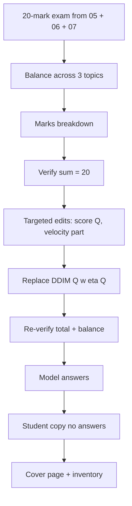

# S030 — Multi-file 20-point generative-models exam

## Tests

Across twelve turns Fazah builds ONE 20-mark exam from three sources (NCSN, diffusion, flow
matching), balances it across the three topics, verifies the mark total, applies targeted
per-question edits and a replacement without disturbing the rest, adds model answers, and derives
a clean student copy — with the total staying at exactly 20 and every fact traceable to the three
selected files.

## Setup

- Start: New chat
- Select files: `05_ncsn_score_based_models_notes.pdf` + `06_diffusion_ddpm_ddim_notes.pdf` +
  `07_flow_matching_notes.pdf`
- Do not select: `08_diffusion_score_flow_worked_problems.md`, `13_exam_master_cheatsheet.md`
- Turns: 12
- Auditor variation: Not allowed

## Workflow



---

## Turn 1

### Enter

```text
build me a 20 mark exam covering score based models, ddpm/ddim, and flow matching — use all 3 files
```

### Expect

- One exam with a stated total of 20 marks, drawing on all THREE files: score/NCSN material from
  05, DDPM/DDIM material from 06, SDE/flow-matching material from 07.
- Used sources list all three selected files; no content pulled from the unselected worked
  problems or master cheat sheet.
- Every question is answerable from the notes (score target, closed-form jump, η, VE/VP drift,
  linear interpolant, etc.), nothing invented.

### Record

- Actual prompt entered:
- Files selected:
- Files Fazah used:
- Result: Pass / Small Issue / Fail / Critical Fail
- Short note:

---

## Turn 2   (continue the same chat; keep all three files selected)

### Enter

```text
balance it evenly across the 3 topics
```

### Expect

- Marks are distributed roughly evenly across the three topics (about 6–7 marks each; an explicit
  split like 7/7/6 is fine).
- The exam is revised as a new version of the same document, not regenerated with new topics.
- Total is still exactly 20.

### Record

- Actual prompt entered:
- Files selected:
- Files Fazah used:
- Result: Pass / Small Issue / Fail / Critical Fail
- Short note:

---

## Turn 3   (continue the same chat)

### Enter

```text
show me a marks breakdown per question with which topic each one hits
```

### Expect

- A breakdown listing every question, its marks, and its topic (score-based / diffusion / flow
  matching).
- The breakdown matches the actual exam — no phantom questions, no mismatched marks.
- Per-topic subtotals reflect the Turn 2 balance.

### Record

- Actual prompt entered:
- Files selected:
- Files Fazah used:
- Result: Pass / Small Issue / Fail / Critical Fail
- Short note:

---

## Turn 4   (continue the same chat)

### Enter

```text
verify the marks add up to 20
```

### Expect

- Fazah sums the per-question marks and confirms the total is exactly 20 (or finds and fixes a
  discrepancy explicitly).
- The check is auditable — the arithmetic is shown or clearly stated per question.
- No question content changes during the verification.

### Record

- Actual prompt entered:
- Files selected:
- Files Fazah used:
- Result: Pass / Small Issue / Fail / Critical Fail
- Short note:

---

## Turn 5   (continue the same chat)

### Enter

```text
make the score based question ask students for the true score formula
```

### Expect

- Only the score-based question changes; its expected answer is the true Gaussian score
  S_true(x̃|x) = −ε/σ, equivalently (x−x̃)/σ², from the NCSN notes.
- All other questions and their marks are untouched.
- Total marks remain 20.

### Record

- Actual prompt entered:
- Files selected:
- Files Fazah used:
- Result: Pass / Small Issue / Fail / Critical Fail
- Short note:

---

## Turn 6   (continue the same chat)

### Enter

```text
add a part b to the flow matching question on the target velocity, keep the total at 20
```

### Expect

- Only the flow-matching question gains a part (b); its expected answer is the linear-interpolant
  target velocity v = x₁ − x₀ (with x_t = (1−t)x₀ + t·x₁) from the flow-matching notes.
- Marks are rebalanced within that question (or as stated) so the exam total stays exactly 20.
- Other questions, including the Turn 5 edit, are unchanged.

### Record

- Actual prompt entered:
- Files selected:
- Files Fazah used:
- Result: Pass / Small Issue / Fail / Critical Fail
- Short note:

---

## Turn 7   (continue the same chat)

### Enter

```text
replace the ddim question with one about what eta controls
```

### Expect

- Exactly one question (the DDIM one) is replaced; the replacement's answer matches the diffusion
  notes: η scales the DDIM variance σ_t — η=0 deterministic, η=1 with t′=t−1 collapses to DDPM.
- The replacement carries the same marks as the question it replaced; total stays 20.
- All other questions are untouched.

### Record

- Actual prompt entered:
- Files selected:
- Files Fazah used:
- Result: Pass / Small Issue / Fail / Critical Fail
- Short note:

---

## Turn 8   (continue the same chat)

### Enter

```text
re-verify the total and the topic balance after all that
```

### Expect

- Fazah re-sums the marks (still exactly 20) and re-states the per-topic split, reflecting the
  Turn 5–7 edits.
- The breakdown matches the current exam, not a stale earlier version.
- Any drift introduced by the edits is caught and fixed, explicitly.

### Record

- Actual prompt entered:
- Files selected:
- Files Fazah used:
- Result: Pass / Small Issue / Fail / Critical Fail
- Short note:

---

## Turn 9   (continue the same chat)

### Enter

```text
add model answers for every question
```

### Expect

- Every question, including the new η question and the velocity part (b), gets a model answer.
- Answers match the notes: true score −ε/σ ≡ (x−x̃)/σ²; closed-form jump / SNR facts from 06;
  VE f=0 vs VP −½β(t)x_t; v = x₁ − x₀; η behavior as above.
- Questions and marks are unchanged by the addition.

### Record

- Actual prompt entered:
- Files selected:
- Files Fazah used:
- Result: Pass / Small Issue / Fail / Critical Fail
- Short note:

---

## Turn 10   (continue the same chat)

### Enter

```text
now a student copy without the answers
```

### Expect

- A student copy with all questions, parts, and mark allocations — and NO model answers
  (answer-leakage check; leaked answers = Critical fail).
- The copy matches the current exam exactly (same questions, same 20-mark total).
- The teacher version with model answers is preserved separately.

### Record

- Actual prompt entered:
- Files selected:
- Files Fazah used:
- Result: Pass / Small Issue / Fail / Critical Fail
- Short note:

---

## Turn 11   (continue the same chat)

### Enter

```text
add a small header to the student copy — course, total marks, time allowed 60 mins
```

### Expect

- Only a header is added to the student copy (course name, total = 20 marks, 60 minutes).
- Question content is unchanged and answers still do not appear anywhere in the student copy.
- The stated total in the header agrees with the verified 20.

### Record

- Actual prompt entered:
- Files selected:
- Files Fazah used:
- Result: Pass / Small Issue / Fail / Critical Fail
- Short note:

---

## Turn 12   (continue the same chat)

### Enter

```text
which files did u use, and list what we ended up with
```

### Expect

- Fazah names `05_ncsn_score_based_models_notes.pdf`, `06_diffusion_ddpm_ddim_notes.pdf`, and
  `07_flow_matching_notes.pdf` as the sources used throughout.
- Inventory: the 20-mark teacher exam with model answers and the student copy with header — with
  the consistent 20-mark total.
- No fabricated artifact and no source that was never selected.

### Record

- Actual prompt entered:
- Files selected:
- Files Fazah used:
- Result: Pass / Small Issue / Fail / Critical Fail
- Short note:

---

## Final Check

- Understood the request: Yes / Mostly / No
- Used the correct source: Yes / Partly / No / N/A
- Output is usable: Yes / Needs editing / No
- Conversation handled correctly: Yes / Mostly / No / N/A

## Overall

- [ ] Pass
- [ ] Pass with small issue
- [ ] Fail
- [ ] Critical fail

## Main issue

- [ ] None
- [ ] Misunderstood request
- [ ] Wrong source
- [ ] Ignored selected file
- [ ] Incorrect content
- [ ] Missed instruction
- [ ] Clarification problem
- [ ] Lost previous work
- [ ] Changed unrelated content
- [ ] Exposed student answers
- [ ] Error or timeout
- [ ] Other

## One-line note

Fazah should improve:
