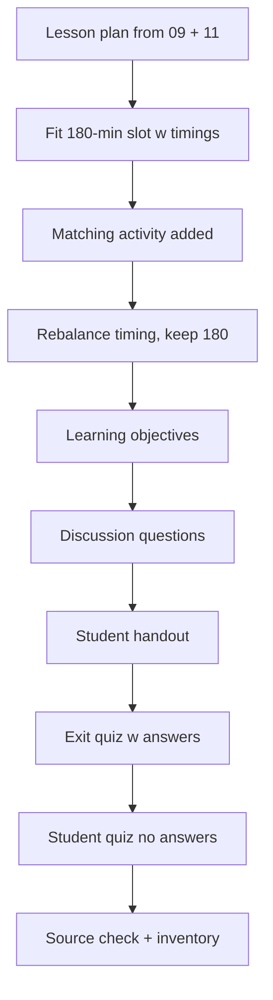

# S031 — Alignment lesson plan iterated into teaching assets

## Tests

From the alignment cheat sheet and the PA2 deck, Fazah designs ONE lesson plan for a PPO/DPO/GRPO
lecture, then iterates on timing and activities for the course's 180-minute slot, and derives
connected teaching assets from it — a student handout and an exit quiz with a student version —
keeping every alignment fact straight and every derived asset consistent with the plan.

## Setup

- Start: New chat
- Select files: `09_ar_alignment_rlhf_notes.pdf` + `11_ppo_dpo_grpo_alignment.pptx`
- Do not select: `10_ar_alignment_worked_problems.md`
- Turns: 10
- Auditor variation: Not allowed

## Workflow



---

## Turn 1

### Enter

```text
plan me a lecture on ppo dpo n grpo using these files
```

### Expect

- One lesson plan covering the PA2 deck's arc: the alignment pipeline (base model → preference
  data → reward model → policy optimization, KL constrains drift), then PPO, DPO, and GRPO.
- Core facts are correct: PPO needs policy + reference + reward + critic (most complex); DPO uses
  pairwise preferences with no separate reward model; GRPO drops the critic and normalizes
  rewards within a sampled group; all three keep a reference model for KL.
- Used sources list both `09_ar_alignment_rlhf_notes.pdf` and `11_ppo_dpo_grpo_alignment.pptx`.

### Record

- Actual prompt entered:
- Files selected:
- Files Fazah used:
- Result: Pass / Small Issue / Fail / Critical Fail
- Short note:

---

## Turn 2   (continue the same chat; keep both files selected)

### Enter

```text
fit it to our 180 minute slot with timings per section n a break
```

### Expect

- The plan gains per-section timings plus a break, summing to 180 minutes (the course's weekly
  1×180-min lecture format).
- The content and ordering from Turn 1 are preserved inside the timed sections, not regenerated.
- The time arithmetic is checkable and adds up.

### Record

- Actual prompt entered:
- Files selected:
- Files Fazah used:
- Result: Pass / Small Issue / Fail / Critical Fail
- Short note:

---

## Turn 3   (continue the same chat)

### Enter

```text
add a 10 min activity where students match each method to the models it needs
```

### Expect

- A 10-minute matching activity is added with a correct key: PPO → policy + reference + reward +
  critic; DPO → no separate reward model (preference pairs); GRPO → no critic (group-normalized
  rewards); reference model → common to all three.
- The activity is placed in the schedule and the total still sums to 180 (something else absorbs
  the 10 minutes, or Fazah shows the adjustment).
- Earlier sections are otherwise unchanged.

### Record

- Actual prompt entered:
- Files selected:
- Files Fazah used:
- Result: Pass / Small Issue / Fail / Critical Fail
- Short note:

---

## Turn 4   (continue the same chat)

### Enter

```text
give the pipeline section more time n trim something else to compensate
```

### Expect

- The pipeline section's allocation increases; one or more other sections shrink correspondingly.
- The total remains exactly 180 minutes, stated or verifiable from the new timings.
- No section content is lost — only durations move; the Turn 3 activity survives.

### Record

- Actual prompt entered:
- Files selected:
- Files Fazah used:
- Result: Pass / Small Issue / Fail / Critical Fail
- Short note:

---

## Turn 5   (continue the same chat)

### Enter

```text
add learning objectives at the top
```

### Expect

- Learning objectives are added at the top, reflecting the actual plan (e.g. explain the
  alignment pipeline and the role of KL; distinguish PPO/DPO/GRPO by the models each needs).
- Objectives stay within the two selected files' content — no objectives about topics the plan
  does not teach.
- The schedule and activity below are unchanged.

### Record

- Actual prompt entered:
- Files selected:
- Files Fazah used:
- Result: Pass / Small Issue / Fail / Critical Fail
- Short note:

---

## Turn 6   (continue the same chat)

### Enter

```text
write 3 discussion questions for the group segment
```

### Expect

- Exactly three discussion questions, answerable from the covered material (e.g. why every method
  keeps a reference model; what trade-off DPO makes by dropping the reward model; why GRPO's
  group normalization can replace a critic).
- Questions are grounded in the alignment files, not outside RLHF literature.
- They are attached to the plan's group/discussion segment without disturbing the timings.

### Record

- Actual prompt entered:
- Files selected:
- Files Fazah used:
- Result: Pass / Small Issue / Fail / Critical Fail
- Short note:

---

## Turn 7   (continue the same chat)

### Enter

```text
turn the plan into a 1 page student handout
```

### Expect

- A student-facing one-page handout is derived from the plan: pipeline, the three methods, and
  the key distinctions (reward model dropped by DPO, critic dropped by GRPO, reference kept by
  all).
- Teacher-only material (timings, activity answer key, facilitation notes) does not leak into the
  handout (audience-leakage check).
- The handout matches the current plan's content; nothing new is invented for it.

### Record

- Actual prompt entered:
- Files selected:
- Files Fazah used:
- Result: Pass / Small Issue / Fail / Critical Fail
- Short note:

---

## Turn 8   (continue the same chat)

### Enter

```text
n make a 5 question exit quiz w answers
```

### Expect

- Exactly five questions with answers, aligned to the lesson (e.g. which method needs a critic →
  PPO; which drops the reward model → DPO; what GRPO normalizes against → the sampled group; what
  all three keep → the reference model for KL; what alignment aims for → helpful/harmless/honest).
- Every answer is supported by the two selected files.
- The lesson plan and handout are not altered by the quiz creation.

### Record

- Actual prompt entered:
- Files selected:
- Files Fazah used:
- Result: Pass / Small Issue / Fail / Critical Fail
- Short note:

---

## Turn 9   (continue the same chat)

### Enter

```text
student version of the quiz, no answers
```

### Expect

- The same five questions with NO answers shown (answer-leakage check — leaked answers = Critical
  fail).
- Count, order, and wording are unchanged; only answers are removed.
- The teacher quiz from Turn 8 is preserved as its own version.

### Record

- Actual prompt entered:
- Files selected:
- Files Fazah used:
- Result: Pass / Small Issue / Fail / Critical Fail
- Short note:

---

## Turn 10   (continue the same chat)

### Enter

```text
which files did u use n list everything we made
```

### Expect

- Fazah names `09_ar_alignment_rlhf_notes.pdf` and `11_ppo_dpo_grpo_alignment.pptx` as the
  sources used throughout (it never claims the unselected worked problems).
- Inventory matches reality: the timed 180-min lesson plan with objectives, matching activity,
  and discussion questions; the student handout; the exit quiz in teacher and student versions.
- No fabricated artifacts in the summary.

### Record

- Actual prompt entered:
- Files selected:
- Files Fazah used:
- Result: Pass / Small Issue / Fail / Critical Fail
- Short note:

---

## Final Check

- Understood the request: Yes / Mostly / No
- Used the correct source: Yes / Partly / No / N/A
- Output is usable: Yes / Needs editing / No
- Conversation handled correctly: Yes / Mostly / No / N/A

## Overall

- [ ] Pass
- [ ] Pass with small issue
- [ ] Fail
- [ ] Critical fail

## Main issue

- [ ] None
- [ ] Misunderstood request
- [ ] Wrong source
- [ ] Ignored selected file
- [ ] Incorrect content
- [ ] Missed instruction
- [ ] Clarification problem
- [ ] Lost previous work
- [ ] Changed unrelated content
- [ ] Exposed student answers
- [ ] Error or timeout
- [ ] Other

## One-line note

Fazah should improve:
