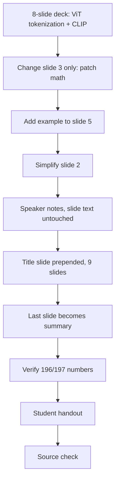

# S032 — VLM teaching slide deck with slide-specific edits, then handout

## Tests

Sustained multi-turn workflow on ONE eight-slide VLM deck built from the VLM notes: Fazah covers
ViT patch tokenization and CLIP contrastive learning, applies slide-specific selective edits
("change slide 3 only", "add an example to slide 5", simplify slide 2), adds speaker notes and a
title slide, verifies the 196/197 patch numbers, and derives a student handout — changing only
the targeted slide each time and preserving prior edits as slides are renumbered.

## Setup

- Start: New chat
- Select files: `12_vlm_vit_clip_reasoning.md`
- Do not select: any other course file
- Turns: 10
- Auditor variation: Not allowed

## Workflow



---

## Turn 1

### Enter

```text
make an 8 slide teaching deck on how vit turns an image into tokens and how clip learns, use the vlm file
```

### Expect

- Exactly eight slides are produced, numbered/ordered so later slide-specific edits can be
  targeted.
- ViT content matches the notes: N = (H/P)·(W/P) spatial patches; for 224×224 with P=16 that is
  196 patches, plus the prepended [CLS] token → sequence length 197.
- CLIP content matches the notes: contrastive learning with temperature-scaled logits
  ℓ_ij = uᵢᵀvⱼ/τ and the symmetric InfoNCE loss (matched pairs on the diagonal), averaged over
  both the image→text and text→image directions.
- Grounded in `12_vlm_vit_clip_reasoning.md`, not generic outside material.

### Record

- Actual prompt entered:
- Files selected:
- Files Fazah used:
- Result: Pass / Small Issue / Fail / Critical Fail
- Short note:

---

## Turn 2   (continue the same chat; keep `12_vlm_vit_clip_reasoning.md` selected)

### Enter

```text
change slide 3 only — make it walk through the 224x224 patch example step by step
```

### Expect

- Only slide 3 changes; the other seven slides are untouched.
- The walkthrough matches the notes' Problem 1: 224/16 = 14 patches per side; 14×14 = 196 spatial
  patches; +1 [CLS] → 197 tokens.
- The deck still has exactly eight slides.

### Record

- Actual prompt entered:
- Files selected:
- Files Fazah used:
- Result: Pass / Small Issue / Fail / Critical Fail
- Short note:

---

## Turn 3   (continue the same chat)

### Enter

```text
add an example to slide 5
```

### Expect

- Only slide 5 gains a worked example; all other slides, including the edited slide 3, are
  unchanged.
- The example is grounded in the VLM notes (e.g. cosine similarity of normalized embeddings with
  temperature scaling — the notes' u=(3,4), v=(1,2) example gives s ≈ 0.9839, and τ=0.1 yields a
  sharper softmax than τ=1.0 — or another example traceable to the file).
- The deck still has exactly eight slides.

### Record

- Actual prompt entered:
- Files selected:
- Files Fazah used:
- Result: Pass / Small Issue / Fail / Critical Fail
- Short note:

---

## Turn 4   (continue the same chat)

### Enter

```text
slide 2 is too dense, simplify it
```

### Expect

- Only slide 2 is simplified; slides 1 and 3–8 are unchanged, including the Turn 2–3 edits.
- Simplification does not corrupt facts (196/197 and the CLIP loss stay correct wherever they
  appear).
- The change is a new version of the same eight-slide deck.

### Record

- Actual prompt entered:
- Files selected:
- Files Fazah used:
- Result: Pass / Small Issue / Fail / Critical Fail
- Short note:

---

## Turn 5   (continue the same chat)

### Enter

```text
add speaker notes but dont change the slide text
```

### Expect

- Speaker notes are added for the slides.
- The visible slide text is unchanged from the prior version.
- All earlier slide-specific edits (slides 2, 3, 5) are still present.

### Record

- Actual prompt entered:
- Files selected:
- Files Fazah used:
- Result: Pass / Small Issue / Fail / Critical Fail
- Short note:

---

## Turn 6   (continue the same chat)

### Enter

```text
add a title slide at the front
```

### Expect

- A title slide is prepended; the deck now has nine slides.
- Earlier edits move with their content — the patch walkthrough, the slide-5 example, and the
  simplified slide 2 survive under their new numbers.
- Speaker notes from Turn 5 are retained.

### Record

- Actual prompt entered:
- Files selected:
- Files Fazah used:
- Result: Pass / Small Issue / Fail / Critical Fail
- Short note:

---

## Turn 7   (continue the same chat)

### Enter

```text
make the last slide a summary
```

### Expect

- Only the final slide becomes a summary of the deck's key points (patch tokenization → 197
  tokens; CLIP's symmetric contrastive objective).
- The other slides, including all earlier edits, are unchanged.
- Slide count is unchanged by this edit (still nine).

### Record

- Actual prompt entered:
- Files selected:
- Files Fazah used:
- Result: Pass / Small Issue / Fail / Critical Fail
- Short note:

---

## Turn 8   (continue the same chat)

### Enter

```text
double check the patch numbers on the tokenization slides are right
```

### Expect

- Fazah verifies against the notes: 224/16 = 14 per side, 14² = 196 patches, 196 + 1 [CLS] = 197
  tokens — and confirms or corrects the deck accordingly.
- If a correction is needed, only the affected number changes; no slide is rewritten wholesale.
- The check is auditable (the arithmetic is shown or clearly stated).

### Record

- Actual prompt entered:
- Files selected:
- Files Fazah used:
- Result: Pass / Small Issue / Fail / Critical Fail
- Short note:

---

## Turn 9   (continue the same chat)

### Enter

```text
make a student handout from the deck
```

### Expect

- A student handout is derived from the current deck, written for students.
- Speaker notes / teacher-only asides are not carried into the handout (audience-leakage check).
- The handout content matches the deck's slides, including the verified 196/197 numbers and the
  slide-5 example.

### Record

- Actual prompt entered:
- Files selected:
- Files Fazah used:
- Result: Pass / Small Issue / Fail / Critical Fail
- Short note:

---

## Turn 10   (continue the same chat)

### Enter

```text
which file did u use for all of this
```

### Expect

- Fazah names `12_vlm_vit_clip_reasoning.md` as the source.
- It does not claim any other course file; all deck and handout content traces to the VLM notes.
- The answer reflects the actual deck and handout produced.

### Record

- Actual prompt entered:
- Files selected:
- Files Fazah used:
- Result: Pass / Small Issue / Fail / Critical Fail
- Short note:

---

## Final Check

- Understood the request: Yes / Mostly / No
- Used the correct source: Yes / Partly / No / N/A
- Output is usable: Yes / Needs editing / No
- Conversation handled correctly: Yes / Mostly / No / N/A

## Overall

- [ ] Pass
- [ ] Pass with small issue
- [ ] Fail
- [ ] Critical fail

## Main issue

- [ ] None
- [ ] Misunderstood request
- [ ] Wrong source
- [ ] Ignored selected file
- [ ] Incorrect content
- [ ] Missed instruction
- [ ] Clarification problem
- [ ] Lost previous work
- [ ] Changed unrelated content
- [ ] Exposed student answers
- [ ] Error or timeout
- [ ] Other

## One-line note

Fazah should improve:
