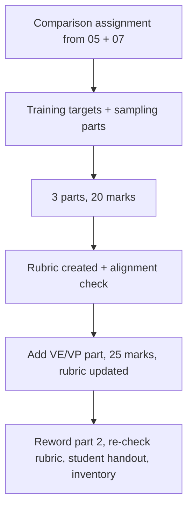

# S034 — Comparison assignment with rubric: score-based models vs flow matching

## Tests

Across twelve turns Fazah builds ONE assignment comparing score-based models (NCSN / Langevin)
with flow matching (linear interpolant, ODE) from two sources, then creates a grading rubric and
keeps it consistent with the assignment through structural edits, a mark change, a reword, and a
student handout — without cross-contaminating or losing alignment between the two documents.

## Setup

- Start: New chat
- Select files: `05_ncsn_score_based_models_notes.pdf` + `07_flow_matching_notes.pdf`
- Do not select: `06_diffusion_ddpm_ddim_notes.pdf`, `08_diffusion_score_flow_worked_problems.md`
- Turns: 12
- Auditor variation: Not allowed

## Workflow



---

## Turn 1

### Enter

```text
make an assignment where students compare score based models with flow matching, use both files
```

### Expect

- One assignment comparing the two approaches, drawing on BOTH files (NCSN forward corruption,
  score, Langevin from 05; linear interpolant, velocity, ODE from 07).
- Used sources list both `05_ncsn_score_based_models_notes.pdf` and `07_flow_matching_notes.pdf`.
- No DDPM/DDIM-specific content pulled from the unselected diffusion notes.

### Record

- Actual prompt entered:
- Files selected:
- Files Fazah used:
- Result: Pass / Small Issue / Fail / Critical Fail
- Short note:

---

## Turn 2   (continue the same chat)

### Enter

```text
make sure theres a part asking what target each network is trained to predict
```

### Expect

- A part contrasts the training targets: the score network's target is the true Gaussian score
  S_true(x̃|x) = −ε/σ (equivalently (x−x̃)/σ²), while the flow-matching network's target is the
  velocity v = x₁ − x₀ of the linear interpolant.
- Both targets are stated as in the notes (not swapped or garbled).
- The rest of the assignment is preserved.

### Record

- Actual prompt entered:
- Files selected:
- Files Fazah used:
- Result: Pass / Small Issue / Fail / Critical Fail
- Short note:

---

## Turn 3   (continue the same chat)

### Enter

```text
add a part comparing how each one samples
```

### Expect

- A sampling part contrasts annealed Langevin dynamics (update x ← x + (α/2)·s_θ(x,σ) + √α·z,
  fresh noise z each step) with the deterministic ODE sampler (no random noise term added).
- The stochastic-vs-deterministic distinction is correct (Langevin injects noise; the
  probability-flow / ODE step drops the Z term and halves the score term).
- Earlier parts are unchanged.

### Record

- Actual prompt entered:
- Files selected:
- Files Fazah used:
- Result: Pass / Small Issue / Fail / Critical Fail
- Short note:

---

## Turn 4   (continue the same chat)

### Enter

```text
structure it as 3 parts with marks, 20 marks total
```

### Expect

- The assignment is organized into exactly three parts with a mark allocation per part.
- Marks sum to exactly 20.
- The content from Turns 1–3 (targets, sampling comparison) is preserved inside the parts, not
  regenerated as new material.

### Record

- Actual prompt entered:
- Files selected:
- Files Fazah used:
- Result: Pass / Small Issue / Fail / Critical Fail
- Short note:

---

## Turn 5   (continue the same chat)

### Enter

```text
now make a grading rubric for it
```

### Expect

- A rubric is created AFTER the assignment and mirrors its three parts.
- Rubric criteria are grounded in the same notes (e.g. credit for stating −ε/σ as the score target,
  v = x₁ − x₀ as the velocity target, noise term present in Langevin but not the ODE step).
- Rubric marks match the assignment's per-part marks and sum to 20.

### Record

- Actual prompt entered:
- Files selected:
- Files Fazah used:
- Result: Pass / Small Issue / Fail / Critical Fail
- Short note:

---

## Turn 6   (continue the same chat)

### Enter

```text
check the rubric lines up with the assignment part by part
```

### Expect

- Fazah verifies part-by-part alignment: every assignment part has rubric criteria and vice versa.
- Mark totals agree (20/20) between the two documents.
- Any mismatch found is fixed, not just reported.

### Record

- Actual prompt entered:
- Files selected:
- Files Fazah used:
- Result: Pass / Small Issue / Fail / Critical Fail
- Short note:

---

## Turn 7   (continue the same chat)

### Enter

```text
add a 4th part on VE vs VP SDEs and make the whole thing 25 marks
```

### Expect

- A fourth part is added on the SDE view: VE-SDE (NCSN) has zero drift (f = 0), VP-SDE (DDPM)
  has drift −½β(t)x_t — as in the flow-matching notes.
- The total becomes exactly 25 marks; parts 1–3 keep their content.
- No invented SDE facts beyond the notes.

### Record

- Actual prompt entered:
- Files selected:
- Files Fazah used:
- Result: Pass / Small Issue / Fail / Critical Fail
- Short note:

---

## Turn 8   (continue the same chat)

### Enter

```text
update the rubric to match
```

### Expect

- The rubric gains criteria for the new part 4 (drift identification: f = 0 for VE,
  −½β(t)x_t for VP).
- Rubric marks now sum to 25 and match the assignment's allocation.
- Existing rubric criteria for parts 1–3 are preserved, not rewritten.

### Record

- Actual prompt entered:
- Files selected:
- Files Fazah used:
- Result: Pass / Small Issue / Fail / Critical Fail
- Short note:

---

## Turn 9   (continue the same chat)

### Enter

```text
reword part 2 as a scenario, like a student claims langevin sampling is deterministic and they have to explain whats wrong
```

### Expect

- Only part 2 is rewritten, now scenario-style; the correct resolution is grounded (Langevin adds
  fresh noise √α·Z each step, so it is stochastic — unlike the ODE sampler which has no noise term).
- Parts 1, 3, 4 and all marks are unchanged.
- Still four parts, 25 marks.

### Record

- Actual prompt entered:
- Files selected:
- Files Fazah used:
- Result: Pass / Small Issue / Fail / Critical Fail
- Short note:

---

## Turn 10   (continue the same chat)

### Enter

```text
does the rubric still match after that change? fix it if not
```

### Expect

- Fazah re-checks rubric consistency after the reword and updates the part-2 criteria to fit the
  scenario framing.
- Marks remain 25 and other criteria are untouched.
- The check reflects the actual current documents, not a stale version.

### Record

- Actual prompt entered:
- Files selected:
- Files Fazah used:
- Result: Pass / Small Issue / Fail / Critical Fail
- Short note:

---

## Turn 11   (continue the same chat)

### Enter

```text
give me a clean student handout, just the assignment, no rubric or answer notes
```

### Expect

- A student handout with the four parts and marks only — no rubric criteria, expected answers, or
  grading notes leak in (answer-leakage check — leaked criteria/answers = Critical fail).
- Wording matches the current assignment (including the scenario part 2).
- The rubric still exists separately for the teacher.

### Record

- Actual prompt entered:
- Files selected:
- Files Fazah used:
- Result: Pass / Small Issue / Fail / Critical Fail
- Short note:

---

## Turn 12   (continue the same chat)

### Enter

```text
which files did u use, and list what we made with the mark totals
```

### Expect

- Fazah names `05_ncsn_score_based_models_notes.pdf` and `07_flow_matching_notes.pdf` as the
  sources used throughout.
- Inventory: the 4-part / 25-mark assignment, the matching rubric, and the student handout — with
  consistent totals (25) across all of them.
- No fabricated artifacts and no source that was never selected.

### Record

- Actual prompt entered:
- Files selected:
- Files Fazah used:
- Result: Pass / Small Issue / Fail / Critical Fail
- Short note:

---

## Final Check

- Understood the request: Yes / Mostly / No
- Used the correct source: Yes / Partly / No / N/A
- Output is usable: Yes / Needs editing / No
- Conversation handled correctly: Yes / Mostly / No / N/A

## Overall

- [ ] Pass
- [ ] Pass with small issue
- [ ] Fail
- [ ] Critical fail

## Main issue

- [ ] None
- [ ] Misunderstood request
- [ ] Wrong source
- [ ] Ignored selected file
- [ ] Incorrect content
- [ ] Missed instruction
- [ ] Clarification problem
- [ ] Lost previous work
- [ ] Changed unrelated content
- [ ] Exposed student answers
- [ ] Error or timeout
- [ ] Other

## One-line note

Fazah should improve:
