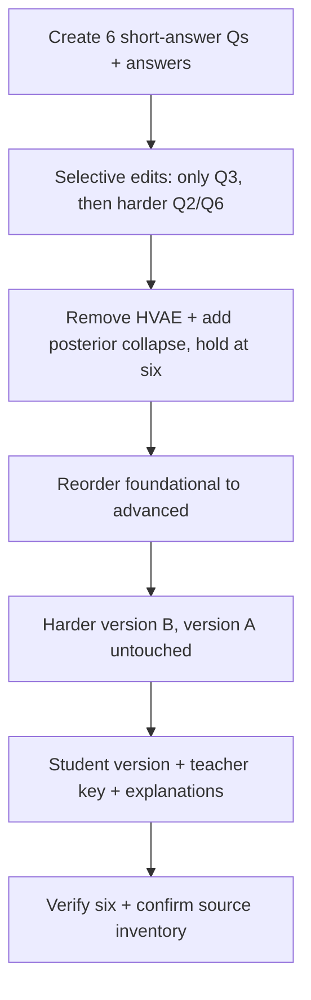

# S035 — VAE assessment, full editing lifecycle

## Tests

Across twelve turns on one VAE assessment, Fazah performs selective edits ("only change question 3"),
holds the question count at six through remove/add, reorders, builds a harder version-B variant
without touching version A, and separates a no-answers student version from a teacher key with
explanations — all grounded in the VAE / denoising-autoencoder notes.

## Setup

- Start: New chat
- Select files: `04_vae_denoising_autoencoders_notes.pdf`
- Do not select: any other file (especially `05_ncsn_score_based_models_notes.pdf`, `06_diffusion_ddpm_ddim_notes.pdf`)
- Turns: 12
- Auditor variation: Not allowed

## Workflow



---

## Turn 1

### Enter

```text
make 6 short answer qs on VAEs and denoising autoencoders, w answers
```

### Expect

- Exactly six short-answer questions, each with an answer.
- Content is grounded in the VAE notes (e.g. DAE forward corruption x̃ = x + ε with ε∼N(0, σ²I),
  Tweedie's formula, the reparameterization trick z = μ_φ(x) + σ_φ(x)⊙ε, ELBO = reconstruction
  − KL, closed-form Gaussian KL); used source = `04_vae_denoising_autoencoders_notes.pdf`.
- No fabricated citation to a file that was not selected.

### Record

- Actual prompt entered:
- Files selected:
- Files Fazah used:
- Result: Pass / Small Issue / Fail / Critical Fail
- Short note:

---

## Turn 2   (continue the same chat)

### Enter

```text
only change question 3, make it about tweedies formula, dont touch the others
```

### Expect

- Only Q3 changes; it now targets Tweedie's formula E[x|x̃] = x̃ + σ²∇log P(x̃).
- Q1, Q2, Q4, Q5, Q6 are word-for-word unchanged.
- Still exactly six questions.

### Record

- Actual prompt entered:
- Files selected:
- Files Fazah used:
- Result: Pass / Small Issue / Fail / Critical Fail
- Short note:

---

## Turn 3   (continue the same chat)

### Enter

```text
make qs 2 and 6 harder
```

### Expect

- Only Q2 and Q6 change and become harder.
- The other four questions (including the new Tweedie Q3) are unchanged.
- Still exactly six questions; a new version of the same set.

### Record

- Actual prompt entered:
- Files selected:
- Files Fazah used:
- Result: Pass / Small Issue / Fail / Critical Fail
- Short note:

---

## Turn 4   (continue the same chat)

### Enter

```text
drop any q about hierarchical VAEs
```

### Expect

- Any hierarchical-VAE (HVAE / chained ELBO / Markovian factorization) question is removed
  (count may drop below six here).
- The remaining questions are otherwise preserved, not rewritten.
- Fazah does not silently backfill without saying so.

### Record

- Actual prompt entered:
- Files selected:
- Files Fazah used:
- Result: Pass / Small Issue / Fail / Critical Fail
- Short note:

---

## Turn 5   (continue the same chat)

### Enter

```text
add one q on posterior collapse, keep it at 6 total
```

### Expect

- A posterior-collapse question is added, grounded in the notes (q_φ(z|x) = P_θ(z) ⟹ KL = 0;
  the latent space becomes uninformative).
- The total is back to exactly six questions.
- Previously kept questions are unchanged.

### Record

- Actual prompt entered:
- Files selected:
- Files Fazah used:
- Result: Pass / Small Issue / Fail / Critical Fail
- Short note:

---

## Turn 6   (continue the same chat)

### Enter

```text
reorder them foundational to advanced
```

### Expect

- The same six questions are reordered foundational → advanced (e.g. DAE corruption before ELBO
  and posterior collapse).
- No question is added, dropped, or reworded; only the order changes.

### Record

- Actual prompt entered:
- Files selected:
- Files Fazah used:
- Result: Pass / Small Issue / Fail / Critical Fail
- Short note:

---

## Turn 7   (continue the same chat)

### Enter

```text
now make a harder variant of the whole set as version B, keep version A as is
```

### Expect

- A harder version B of all six questions is produced (still grounded in the VAE notes, e.g.
  combining reparameterization + Gaussian NLL + KL into a full forward-pass question).
- Version A from Turn 6 is untouched — both versions now exist.
- Version B also has exactly six questions.

### Record

- Actual prompt entered:
- Files selected:
- Files Fazah used:
- Result: Pass / Small Issue / Fail / Critical Fail
- Short note:

---

## Turn 8   (continue the same chat)

### Enter

```text
give me a clean student version of version A, no answers
```

### Expect

- A student version of version A's six questions with NO answers shown (answer-leakage check —
  leaked answers = Critical fail).
- Question order and wording match Turn 6 (version A, not version B).

### Record

- Actual prompt entered:
- Files selected:
- Files Fazah used:
- Result: Pass / Small Issue / Fail / Critical Fail
- Short note:

---

## Turn 9   (continue the same chat)

### Enter

```text
make a separate teacher answer key for version A, dont touch the student version
```

### Expect

- A separate teacher answer key with the answers for the same six version-A questions.
- The student version from Turn 8 is untouched (still no answers).
- Both refer to the same six questions in the same order.

### Record

- Actual prompt entered:
- Files selected:
- Files Fazah used:
- Result: Pass / Small Issue / Fail / Critical Fail
- Short note:

---

## Turn 10   (continue the same chat)

### Enter

```text
add a short explanation to each answer in the key
```

### Expect

- Each answer in the teacher key gains a short explanation grounded in the VAE notes (e.g. why the
  reparameterization trick enables backpropagation, why KL = 0 proves posterior collapse, why a
  large decoder variance produces blur).
- The student version still shows no answers or explanations.
- No outside-the-notes facts invented.

### Record

- Actual prompt entered:
- Files selected:
- Files Fazah used:
- Result: Pass / Small Issue / Fail / Critical Fail
- Short note:

---

## Turn 11   (continue the same chat)

### Enter

```text
how many qs are in each version now?
```

### Expect

- Fazah reports exactly six questions in version A and six in version B.
- The count is consistent across the student version and the teacher key.
- No drift introduced by the earlier remove/add/variant edits.

### Record

- Actual prompt entered:
- Files selected:
- Files Fazah used:
- Result: Pass / Small Issue / Fail / Critical Fail
- Short note:

---

## Turn 12   (continue the same chat)

### Enter

```text
which file did u use, and list everything we made
```

### Expect

- Fazah names `04_vae_denoising_autoencoders_notes.pdf` as the single source used throughout.
- Inventory covers version A, harder version B, the student version (no answers), and the teacher
  key with explanations.
- No fabricated artifacts and no source that was never selected.

### Record

- Actual prompt entered:
- Files selected:
- Files Fazah used:
- Result: Pass / Small Issue / Fail / Critical Fail
- Short note:

---

## Final Check

- Understood the request: Yes / Mostly / No
- Used the correct source: Yes / Partly / No / N/A
- Output is usable: Yes / Needs editing / No
- Conversation handled correctly: Yes / Mostly / No / N/A

## Overall

- [ ] Pass
- [ ] Pass with small issue
- [ ] Fail
- [ ] Critical fail

## Main issue

- [ ] None
- [ ] Misunderstood request
- [ ] Wrong source
- [ ] Ignored selected file
- [ ] Incorrect content
- [ ] Missed instruction
- [ ] Clarification problem
- [ ] Lost previous work
- [ ] Changed unrelated content
- [ ] Exposed student answers
- [ ] Error or timeout
- [ ] Other

## One-line note

Fazah should improve:
