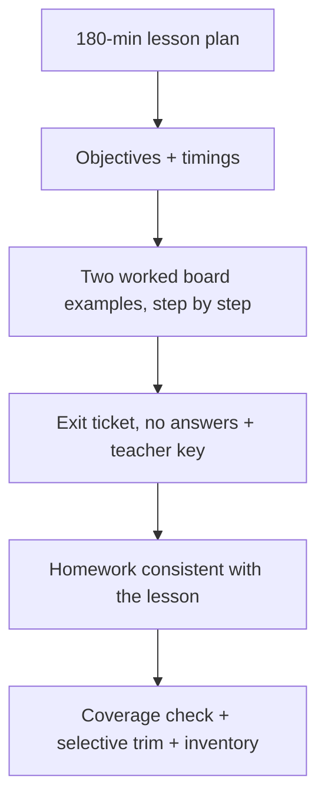

# S036 — Diffusion lesson plan transformed into teaching assets

## Tests

Across twelve turns Fazah turns ONE diffusion source into a family of connected artifacts — lesson
plan, worked board examples, exit ticket, homework — keeping every asset grounded in the same
DDPM/DDIM notes, consistent with the lesson plan and with each other, and applying each later edit
selectively without breaking earlier assets.

## Setup

- Start: New chat
- Select files: `06_diffusion_ddpm_ddim_notes.pdf`
- Do not select: `05_ncsn_score_based_models_notes.pdf`, `07_flow_matching_notes.pdf`, `08_diffusion_score_flow_worked_problems.md`
- Turns: 12
- Auditor variation: Not allowed

## Workflow



---

## Turn 1

### Enter

```text
plan my 180 min lecture on ddpm and ddim from these notes
```

### Expect

- A lesson plan for one 180-minute session grounded in the diffusion notes (schedules α_t = 1−β_t
  and ᾱ_t, forward process, closed-form jump, posterior, DDPM sampling, DDIM and η).
- Used source = `06_diffusion_ddpm_ddim_notes.pdf`; no NCSN or flow-matching material pulled in.
- The plan is teacher-facing and structured (sections/segments).

### Record

- Actual prompt entered:
- Files selected:
- Files Fazah used:
- Result: Pass / Small Issue / Fail / Critical Fail
- Short note:

---

## Turn 2   (continue the same chat)

### Enter

```text
add learning objectives
```

### Expect

- Learning objectives are added, tied to the notes (e.g. compute ᾱ_t and SNR_t = ᾱ_t/(1−ᾱ_t),
  apply the closed-form jump, contrast DDPM vs DDIM sampling).
- The Turn 1 plan structure is preserved.

### Record

- Actual prompt entered:
- Files selected:
- Files Fazah used:
- Result: Pass / Small Issue / Fail / Critical Fail
- Short note:

---

## Turn 3   (continue the same chat)

### Enter

```text
put timings on each section, it has to fit 180 mins
```

### Expect

- Each section gets a time allocation; the total is 180 minutes.
- Sections and objectives from earlier turns are preserved, not regenerated.

### Record

- Actual prompt entered:
- Files selected:
- Files Fazah used:
- Result: Pass / Small Issue / Fail / Critical Fail
- Short note:

---

## Turn 4   (continue the same chat)

### Enter

```text
now 2 worked examples i can do on the board, one forward one sampling
```

### Expect

- Exactly two board examples: one on the forward process (the closed-form jump
  x_t = √ᾱ_t·x_0 + √(1−ᾱ_t)·ε), one on sampling (a DDPM denoising step or a DDIM step).
- Both use the notes' formulas and notation (ᾱ_t, β_t, ε), not outside material.
- The examples fit the lesson plan's sections.

### Record

- Actual prompt entered:
- Files selected:
- Files Fazah used:
- Result: Pass / Small Issue / Fail / Critical Fail
- Short note:

---

## Turn 5   (continue the same chat)

### Enter

```text
write both examples out step by step like id do them on the board
```

### Expect

- Each example becomes an explicit step-by-step derivation (schedule values first, then the
  transition), consistent with the notes' formulas.
- If the sampling example uses DDIM, the η behavior is correct (η=0 → deterministic, no z term;
  η=1 collapses to the DDPM step).
- No steps contradict the notes; nothing else in the plan changes.

### Record

- Actual prompt entered:
- Files selected:
- Files Fazah used:
- Result: Pass / Small Issue / Fail / Critical Fail
- Short note:

---

## Turn 6   (continue the same chat)

### Enter

```text
make an exit ticket, 3 quick questions matching what the lesson covers
```

### Expect

- Exactly three short questions, each mapped to lesson content (e.g. what SNR_t = ᾱ_t/(1−ᾱ_t)
  measures, what η=0 means for DDIM, writing the closed-form jump).
- Questions stay within what the lesson plan actually covers — no untaught topics.
- Student-facing wording.

### Record

- Actual prompt entered:
- Files selected:
- Files Fazah used:
- Result: Pass / Small Issue / Fail / Critical Fail
- Short note:

---

## Turn 7   (continue the same chat)

### Enter

```text
no answers on the ticket, but give me a separate key
```

### Expect

- The exit ticket shows NO answers (answer-leakage check — leaked answers = Critical fail).
- A separate teacher key answers the same three questions correctly per the notes.
- Ticket and key refer to identical questions.

### Record

- Actual prompt entered:
- Files selected:
- Files Fazah used:
- Result: Pass / Small Issue / Fail / Critical Fail
- Short note:

---

## Turn 8   (continue the same chat)

### Enter

```text
now a homework assignment that follows on from the lesson
```

### Expect

- A student-facing homework grounded in the same notes (e.g. isolate x_0 from the jump equation,
  compute a posterior mean, explain the DDIM-to-DDPM connection at η=1).
- It builds on lesson content rather than introducing new sources or topics.
- Earlier assets (plan, examples, ticket, key) are unchanged.

### Record

- Actual prompt entered:
- Files selected:
- Files Fazah used:
- Result: Pass / Small Issue / Fail / Critical Fail
- Short note:

---

## Turn 9   (continue the same chat)

### Enter

```text
check the homework only uses stuff the lesson actually covers
```

### Expect

- Fazah cross-checks homework items against the lesson plan sections and confirms or fixes
  coverage.
- Anything outside the lesson (or outside the diffusion notes) is flagged and replaced.
- The check reflects the actual current plan and homework.

### Record

- Actual prompt entered:
- Files selected:
- Files Fazah used:
- Result: Pass / Small Issue / Fail / Critical Fail
- Short note:

---

## Turn 10   (continue the same chat)

### Enter

```text
shorten the intro section of the lesson plan, dont change anything else
```

### Expect

- Only the plan's intro section is shortened; other sections, objectives, and timings elsewhere
  stay as they were (or timings are rebalanced with the change stated).
- Board examples, exit ticket, key, and homework are untouched.

### Record

- Actual prompt entered:
- Files selected:
- Files Fazah used:
- Result: Pass / Small Issue / Fail / Critical Fail
- Short note:

---

## Turn 11   (continue the same chat)

### Enter

```text
do all the assets still line up with each other and the notes? same notation everywhere?
```

### Expect

- Fazah verifies cross-asset consistency: examples, ticket, and homework all match the lesson plan
  and use the notes' notation (ᾱ_t, β_t, η) consistently.
- Any inconsistency found is corrected, not just reported.
- No asset silently changed beyond what consistency requires.

### Record

- Actual prompt entered:
- Files selected:
- Files Fazah used:
- Result: Pass / Small Issue / Fail / Critical Fail
- Short note:

---

## Turn 12   (continue the same chat)

### Enter

```text
which file did u use and list everything we made
```

### Expect

- Fazah names `06_diffusion_ddpm_ddim_notes.pdf` as the single source used throughout.
- Inventory: lesson plan (objectives + timings), two step-by-step board examples, exit ticket
  (no answers), teacher key, homework.
- No fabricated artifacts and no source that was never selected.

### Record

- Actual prompt entered:
- Files selected:
- Files Fazah used:
- Result: Pass / Small Issue / Fail / Critical Fail
- Short note:

---

## Final Check

- Understood the request: Yes / Mostly / No
- Used the correct source: Yes / Partly / No / N/A
- Output is usable: Yes / Needs editing / No
- Conversation handled correctly: Yes / Mostly / No / N/A

## Overall

- [ ] Pass
- [ ] Pass with small issue
- [ ] Fail
- [ ] Critical fail

## Main issue

- [ ] None
- [ ] Misunderstood request
- [ ] Wrong source
- [ ] Ignored selected file
- [ ] Incorrect content
- [ ] Missed instruction
- [ ] Clarification problem
- [ ] Lost previous work
- [ ] Changed unrelated content
- [ ] Exposed student answers
- [ ] Error or timeout
- [ ] Other

## One-line note

Fazah should improve:
