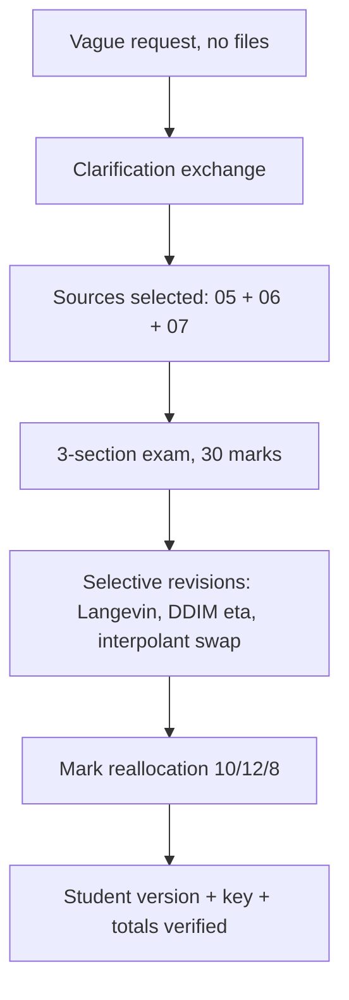

# S039 — Ambiguous exam request via clarification, selection, and revision

## Tests

Across fourteen turns Fazah turns a vague "i need an exam" into a real generative-models exam:
it clarifies instead of guessing, waits for sources, builds a three-section exam from the NCSN,
diffusion, and flow-matching notes once they are selected, survives several selective revisions and a
mark reallocation, separates student and teacher versions, and verifies the totals at the end.

## Setup

- Start: New chat
- Select files: none at the start (select `05_ncsn_score_based_models_notes.pdf` +
  `06_diffusion_ddpm_ddim_notes.pdf` + `07_flow_matching_notes.pdf` at Turn 4)
- Do not select: `04_vae_denoising_autoencoders_notes.pdf`, `08_diffusion_score_flow_worked_problems.md`
- Turns: 14
- Auditor variation: Not allowed

## Workflow



---

## Turn 1

### Enter

```text
i need an exam
```

### Expect

- Fazah asks clarifying questions (topic/scope, length or marks, question style) rather than
  generating a random exam.
- With no file selected, it does not fabricate course content or cite any source.
- The clarification is concise and useful, not an interrogation.

### Record

- Actual prompt entered:
- Files selected:
- Files Fazah used:
- Result: Pass / Small Issue / Fail / Critical Fail
- Short note:

---

## Turn 2   (continue the same chat; still no files selected)

### Enter

```text
for the generative models part of my course
```

### Expect

- Fazah narrows the scope but still resolves the remaining unknowns (which materials, how long,
  what format) instead of guessing.
- It may propose candidate topics/files (score-based, diffusion, flow matching) without inventing
  their content.
- No exam is generated yet from nothing.

### Record

- Actual prompt entered:
- Files selected:
- Files Fazah used:
- Result: Pass / Small Issue / Fail / Critical Fail
- Short note:

---

## Turn 3   (continue the same chat; still no files selected)

### Enter

```text
score based models, diffusion, and flow matching. 90 mins
```

### Expect

- Fazah identifies the matching sources (the NCSN, diffusion, and flow-matching notes) and asks
  for / suggests selecting them.
- It does not claim to have read files that are not selected.
- Any proposed structure fits a 90-minute exam.

### Record

- Actual prompt entered:
- Files selected:
- Files Fazah used:
- Result: Pass / Small Issue / Fail / Critical Fail
- Short note:

---

## Turn 4   (continue the same chat; select `05_ncsn_score_based_models_notes.pdf` + `06_diffusion_ddpm_ddim_notes.pdf` + `07_flow_matching_notes.pdf`)

### Enter

```text
ok selected the 3 note files, go ahead
```

### Expect

- An exam is built with one section per topic: score-based (NCSN/Langevin), diffusion (DDPM/DDIM),
  flow matching (SDE/ODE, interpolant).
- Content is grounded in the three selected files; used sources list all three.
- Nothing pulled from the VAE notes or the worked-problem file.

### Record

- Actual prompt entered:
- Files selected:
- Files Fazah used:
- Result: Pass / Small Issue / Fail / Critical Fail
- Short note:

---

## Turn 5   (continue the same chat)

### Enter

```text
make it 30 marks total, 10 per section
```

### Expect

- Marks are assigned: exactly 10 per section, 30 total.
- Section content from Turn 4 is preserved, not regenerated.
- Per-question marks within each section sum to that section's 10.

### Record

- Actual prompt entered:
- Files selected:
- Files Fazah used:
- Result: Pass / Small Issue / Fail / Critical Fail
- Short note:

---

## Turn 6   (continue the same chat)

### Enter

```text
the langevin question in section 1 is too easy, make it harder, dont touch the rest
```

### Expect

- Only the Langevin question in section 1 changes and becomes harder (still grounded, e.g. the
  annealed Langevin update x ← x + (α/2)s_θ(x,σ) + √α·z and its step-size/noise structure).
- All other questions in all sections are unchanged.
- Marks still 10/10/10 = 30.

### Record

- Actual prompt entered:
- Files selected:
- Files Fazah used:
- Result: Pass / Small Issue / Fail / Critical Fail
- Short note:

---

## Turn 7   (continue the same chat)

### Enter

```text
add a ddim eta question to the diffusion section
```

### Expect

- A DDIM η question is added to section 2, grounded in the diffusion notes (η=0 → deterministic
  sampling, no z term; η=1 with no skipping collapses to the DDPM step).
- Section 2's marks are rebalanced within its total or the change is stated explicitly.
- Sections 1 and 3 are untouched.

### Record

- Actual prompt entered:
- Files selected:
- Files Fazah used:
- Result: Pass / Small Issue / Fail / Critical Fail
- Short note:

---

## Turn 8   (continue the same chat)

### Enter

```text
in section 3 swap one q for the linear interpolant and target velocity
```

### Expect

- Exactly one section-3 question is replaced with one on the linear interpolant
  x_t = (1−t)x_0 + t·x_1 and target velocity v = x_1 − x_0.
- Other section-3 questions and sections 1–2 are unchanged.
- The interpolant/velocity facts match the flow-matching notes.

### Record

- Actual prompt entered:
- Files selected:
- Files Fazah used:
- Result: Pass / Small Issue / Fail / Critical Fail
- Short note:

---

## Turn 9   (continue the same chat)

### Enter

```text
actually reweight it, section 2 should be 12 and section 3 should be 8, keep 30 total
```

### Expect

- Marks become 10 / 12 / 8 = 30 exactly.
- Question content is preserved; only mark allocations change.
- Per-question marks inside sections 2 and 3 are adjusted to hit the new section totals.

### Record

- Actual prompt entered:
- Files selected:
- Files Fazah used:
- Result: Pass / Small Issue / Fail / Critical Fail
- Short note:

---

## Turn 10   (continue the same chat)

### Enter

```text
add brief instructions at the top, open book open notes, 90 mins
```

### Expect

- A short instructions header is added: open-book / open-notes, 90 minutes, total marks 30.
- No exam content changes.
- The header is consistent with the actual exam (sections, totals).

### Record

- Actual prompt entered:
- Files selected:
- Files Fazah used:
- Result: Pass / Small Issue / Fail / Critical Fail
- Short note:

---

## Turn 11   (continue the same chat)

### Enter

```text
now the student version, no answers anywhere
```

### Expect

- A student version with all sections, marks, and instructions but NO answers or solution hints
  (answer-leakage check — leaked answers = Critical fail).
- Wording matches the current exam after all revisions (harder Langevin, DDIM η, interpolant swap).

### Record

- Actual prompt entered:
- Files selected:
- Files Fazah used:
- Result: Pass / Small Issue / Fail / Critical Fail
- Short note:

---

## Turn 12   (continue the same chat)

### Enter

```text
and a teacher key with model answers
```

### Expect

- A separate teacher key with model answers for every question, grounded in the three note files
  (e.g. score target −ε/σ; η=0 deterministic; v = x_1 − x_0).
- The key follows the same section order and question numbering as the student version.
- The student version stays answer-free.

### Record

- Actual prompt entered:
- Files selected:
- Files Fazah used:
- Result: Pass / Small Issue / Fail / Critical Fail
- Short note:

---

## Turn 13   (continue the same chat)

### Enter

```text
verify the totals for me, marks per section and overall
```

### Expect

- Fazah checks and reports section totals 10 / 12 / 8 and overall 30, matching the actual exam.
- Any discrepancy between per-question marks and section totals is found and fixed.
- Student version and teacher key agree on all totals.

### Record

- Actual prompt entered:
- Files selected:
- Files Fazah used:
- Result: Pass / Small Issue / Fail / Critical Fail
- Short note:

---

## Turn 14   (continue the same chat)

### Enter

```text
which files did u use in the end? list the final documents
```

### Expect

- Fazah names exactly `05_ncsn_score_based_models_notes.pdf`, `06_diffusion_ddpm_ddim_notes.pdf`,
  and `07_flow_matching_notes.pdf` as the sources.
- Inventory: the 30-mark three-section exam, the student version (no answers), the teacher key.
- No claim of a source used before Turn 4's selection, and none that was never selected.

### Record

- Actual prompt entered:
- Files selected:
- Files Fazah used:
- Result: Pass / Small Issue / Fail / Critical Fail
- Short note:

---

## Final Check

- Understood the request: Yes / Mostly / No
- Used the correct source: Yes / Partly / No / N/A
- Output is usable: Yes / Needs editing / No
- Conversation handled correctly: Yes / Mostly / No / N/A

## Overall

- [ ] Pass
- [ ] Pass with small issue
- [ ] Fail
- [ ] Critical fail

## Main issue

- [ ] None
- [ ] Misunderstood request
- [ ] Wrong source
- [ ] Ignored selected file
- [ ] Incorrect content
- [ ] Missed instruction
- [ ] Clarification problem
- [ ] Lost previous work
- [ ] Changed unrelated content
- [ ] Exposed student answers
- [ ] Error or timeout
- [ ] Other

## One-line note

Fazah should improve:
