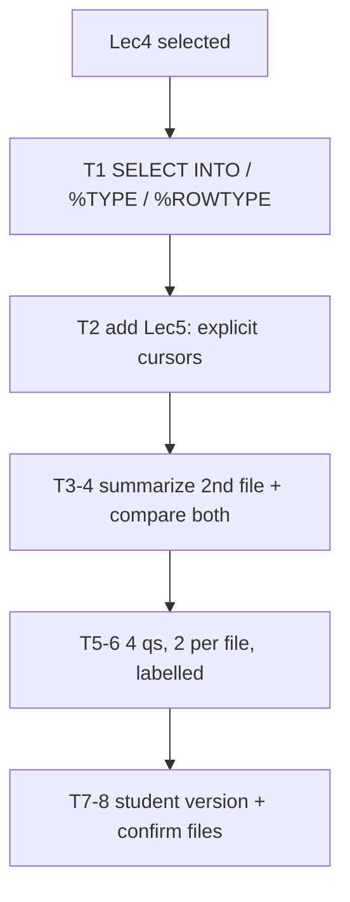

# S006 — Source changes mid-chat

## Tests

Starting on the SELECT INTO lecture (Lec4), the auditor adds the explicit-cursor lecture (Lec5)
mid-chat; Fazah tracks the change, summarizes only the second file, compares across both, and produces
per-file-labelled teacher and student questions with correct source attribution.

## Setup

- Start: New chat
- Select files: `Lec4.pdf` (SELECT INTO, %TYPE, %ROWTYPE)
- Do not select: `Lec5.pdf` yet (it is added at Turn 2)
- Turns: 8
- Auditor variation: Not allowed

## Workflow



---

## Turn 1

### Enter

```text
explain select into with %type and %rowtype
```

### Expect

- `SELECT col INTO var` reads a single row; `%TYPE` types a variable like a column; `%ROWTYPE` is a
  record for a whole row — matching Lec4.
- Grounded in `Lec4.pdf` (HR `employees` / `jobs` style).
- No fabricated columns/tables.

### Record

- Actual prompt entered:
- Files selected:
- Files Fazah used:
- Result: Pass / Small Issue / Fail / Critical Fail
- Short note:

---

## Turn 2  (continue the same chat — add `Lec5.pdf` to the selection)

### Enter

```text
now explain explicit cursors
```

### Expect

- Uses the newly added Lec5 (explicit cursors): `DECLARE` → `OPEN` → `FETCH ... INTO` → `CLOSE`.
- Grounds this answer in Lec5, not Lec4.
- No cursor content misattributed to Lec4.

### Record

- Actual prompt entered:
- Files selected:
- Files Fazah used:
- Result: Pass / Small Issue / Fail / Critical Fail
- Short note:

---

## Turn 3  (continue the same chat)

### Enter

```text
summarize only what we covered from the second file
```

### Expect

- Summary limited to the second file (Lec5, explicit cursors) — not Lec4 SELECT INTO content.
- Correctly identifies the second file as the cursor lecture.

### Record

- Actual prompt entered:
- Files selected:
- Files Fazah used:
- Result: Pass / Small Issue / Fail / Critical Fail
- Short note:

---

## Turn 4  (continue the same chat)

### Enter

```text
compare select into vs a cursor across both files
```

### Expect

- Contrasts `SELECT INTO` (single-row read, Lec4) with an explicit cursor (multi-row read, Lec5).
- Draws on both selected files with correct attribution.
- No invented facts.

### Record

- Actual prompt entered:
- Files selected:
- Files Fazah used:
- Result: Pass / Small Issue / Fail / Critical Fail
- Short note:

---

## Turn 5  (continue the same chat)

### Enter

```text
make 4 questions, 2 from each file
```

### Expect

- Exactly four questions — two grounded in Lec4 and two in Lec5.
- Content matches each file; nothing fabricated.

### Record

- Actual prompt entered:
- Files selected:
- Files Fazah used:
- Result: Pass / Small Issue / Fail / Critical Fail
- Short note:

---

## Turn 6  (continue the same chat)

### Enter

```text
label each q with its file
```

### Expect

- Each of the four questions is tagged with its source file (Lec4 or Lec5).
- The labels match the question content.

### Record

- Actual prompt entered:
- Files selected:
- Files Fazah used:
- Result: Pass / Small Issue / Fail / Critical Fail
- Short note:

---

## Turn 7  (continue the same chat)

### Enter

```text
student version, no answers
```

### Expect

- The same four questions in a student-facing version with NO answers shown
  (answer-leakage check — leaked answers = Critical fail).
- File labels may stay; the teacher version is preserved.

### Record

- Actual prompt entered:
- Files selected:
- Files Fazah used:
- Result: Pass / Small Issue / Fail / Critical Fail
- Short note:

---

## Turn 8  (continue the same chat)

### Enter

```text
which files did you use in the end
```

### Expect

- Names both `Lec4.pdf` and `Lec5.pdf` as the sources used.
- No unselected or fabricated files claimed.

### Record

- Actual prompt entered:
- Files selected:
- Files Fazah used:
- Result: Pass / Small Issue / Fail / Critical Fail
- Short note:

---

## Final Check

- Understood the request: Yes / Mostly / No
- Used the correct source: Yes / Partly / No / N/A
- Output is usable: Yes / Needs editing / No
- Conversation handled correctly: Yes / Mostly / No / N/A

## Overall

- [ ] Pass
- [ ] Pass with small issue
- [ ] Fail
- [ ] Critical fail

## Main issue

- [ ] None
- [ ] Misunderstood request
- [ ] Wrong source
- [ ] Ignored selected file
- [ ] Incorrect content
- [ ] Missed instruction
- [ ] Clarification problem
- [ ] Lost previous work
- [ ] Changed unrelated content
- [ ] Exposed student answers
- [ ] Error or timeout
- [ ] Other

## One-line note

Fazah should improve:

For the complete workflow, see [Context Diagram](../misc/CONTEXT-DIAGRAM.md).
