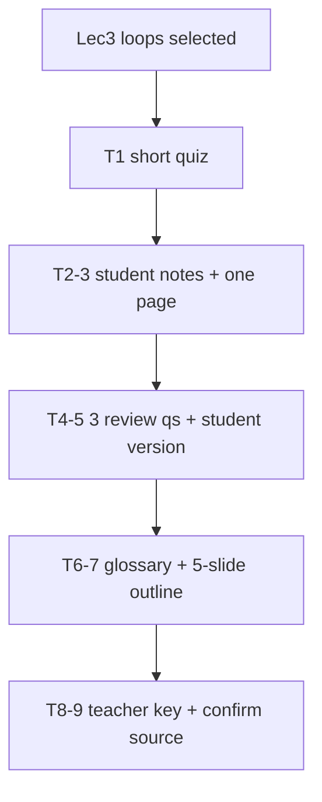

# S008 — "Use the same source" continuity

## Tests

With only the loops lecture (Lec3) selected, Fazah honors repeated "same source" instructions across a
long workflow — quiz, student notes, condensed page, review questions with student and teacher
versions, a glossary and a slide outline — keeping every artifact grounded in the one file.

## Setup

- Start: New chat
- Select files: `Lec3.pdf` (loops)
- Do not select: any other lecture
- Turns: 9
- Auditor variation: Not allowed

## Workflow



---

## Turn 1

### Enter

```text
make a short quiz on loops
```

### Expect

- A short quiz grounded in the loops lecture (simple/while/for), Lec3.
- No non-loop content.
- Grounded in `Lec3.pdf`.

### Record

- Actual prompt entered:
- Files selected:
- Files Fazah used:
- Result: Pass / Small Issue / Fail / Critical Fail
- Short note:

---

## Turn 2  (continue the same chat)

### Enter

```text
use the same source and make student notes
```

### Expect

- Student notes on loops built from the same file (Lec3).
- No new file pulled in; still grounded in `Lec3.pdf`.

### Record

- Actual prompt entered:
- Files selected:
- Files Fazah used:
- Result: Pass / Small Issue / Fail / Critical Fail
- Short note:

---

## Turn 3  (continue the same chat)

### Enter

```text
ok now a one-page version
```

### Expect

- A one-page condensed version of the notes; facts kept, detail trimmed.
- Still Lec3 only.

### Record

- Actual prompt entered:
- Files selected:
- Files Fazah used:
- Result: Pass / Small Issue / Fail / Critical Fail
- Short note:

---

## Turn 4  (continue the same chat)

### Enter

```text
add 3 review qs based on those notes
```

### Expect

- Exactly three review questions tied to the notes, grounded in Lec3.
- No topics outside loops.

### Record

- Actual prompt entered:
- Files selected:
- Files Fazah used:
- Result: Pass / Small Issue / Fail / Critical Fail
- Short note:

---

## Turn 5  (continue the same chat)

### Enter

```text
student version of those 3, no answers
```

### Expect

- The three questions in a student-facing version with NO answers shown
  (answer-leakage check — leaked answers = Critical fail).
- The three questions from Turn 4 are preserved.

### Record

- Actual prompt entered:
- Files selected:
- Files Fazah used:
- Result: Pass / Small Issue / Fail / Critical Fail
- Short note:

---

## Turn 6  (continue the same chat)

### Enter

```text
add a glossary from the same file
```

### Expect

- A glossary of loop terms from Lec3 (`LOOP`, `EXIT WHEN`, `WHILE`, `FOR`, `REVERSE`, nested loop,
  `mod`).
- Same source; no invented terms.

### Record

- Actual prompt entered:
- Files selected:
- Files Fazah used:
- Result: Pass / Small Issue / Fail / Critical Fail
- Short note:

---

## Turn 7  (continue the same chat)

### Enter

```text
make a 5-slide outline from the notes
```

### Expect

- A 5-slide outline derived from the loop notes.
- Grounded in Lec3; no new topics.

### Record

- Actual prompt entered:
- Files selected:
- Files Fazah used:
- Result: Pass / Small Issue / Fail / Critical Fail
- Short note:

---

## Turn 8  (continue the same chat)

### Enter

```text
give me the teacher version of the 3 qs w answers
```

### Expect

- The three review questions with correct answers grounded in Lec3.
- The Turn 5 student version is not overwritten inappropriately; both versions remain coherent.

### Record

- Actual prompt entered:
- Files selected:
- Files Fazah used:
- Result: Pass / Small Issue / Fail / Critical Fail
- Short note:

---

## Turn 9  (continue the same chat)

### Enter

```text
confirm every artifact used the loops lecture
```

### Expect

- Confirms all artifacts (quiz, notes, one-page, questions, glossary, outline) came from Lec3.
- No other or fabricated source claimed.

### Record

- Actual prompt entered:
- Files selected:
- Files Fazah used:
- Result: Pass / Small Issue / Fail / Critical Fail
- Short note:

---

## Final Check

- Understood the request: Yes / Mostly / No
- Used the correct source: Yes / Partly / No / N/A
- Output is usable: Yes / Needs editing / No
- Conversation handled correctly: Yes / Mostly / No / N/A

## Overall

- [ ] Pass
- [ ] Pass with small issue
- [ ] Fail
- [ ] Critical fail

## Main issue

- [ ] None
- [ ] Misunderstood request
- [ ] Wrong source
- [ ] Ignored selected file
- [ ] Incorrect content
- [ ] Missed instruction
- [ ] Clarification problem
- [ ] Lost previous work
- [ ] Changed unrelated content
- [ ] Exposed student answers
- [ ] Error or timeout
- [ ] Other

## One-line note

Fazah should improve:

For the complete workflow, see [Context Diagram](../misc/CONTEXT-DIAGRAM.md).
