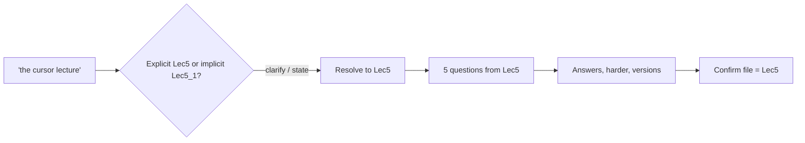

# S017 — Ambiguous "cursor lecture", clarify then build

## Tests

With no file selected, "the cursor lecture" is ambiguous between the explicit-cursor lecture (Lec5)
and the implicit-cursor lecture (Lec5_1); Fazah should flag that ambiguity rather than silently
guess, then — once told it is the explicit one — build five questions from Lec5 and sustain answers,
difficulty edits, a student version, a teacher key, and a source confirmation.

## Setup

- Start: New chat
- Select files: none (the course contains both `Lec5.pdf` explicit and `Lec5_1.pdf` implicit)
- Do not select: any file — leave sources unselected so the "cursor lecture" ambiguity stands
- Turns: 8
- Auditor variation: Not allowed

## Workflow



---

## Turn 1

### Enter

```text
hmm make 5 questions from the cursor lecture
```

### Expect

- Recognizes "the cursor lecture" is ambiguous — two candidates: `Lec5.pdf` (explicit cursors) vs
  `Lec5_1.pdf` (implicit cursors) — and EITHER asks which one OR clearly states which it will use.
- Does not silently pick one without saying so, and does not invent a source or fabricate cursor
  content.
- If it proceeds on a stated assumption, the assumption is explicit; if it waits, no questions yet.

### Record

- Actual prompt entered:
- Files selected:
- Files Fazah used:
- Result: Pass / Small Issue / Fail / Critical Fail
- Short note:

---

## Turn 2  (continue the same chat)

### Enter

```text
i mean the explicit cursors one, Lec5
```

### Expect

- Accepts the explicit-cursor lecture `Lec5.pdf` as the source; if it had assumed the implicit one,
  it corrects itself.
- Confirms it will build from Lec5 (explicit cursors), not Lec5_1.
- No implicit-cursor (`SQL%`) material pulled in; no invented source.

### Record

- Actual prompt entered:
- Files selected:
- Files Fazah used:
- Result: Pass / Small Issue / Fail / Critical Fail
- Short note:

---

## Turn 3  (continue the same chat)

### Enter

```text
ok go ahead n make them
```

### Expect

- Produces exactly 5 questions grounded in Lec5 explicit cursors — e.g. the four-step lifecycle
  (`DECLARE` → `OPEN` → `FETCH ... INTO` → `CLOSE`), `%FOUND`/`%NOTFOUND`/`%ROWCOUNT`, loop-fetch styles.
- No implicit-cursor `SQL%` attributes and no fabricated columns/tables (deck uses `employees`).
- Still grounded in `Lec5.pdf`.

### Record

- Actual prompt entered:
- Files selected:
- Files Fazah used:
- Result: Pass / Small Issue / Fail / Critical Fail
- Short note:

---

## Turn 4  (continue the same chat)

### Enter

```text
add answers to each of the 5
```

### Expect

- The same 5 questions are kept (not regenerated); each gets a correct answer supported by Lec5.
- Answers stay within explicit-cursor content (lifecycle, attributes, fetch loops).
- Still grounded in `Lec5.pdf`.

### Record

- Actual prompt entered:
- Files selected:
- Files Fazah used:
- Result: Pass / Small Issue / Fail / Critical Fail
- Short note:

---

## Turn 5  (continue the same chat)

### Enter

```text
make 2 of them harder
```

### Expect

- Exactly 2 of the 5 are upgraded to harder items (e.g. trace-the-output or complete-the-cursor);
  the other 3 are unchanged.
- Still 5 questions total, still grounded in Lec5; no new topics introduced.
- Answers updated to match the harder items.

### Record

- Actual prompt entered:
- Files selected:
- Files Fazah used:
- Result: Pass / Small Issue / Fail / Critical Fail
- Short note:

---

## Turn 6  (continue the same chat)

### Enter

```text
student version, no answers
```

### Expect

- The same 5 questions in a student-facing version with NO answers shown
  (answer-leakage check — leaked answers = Critical fail).
- The teacher version (with answers) from Turns 4–5 is preserved; only the student copy is produced.

### Record

- Actual prompt entered:
- Files selected:
- Files Fazah used:
- Result: Pass / Small Issue / Fail / Critical Fail
- Short note:

---

## Turn 7  (continue the same chat)

### Enter

```text
now the teacher key
```

### Expect

- Produces the teacher answer key for all 5 questions, restoring the correct answers per Lec5.
- Consistent with the student version (same 5 questions, including the 2 harder ones).
- Still grounded in `Lec5.pdf`.

### Record

- Actual prompt entered:
- Files selected:
- Files Fazah used:
- Result: Pass / Small Issue / Fail / Critical Fail
- Short note:

---

## Turn 8  (continue the same chat)

### Enter

```text
just to confirm which actual file did u use
```

### Expect

- Names `Lec5.pdf` (explicit cursors) as the source used throughout, matching the Turn 2 resolution.
- Does not claim `Lec5_1.pdf` (implicit) or any file that was never selected, and does not invent one.
- Does not hedge that it had no source.

### Record

- Actual prompt entered:
- Files selected:
- Files Fazah used:
- Result: Pass / Small Issue / Fail / Critical Fail
- Short note:

---

## Final Check

- Understood the request: Yes / Mostly / No
- Used the correct source: Yes / Partly / No / N/A
- Output is usable: Yes / Needs editing / No
- Conversation handled correctly: Yes / Mostly / No / N/A

## Overall

- [ ] Pass
- [ ] Pass with small issue
- [ ] Fail
- [ ] Critical fail

## Main issue

- [ ] None
- [ ] Misunderstood request
- [ ] Wrong source
- [ ] Ignored selected file
- [ ] Incorrect content
- [ ] Missed instruction
- [ ] Clarification problem
- [ ] Lost previous work
- [ ] Changed unrelated content
- [ ] Exposed student answers
- [ ] Error or timeout
- [ ] Other

## One-line note

Fazah should improve:

For the complete workflow, see [Context Diagram](../misc/CONTEXT-DIAGRAM.md).
