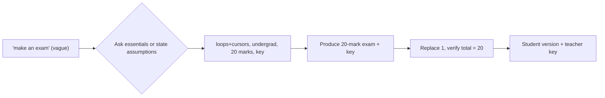

# S020 — Underspecified exam, built through minimal clarification

## Tests

A one-line vague "make an exam" should not be silently guessed; Fazah should gather the essentials
(topic, level, marks, teacher key) or state clear assumptions, then produce a ~20-mark exam over
loops (Lec3) and cursors (Lec5) with a teacher key, and sustain a replace, a total check, a student
version, and a teacher key.

## Setup

- Start: New chat
- Select files: none (topics are named in chat; Fazah maps loops → `Lec3.pdf`, cursors → `Lec5.pdf`)
- Do not select: any file — leave sources unselected so topic-mapping and clarification are tested
- Turns: 9
- Auditor variation: Allowed (see `## Auditor variation`)

## Workflow



---

## Turn 1

### Enter

```text
hmm can u make an exam
```

### Expect

- Does not silently produce a full exam from nothing.
- Asks for the essentials — topic/scope, level, marks or length, whether a teacher key is needed —
  OR states explicit assumptions before proceeding.
- No invented content or sources.

### Record

- Actual prompt entered:
- Files selected:
- Files Fazah used:
- Result: Pass / Small Issue / Fail / Critical Fail
- Short note:

---

## Turn 2  (continue the same chat)

### Enter

```text
cover loops and cursors
```

### Expect

- Maps loops → `Lec3.pdf` and cursors → the cursor lecture(s) — `Lec5.pdf` (explicit); may note
  implicit `Lec5_1.pdf`.
- Confirms the scope; may still ask the remaining essentials (level, marks, key).
- Grounded topics only; no fabricated content.

### Record

- Actual prompt entered:
- Files selected:
- Files Fazah used:
- Result: Pass / Small Issue / Fail / Critical Fail
- Short note:

---

## Turn 3  (continue the same chat)

### Enter

```text
for undergraduate students
```

### Expect

- Notes the level (undergraduate) and factors it in.
- May still ask the remaining essentials (marks/length, teacher key).
- No exam content invented yet; no invented source.

### Record

- Actual prompt entered:
- Files selected:
- Files Fazah used:
- Result: Pass / Small Issue / Fail / Critical Fail
- Short note:

---

## Turn 4  (continue the same chat)

### Enter

```text
about 20 marks, n include a teacher answer key
```

### Expect

- Captures the 20-mark total and that a teacher answer key is required.
- Now has enough to build (loops+cursors, undergrad, ~20 marks, key); may restate the plan.
- Still no fabricated content beyond Lec3/Lec5.

### Record

- Actual prompt entered:
- Files selected:
- Files Fazah used:
- Result: Pass / Small Issue / Fail / Critical Fail
- Short note:

---

## Turn 5  (continue the same chat)

### Enter

```text
ok produce the exam
```

### Expect

- Produces an exam over loops (Lec3) and cursors (Lec5) totalling ~20 marks, with per-question marks
  and a teacher answer key.
- Undergraduate-appropriate; grounded in Lec3/Lec5 (simple/while/for loops; cursor lifecycle,
  attributes, fetch loops); no fabricated columns/tables.
- No implicit-cursor `SQL%` content unless Lec5_1 was explicitly included.

### Record

- Actual prompt entered:
- Files selected:
- Files Fazah used:
- Result: Pass / Small Issue / Fail / Critical Fail
- Short note:

---

## Turn 6  (continue the same chat)

### Enter

```text
one of these is too easy, replace it w a harder one
```

### Expect

- Replaces exactly one question with a harder one (e.g. trace-output or write-a-cursor/loop); the
  rest are kept.
- Total marks still ~20 (or re-balanced and the change noted); still grounded in Lec3/Lec5.
- The teacher key is updated for the replaced item.

### Record

- Actual prompt entered:
- Files selected:
- Files Fazah used:
- Result: Pass / Small Issue / Fail / Critical Fail
- Short note:

---

## Turn 7  (continue the same chat)

### Enter

```text
verify the total is 20 marks
```

### Expect

- Sums the per-question marks and confirms the total is 20 — or flags the discrepancy and fixes it.
- Arithmetic is shown or internally consistent, not just asserted.
- Exam content otherwise unchanged.

### Record

- Actual prompt entered:
- Files selected:
- Files Fazah used:
- Result: Pass / Small Issue / Fail / Critical Fail
- Short note:

---

## Turn 8  (continue the same chat)

### Enter

```text
student version, no answers
```

### Expect

- The full exam in a student-facing version with NO answers and NO teacher key shown
  (answer-leakage check — leaked answers/key = Critical fail).
- Question set and marks preserved; only the answers/key are withheld.

### Record

- Actual prompt entered:
- Files selected:
- Files Fazah used:
- Result: Pass / Small Issue / Fail / Critical Fail
- Short note:

---

## Turn 9  (continue the same chat)

### Enter

```text
and the teacher key
```

### Expect

- Produces a teacher answer key for every question, grounded in Lec3/Lec5.
- Consistent with the final exam (same questions/marks, including the Turn 6 replacement and the
  verified 20-mark total).

### Record

- Actual prompt entered:
- Files selected:
- Files Fazah used:
- Result: Pass / Small Issue / Fail / Critical Fail
- Short note:

---

## Auditor variation

Re-run once with one essential changed to check the same clarify-then-build discipline and grounding
hold. Change only one thing and keep the rest of the arc:

- Change the marks total — e.g. "about 30 marks" instead of 20 (the Turn 7 check must then confirm 30).
- Change the level — e.g. postgraduate or high-school instead of undergraduate.
- Add a constraint — e.g. a time limit ("45 min exam") that must appear on the exam.
- Restrict to one topic — e.g. loops only (grounds in `Lec3.pdf` alone; cursors absent).

Whichever variation is used, preserve every number/constraint for that run, expect the same
essentials-gathering (no silent guess), grounding in the mapped lecture(s), and no answer leakage in
the student version.

---

## Final Check

- Understood the request: Yes / Mostly / No
- Used the correct source: Yes / Partly / No / N/A
- Output is usable: Yes / Needs editing / No
- Conversation handled correctly: Yes / Mostly / No / N/A

## Overall

- [ ] Pass
- [ ] Pass with small issue
- [ ] Fail
- [ ] Critical fail

## Main issue

- [ ] None
- [ ] Misunderstood request
- [ ] Wrong source
- [ ] Ignored selected file
- [ ] Incorrect content
- [ ] Missed instruction
- [ ] Clarification problem
- [ ] Lost previous work
- [ ] Changed unrelated content
- [ ] Exposed student answers
- [ ] Error or timeout
- [ ] Other

## One-line note

Fazah should improve:

For the complete workflow, see [Context Diagram](../misc/CONTEXT-DIAGRAM.md).
