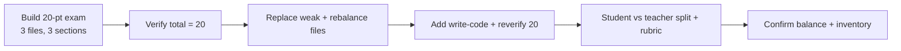

# S030 — Multi-file 20-point exam

## Tests

Across three selected lectures, Fazah builds a balanced 20-point, three-section exam, then holds the
20-point total and even file coverage through verify / replace / rebalance / add-section edits, and
finally splits it into a student version, a separate teacher key, and a rubric — all grounded in the
three files, with a correct final inventory.

## Setup

- Start: New chat
- Select files: `Lec3.pdf` (loops), `Lec4.pdf` (SELECT INTO / %TYPE / %ROWTYPE), `Lec5.pdf`
  (explicit cursors)
- Do not select: any other lecture
- Turns: 12
- Auditor variation: Not allowed

## Workflow



---

## Turn 1

### Enter

```text
need a 20 point exam. 3 sections, mix of question types, balance it across the 3 files i selected (loops, select into, cursors). must include a teacher key
```

### Expect

- A 20-point exam in 3 sections with a mix of question types, drawing on Lec3 (loops), Lec4
  (SELECT INTO / %TYPE / %ROWTYPE), and Lec5 (explicit cursors), plus a teacher key.
- Point values are allotted and the stated sum is 20; coverage spans all 3 selected files.
- Grounded in the 3 files (employees/jobs, cursor lifecycle, loop styles); no unselected lecture.

### Record

- Actual prompt entered:
- Files selected:
- Files Fazah used:
- Result: Pass / Small Issue / Fail / Critical Fail
- Short note:

---

## Turn 2  (continue the same chat)

### Enter

```text
verify the total comes to exactly 20 pts
```

### Expect

- Re-lists the per-section point values and confirms they total 20 (or flags and fixes if not).
- No questions rewritten just to run the check; content preserved.
- Still 3 sections across the 3 files.

### Record

- Actual prompt entered:
- Files selected:
- Files Fazah used:
- Result: Pass / Small Issue / Fail / Critical Fail
- Short note:

---

## Turn 3  (continue the same chat)

### Enter

```text
one of these is weak, replace it
```

### Expect

- Exactly one question is replaced with a new grounded question; the other questions are unchanged.
- Total stays 20; still 3 sections.
- Replacement is grounded in whichever of Lec3/Lec4/Lec5 it belongs to.

### Record

- Actual prompt entered:
- Files selected:
- Files Fazah used:
- Result: Pass / Small Issue / Fail / Critical Fail
- Short note:

---

## Turn 4  (continue the same chat)

### Enter

```text
rebalance it so all 3 files are evenly represented
```

### Expect

- Questions are redistributed so Lec3 / Lec4 / Lec5 are evenly represented; still 20 points, 3
  sections.
- Only the balance changes — the teacher key is kept and no wholesale rewrite happens.
- Coverage stays grounded in the 3 selected files.

### Record

- Actual prompt entered:
- Files selected:
- Files Fazah used:
- Result: Pass / Small Issue / Fail / Critical Fail
- Short note:

---

## Turn 5  (continue the same chat)

### Enter

```text
add a short write the code section, total must stay 20
```

### Expect

- A short "write the code" section is added and points are re-allocated so the total is still 20.
- Existing sections are preserved (possibly re-pointed); write-code tasks are grounded (write a
  loop / a SELECT INTO / an explicit cursor).
- Still grounded in Lec3/Lec4/Lec5.

### Record

- Actual prompt entered:
- Files selected:
- Files Fazah used:
- Result: Pass / Small Issue / Fail / Critical Fail
- Short note:

---

## Turn 6  (continue the same chat)

### Enter

```text
verify its still 20
```

### Expect

- Confirms the total is still exactly 20 after the write-code section (lists the per-section points).
- Honest if it does not sum to 20 — fixes rather than misreports.
- No unrelated content changed.

### Record

- Actual prompt entered:
- Files selected:
- Files Fazah used:
- Result: Pass / Small Issue / Fail / Critical Fail
- Short note:

---

## Turn 7  (continue the same chat)

### Enter

```text
label every q w its source file
```

### Expect

- Each question is labeled with its source file (Lec3 / Lec4 / Lec5); labels match the question's
  actual topic.
- No question mislabeled to a file that does not cover it (e.g. a loop question tagged Lec5).
- Only labels are added; nothing else changed.

### Record

- Actual prompt entered:
- Files selected:
- Files Fazah used:
- Result: Pass / Small Issue / Fail / Critical Fail
- Short note:

---

## Turn 8  (continue the same chat)

### Enter

```text
now the student version, no answers
```

### Expect

- A student-facing version of the exam with NO answers and NO teacher key
  (answer-leakage check — leaked answers = Critical fail).
- Same questions, sections, and 20 points; the teacher version is preserved.

### Record

- Actual prompt entered:
- Files selected:
- Files Fazah used:
- Result: Pass / Small Issue / Fail / Critical Fail
- Short note:

---

## Turn 9  (continue the same chat)

### Enter

```text
teacher answer key as a separate doc
```

### Expect

- A separate teacher answer-key document with the correct answers/marks, grounded in the 3 files.
- The student version stays answer-free; the question set is unchanged.

### Record

- Actual prompt entered:
- Files selected:
- Files Fazah used:
- Result: Pass / Small Issue / Fail / Critical Fail
- Short note:

---

## Turn 10  (continue the same chat)

### Enter

```text
make a rubric for the write the code section
```

### Expect

- A rubric for the write-the-code section (criteria / levels) consistent with what those tasks ask
  (correct loop / cursor / SELECT INTO usage).
- The rest of the exam is untouched.
- Rubric content stays within the 3 files' scope.

### Record

- Actual prompt entered:
- Files selected:
- Files Fazah used:
- Result: Pass / Small Issue / Fail / Critical Fail
- Short note:

---

## Turn 11  (continue the same chat)

### Enter

```text
confirm coverage is balanced across all 3 files
```

### Expect

- Confirms coverage is balanced across Lec3 / Lec4 / Lec5, referencing per-file question counts.
- Honest report; does not claim a balance it cannot show.
- Names only the 3 selected files.

### Record

- Actual prompt entered:
- Files selected:
- Files Fazah used:
- Result: Pass / Small Issue / Fail / Critical Fail
- Short note:

---

## Turn 12  (continue the same chat)

### Enter

```text
give me a final inventory of everything you produced
```

### Expect

- Lists everything produced: the 20-point exam (3 sections + write-code), the student version, the
  separate teacher key, and the rubric — plus the 3 source files.
- Inventory matches what was actually created; names Lec3 / Lec4 / Lec5 only.
- No invented artifacts or sources.

### Record

- Actual prompt entered:
- Files selected:
- Files Fazah used:
- Result: Pass / Small Issue / Fail / Critical Fail
- Short note:

---

## Final Check

- Understood the request: Yes / Mostly / No
- Used the correct source: Yes / Partly / No / N/A
- Output is usable: Yes / Needs editing / No
- Conversation handled correctly: Yes / Mostly / No / N/A

## Overall

- [ ] Pass
- [ ] Pass with small issue
- [ ] Fail
- [ ] Critical fail

## Main issue

- [ ] None
- [ ] Misunderstood request
- [ ] Wrong source
- [ ] Ignored selected file
- [ ] Incorrect content
- [ ] Missed instruction
- [ ] Clarification problem
- [ ] Lost previous work
- [ ] Changed unrelated content
- [ ] Exposed student answers
- [ ] Error or timeout
- [ ] Other

## One-line note

Fazah should improve:

For the complete workflow, see [Context Diagram](../misc/CONTEXT-DIAGRAM.md).
