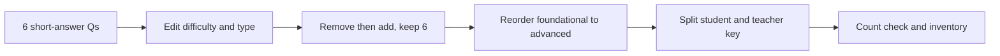

# S035 — Complete conditionals assessment lifecycle

## Tests

With the conditionals lecture selected, Fazah runs a full 12-turn assessment lifecycle on IF/CASE —
selective difficulty and format edits, remove-then-add with an exact count, foundational-to-advanced
reordering, and a clean student/teacher split — all grounded in the same lecture without losing prior
work or leaking answers.

## Setup

- Start: New chat
- Select files: `Lec2.pdf` (conditionals — IF / CASE)
- Do not select: any other lecture
- Turns: 12
- Auditor variation: Not allowed

## Workflow



---

## Turn 1

### Enter

```text
make 6 short-answer questions on conditionals w answers
```

### Expect

- Produces exactly 6 short-answer questions on conditionals (IF / IF..ELSIF / CASE), each with an
  answer — matching Lec2.
- Content stays within the deck (grade-band IF..ELSIF, selector vs searched CASE); nothing invented.
- Grounded in `Lec2.pdf` (grounding badge / Lec2 under used sources).

### Record

- Actual prompt entered:
- Files selected:
- Files Fazah used:
- Result: Pass / Small Issue / Fail / Critical Fail
- Short note:

---

## Turn 2  (continue the same chat)

### Enter

```text
make questions 2 and 6 harder
```

### Expect

- Only questions 2 and 6 are made harder; questions 1, 3, 4, 5 are unchanged.
- Still exactly 6 questions, each with an answer; still Lec2 content.
- No unrelated content changed (edit preserves the rest).

### Record

- Actual prompt entered:
- Files selected:
- Files Fazah used:
- Result: Pass / Small Issue / Fail / Critical Fail
- Short note:

---

## Turn 3  (continue the same chat)

### Enter

```text
replace question 3 with a trace-the-output question
```

### Expect

- Question 3 becomes a trace-the-output item over a small Lec2 IF/CASE block (e.g. grade-band
  classifier); the other 5 are kept.
- Still exactly 6 questions with answers; the traced output matches the deck's logic.
- Grounded in Lec2; no fabricated constructs.

### Record

- Actual prompt entered:
- Files selected:
- Files Fazah used:
- Result: Pass / Small Issue / Fail / Critical Fail
- Short note:

---

## Turn 4  (continue the same chat)

### Enter

```text
remove any question about searched CASE
```

### Expect

- Removes only questions about searched CASE (leaving selector CASE / IF items intact); does not
  delete unrelated questions.
- The resulting count is stated; if none matched, it says so rather than deleting arbitrarily.
- Still grounded in Lec2.

### Record

- Actual prompt entered:
- Files selected:
- Files Fazah used:
- Result: Pass / Small Issue / Fail / Critical Fail
- Short note:

---

## Turn 5  (continue the same chat)

### Enter

```text
add one question about nested IF, keeping 6 total
```

### Expect

- Adds one nested-IF question (Lec2's validate-then-grade pattern) and brings the total back to
  exactly 6.
- The previously kept questions are preserved.
- Grounded in Lec2.

### Record

- Actual prompt entered:
- Files selected:
- Files Fazah used:
- Result: Pass / Small Issue / Fail / Critical Fail
- Short note:

---

## Turn 6  (continue the same chat)

### Enter

```text
reorder foundational to advanced
```

### Expect

- Reorders the 6 questions from foundational to advanced; no question content is changed, added, or
  dropped.
- Still exactly 6 questions with answers.
- Grounded in Lec2.

### Record

- Actual prompt entered:
- Files selected:
- Files Fazah used:
- Result: Pass / Small Issue / Fail / Critical Fail
- Short note:

---

## Turn 7  (continue the same chat)

### Enter

```text
clean student version, no answers
```

### Expect

- A student-facing version of all 6 questions with NO answers shown (answer-leakage check — leaked
  answers = Critical fail).
- Question wording and order preserved from the current set.
- The teacher set with answers is not destroyed.

### Record

- Actual prompt entered:
- Files selected:
- Files Fazah used:
- Result: Pass / Small Issue / Fail / Critical Fail
- Short note:

---

## Turn 8  (continue the same chat)

### Enter

```text
separate teacher key without changing the student version
```

### Expect

- Produces a separate teacher key (questions + answers) while the student version from Turn 7 stays
  answer-free and unchanged.
- Both versions cover the same 6 questions.
- Grounded in Lec2.

### Record

- Actual prompt entered:
- Files selected:
- Files Fazah used:
- Result: Pass / Small Issue / Fail / Critical Fail
- Short note:

---

## Turn 9  (continue the same chat)

### Enter

```text
add a short explanation to each answer in the key
```

### Expect

- Adds a short explanation to each answer in the teacher key only.
- The student version stays answer-free (leakage check).
- Explanations stay consistent with Lec2; nothing invented.

### Record

- Actual prompt entered:
- Files selected:
- Files Fazah used:
- Result: Pass / Small Issue / Fail / Critical Fail
- Short note:

---

## Turn 10  (continue the same chat)

### Enter

```text
turn one question into multiple choice
```

### Expect

- Converts exactly one question into a multiple-choice item with exactly one correct option; the
  other 5 keep their format.
- Still 6 questions total; teacher key updated, student version stays answer-free.
- Grounded in Lec2.

### Record

- Actual prompt entered:
- Files selected:
- Files Fazah used:
- Result: Pass / Small Issue / Fail / Critical Fail
- Short note:

---

## Turn 11  (continue the same chat)

### Enter

```text
how many questions are there now
```

### Expect

- Answers 6.
- Consistent with the running set (no miscount).

### Record

- Actual prompt entered:
- Files selected:
- Files Fazah used:
- Result: Pass / Small Issue / Fail / Critical Fail
- Short note:

---

## Turn 12  (continue the same chat)

### Enter

```text
which file did you use + list everything we made
```

### Expect

- Names `Lec2.pdf` as the source used throughout; does not claim an unselected file.
- Lists the artifacts built (the 6-question set, the student version, the teacher key with
  explanations).
- Does not hedge that it had no source.

### Record

- Actual prompt entered:
- Files selected:
- Files Fazah used:
- Result: Pass / Small Issue / Fail / Critical Fail
- Short note:

---

## Final Check

- Understood the request: Yes / Mostly / No
- Used the correct source: Yes / Partly / No / N/A
- Output is usable: Yes / Needs editing / No
- Conversation handled correctly: Yes / Mostly / No / N/A

## Overall

- [ ] Pass
- [ ] Pass with small issue
- [ ] Fail
- [ ] Critical fail

## Main issue

- [ ] None
- [ ] Misunderstood request
- [ ] Wrong source
- [ ] Ignored selected file
- [ ] Incorrect content
- [ ] Missed instruction
- [ ] Clarification problem
- [ ] Lost previous work
- [ ] Changed unrelated content
- [ ] Exposed student answers
- [ ] Error or timeout
- [ ] Other

## One-line note

Fazah should improve:

For the complete workflow, see [Context Diagram](../misc/CONTEXT-DIAGRAM.md).
