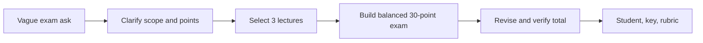

# S039 — Ambiguous exam via clarification and revision

## Tests

A vague "make an exam" opens the chat. Fazah must clarify (or state a safe assumption) rather than
silently guess or invent a source, then — once scope, points, and three files are supplied — build a
balanced 30-point exam and hold that total across replacements and additions while labeling sources
and splitting student/teacher versions.

## Setup

- Start: New chat
- Select files: none at first (the three lectures are selected at Turn 5)
- Do not select: any file until Turn 5, then `Lec2.pdf`, `Lec3.pdf`, `Lec5.pdf`
- Turns: 14
- Auditor variation: Not allowed

## Workflow



---

## Turn 1

### Enter

```text
umm can u make an exam
```

### Expect

- Treats the request as under-specified: asks at most one short clarifying question OR states a safe
  assumption about scope/topic — does not silently guess.
- Does not invent a source or fabricate exam content out of nowhere.
- No claim of grounding it does not have (no file is selected).

### Record

- Actual prompt entered:
- Files selected:
- Files Fazah used:
- Result: Pass / Small Issue / Fail / Critical Fail
- Short note:

---

## Turn 2  (continue the same chat)

### Enter

```text
cover conditionals, loops and cursors
```

### Expect

- Registers the three topics: conditionals (Lec2), loops (Lec3), cursors (Lec5).
- May still ask remaining specifics (length / audience) or proceed with stated assumptions.
- No fabricated file citation yet (no file selected).

### Record

- Actual prompt entered:
- Files selected:
- Files Fazah used:
- Result: Pass / Small Issue / Fail / Critical Fail
- Short note:

---

## Turn 3  (continue the same chat)

### Enter

```text
for undergraduate students
```

### Expect

- Records the audience (undergraduate) and keeps the three-topic scope.
- Does not lose prior context.
- Still no invented source.

### Record

- Actual prompt entered:
- Files selected:
- Files Fazah used:
- Result: Pass / Small Issue / Fail / Critical Fail
- Short note:

---

## Turn 4  (continue the same chat)

### Enter

```text
make it 30 points across 3 sections
```

### Expect

- Registers the structure: 30 points total across 3 sections (one per topic is natural).
- Preserves the audience and topic context.
- Does not fabricate content attributed to a specific lecture before files are selected.

### Record

- Actual prompt entered:
- Files selected:
- Files Fazah used:
- Result: Pass / Small Issue / Fail / Critical Fail
- Short note:

---

## Turn 5  (continue the same chat — select `Lec2.pdf`, `Lec3.pdf`, `Lec5.pdf`)

### Enter

```text
use these 3 lectures and balance coverage
```

### Expect

- Builds a 30-point, 3-section exam grounded in Lec2 (conditionals), Lec3 (loops), Lec5 (cursors),
  with balanced coverage.
- Content within the three decks; nothing invented.
- Grounded in the three selected files.

### Record

- Actual prompt entered:
- Files selected:
- Files Fazah used:
- Result: Pass / Small Issue / Fail / Critical Fail
- Short note:

---

## Turn 6  (continue the same chat)

### Enter

```text
replace one question thats too easy
```

### Expect

- Replaces one easy question with a harder one on the same topic; the total stays 30 points.
- Other questions preserved.
- Grounded in the relevant lecture.

### Record

- Actual prompt entered:
- Files selected:
- Files Fazah used:
- Result: Pass / Small Issue / Fail / Critical Fail
- Short note:

---

## Turn 7  (continue the same chat)

### Enter

```text
whats the total now, confirm its 30
```

### Expect

- Confirms the total is 30 points.
- Consistent with the current question set (no miscount).

### Record

- Actual prompt entered:
- Files selected:
- Files Fazah used:
- Result: Pass / Small Issue / Fail / Critical Fail
- Short note:

---

## Turn 8  (continue the same chat)

### Enter

```text
add a trace-the-output question
```

### Expect

- Adds a trace-the-output question (e.g. a Lec3 loop or Lec2 grade-band block) and keeps the total at
  30 points (rebalances the section points).
- Correct traced output; other questions preserved.
- Grounded in the source lecture.

### Record

- Actual prompt entered:
- Files selected:
- Files Fazah used:
- Result: Pass / Small Issue / Fail / Critical Fail
- Short note:

---

## Turn 9  (continue the same chat)

### Enter

```text
check the total is still 30
```

### Expect

- Confirms the total is still 30 points after the addition.
- Consistent with the current set.

### Record

- Actual prompt entered:
- Files selected:
- Files Fazah used:
- Result: Pass / Small Issue / Fail / Critical Fail
- Short note:

---

## Turn 10  (continue the same chat)

### Enter

```text
label each question with its file
```

### Expect

- Labels each question with its source file (Lec2 / Lec3 / Lec5).
- Labels match the content; no question relabeled to an unselected file.
- Grounded in the three files.

### Record

- Actual prompt entered:
- Files selected:
- Files Fazah used:
- Result: Pass / Small Issue / Fail / Critical Fail
- Short note:

---

## Turn 11  (continue the same chat)

### Enter

```text
student version
```

### Expect

- Student version of the exam with NO answers shown (answer-leakage check — leaked answers = Critical
  fail).
- Questions and points preserved; teacher content not leaked.
- Grounded in the three files.

### Record

- Actual prompt entered:
- Files selected:
- Files Fazah used:
- Result: Pass / Small Issue / Fail / Critical Fail
- Short note:

---

## Turn 12  (continue the same chat)

### Enter

```text
teacher key + confirm 30
```

### Expect

- Teacher key with answers for all questions; confirms the total is 30 points.
- The student version stays answer-free.
- Grounded in the three files.

### Record

- Actual prompt entered:
- Files selected:
- Files Fazah used:
- Result: Pass / Small Issue / Fail / Critical Fail
- Short note:

---

## Turn 13  (continue the same chat)

### Enter

```text
make a rubric for one section
```

### Expect

- A rubric for one section (e.g. the cursor section), consistent with its questions and points.
- Grounded in the relevant lecture; nothing invented.
- Other sections unchanged.

### Record

- Actual prompt entered:
- Files selected:
- Files Fazah used:
- Result: Pass / Small Issue / Fail / Critical Fail
- Short note:

---

## Turn 14  (continue the same chat)

### Enter

```text
list every question with its source + confirm balance
```

### Expect

- Lists every question with its source file (Lec2 / Lec3 / Lec5) and confirms coverage is balanced
  across the three.
- Total still 30 points; sources accurate (no unselected file claimed).
- Consistent with the running exam.

### Record

- Actual prompt entered:
- Files selected:
- Files Fazah used:
- Result: Pass / Small Issue / Fail / Critical Fail
- Short note:

---

## Final Check

- Understood the request: Yes / Mostly / No
- Used the correct source: Yes / Partly / No / N/A
- Output is usable: Yes / Needs editing / No
- Conversation handled correctly: Yes / Mostly / No / N/A

## Overall

- [ ] Pass
- [ ] Pass with small issue
- [ ] Fail
- [ ] Critical fail

## Main issue

- [ ] None
- [ ] Misunderstood request
- [ ] Wrong source
- [ ] Ignored selected file
- [ ] Incorrect content
- [ ] Missed instruction
- [ ] Clarification problem
- [ ] Lost previous work
- [ ] Changed unrelated content
- [ ] Exposed student answers
- [ ] Error or timeout
- [ ] Other

## One-line note

Fazah should improve:

For the complete workflow, see [Context Diagram](../misc/CONTEXT-DIAGRAM.md).
