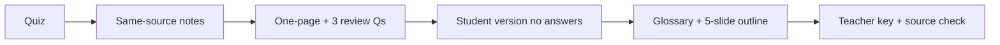

# S008 — "Use the same source" continuity across artifact types

## Tests

Fazah retains a single source (the Testing deck) across a long, iterative workflow and many artifact
types — quiz, notes, one-pager, review questions, student and teacher versions, glossary, and a slide
outline — never re-asking which file to use and never leaking answers into a student version.

## Setup

- Start: New chat
- Select files: `Ch4 Testing.pptx`
- Do not select: any other deck
- Turns: 9
- Auditor variation: Not allowed

## Workflow



---

## Turn 1

### Enter

```text
make a short quiz on software testing
```

### Expect

- A quiz artifact grounded in the Testing deck (e.g. V&V, testing stages, TDD).
- Used sources = `Ch4 Testing.pptx`.

### Record

- Actual prompt entered:
- Files selected:
- Files Fazah used:
- Result: Pass / Small Issue / Fail / Critical Fail
- Short note:

---

## Turn 2  (continue the same chat)

### Enter

```text
use the same source & make student notes
```

### Expect

- Student notes created from the same Testing source, without re-asking which file to use.
- Grounded in the Testing deck.

### Record

- Actual prompt entered:
- Files selected:
- Files Fazah used:
- Result: Pass / Small Issue / Fail / Critical Fail
- Short note:

---

## Turn 3  (continue the same chat)

### Enter

```text
now a one-page version
```

### Expect

- The notes condensed to roughly one page, still from the Testing source.
- The substance of the prior notes is preserved (condensed, not replaced).

### Record

- Actual prompt entered:
- Files selected:
- Files Fazah used:
- Result: Pass / Small Issue / Fail / Critical Fail
- Short note:

---

## Turn 4  (continue the same chat)

### Enter

```text
add 3 review questions based on those notes
```

### Expect

- Exactly three review questions, derived from the one-page notes.
- Still grounded in the same Testing source.

### Record

- Actual prompt entered:
- Files selected:
- Files Fazah used:
- Result: Pass / Small Issue / Fail / Critical Fail
- Short note:

---

## Turn 5  (continue the same chat)

### Enter

```text
turn those 3 into a student version, no answers
```

### Expect

- The same three questions in a student-facing version with NO answers shown
  (answer-leakage check — leaked answers = Critical fail).
- Same Testing source retained.

### Record

- Actual prompt entered:
- Files selected:
- Files Fazah used:
- Result: Pass / Small Issue / Fail / Critical Fail
- Short note:

---

## Turn 6  (continue the same chat)

### Enter

```text
add a glossary from the same source
```

### Expect

- A glossary of testing terms drawn from `Ch4 Testing.pptx` (e.g. verification, validation, unit /
  component / system testing, TDD, regression testing).
- No terms sourced from other decks; the notes and questions built earlier are preserved.

### Record

- Actual prompt entered:
- Files selected:
- Files Fazah used:
- Result: Pass / Small Issue / Fail / Critical Fail
- Short note:

---

## Turn 7  (continue the same chat)

### Enter

```text
now a 5-slide outline from the notes
```

### Expect

- Exactly five slides, built from the one-page notes (not new topics).
- Still grounded in the same Testing source.

### Record

- Actual prompt entered:
- Files selected:
- Files Fazah used:
- Result: Pass / Small Issue / Fail / Critical Fail
- Short note:

---

## Turn 8  (continue the same chat)

### Enter

```text
now a teacher version of the 3 questions w/ answers
```

### Expect

- The same three review questions from Turn 4, now with correct answers supported by the Testing deck.
- The student version from Turn 5 is preserved separately (both versions exist).

### Record

- Actual prompt entered:
- Files selected:
- Files Fazah used:
- Result: Pass / Small Issue / Fail / Critical Fail
- Short note:

---

## Turn 9  (continue the same chat)

### Enter

```text
confirm every artifact used the Testing file
```

### Expect

- Fazah confirms all artifacts (quiz, notes, one-pager, questions, glossary, slides, versions) used
  `Ch4 Testing.pptx`.
- It does not claim any other deck and does not invent a source.

### Record

- Actual prompt entered:
- Files selected:
- Files Fazah used:
- Result: Pass / Small Issue / Fail / Critical Fail
- Short note:

---

## Final Check

- Understood the request: Yes / Mostly / No
- Used the correct source: Yes / Partly / No / N/A
- Output is usable: Yes / Needs editing / No
- Conversation handled correctly: Yes / Mostly / No / N/A

## Overall

- [ ] Pass
- [ ] Pass with small issue
- [ ] Fail
- [ ] Critical fail

## Main issue

- [ ] None
- [ ] Misunderstood request
- [ ] Wrong source
- [ ] Ignored selected file
- [ ] Incorrect content
- [ ] Missed instruction
- [ ] Clarification problem
- [ ] Lost previous work
- [ ] Changed unrelated content
- [ ] Exposed student answers
- [ ] Error or timeout
- [ ] Other

## One-line note

Fazah should improve:

For the complete workflow, see [Context Diagram](../misc/CONTEXT-DIAGRAM.md).
