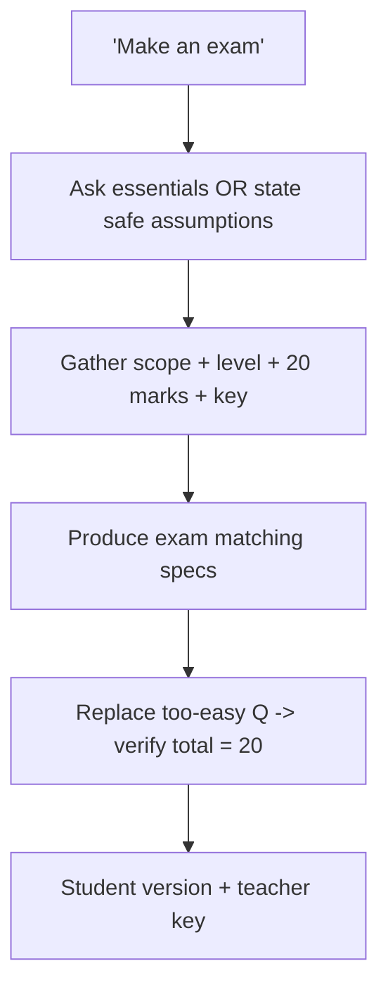

# S020 — Underspecified exam request

## Tests

Fazah handles an underspecified "make an exam" request efficiently — clarifying only the essentials
(or stating safe assumptions) without over-questioning — then builds on accumulated specs across a
sustained workflow: produce, selective replace, count-check, student version, teacher key.

## Setup

- Start: New chat
- Select files: none
- Do not select: any deck (scope is supplied in the conversation)
- Turns: 9
- Auditor variation: Allowed — see the Auditor variation section

## Workflow



---

## Turn 1

### Enter

```text
hmm can u make an exam
```

### Expect

- Recognizes the request is underspecified (no scope, level, or length given).
- Asks only the essential questions OR states safe assumptions for scope, level, and length — a
  short clarification, not a long interrogation.
- Does not fabricate an exam grounded in slides it was never pointed at.

### Record

- Actual prompt entered:
- Files selected:
- Files Fazah used:
- Result: Pass / Small Issue / Fail / Critical Fail
- Short note:

---

## Turn 2   (continue the same chat)

### Enter

```text
cover software testing and requirements engineering i think
```

### Expect

- Accepts the scope (testing + requirements engineering).
- Does not re-ask about scope; moves toward remaining essentials (level / length) if still needed.

### Record

- Actual prompt entered:
- Files selected:
- Files Fazah used:
- Result: Pass / Small Issue / Fail / Critical Fail
- Short note:

---

## Turn 3   (continue the same chat)

### Enter

```text
for undergraduate students
```

### Expect

- Accepts the level (undergraduate) and retains the scope from Turn 2.
- Does not re-ask about level or scope.

### Record

- Actual prompt entered:
- Files selected:
- Files Fazah used:
- Result: Pass / Small Issue / Fail / Critical Fail
- Short note:

---

## Turn 4   (continue the same chat)

### Enter

```text
maybe about 20 marks, n include a teacher answer key
```

### Expect

- Captures the remaining specs: ~20 marks total and a teacher answer key.
- Retains scope (testing + requirements) and level (undergraduate) from earlier turns.
- Does not re-ask anything already provided.

### Record

- Actual prompt entered:
- Files selected:
- Files Fazah used:
- Result: Pass / Small Issue / Fail / Critical Fail
- Short note:

---

## Turn 5   (continue the same chat)

### Enter

```text
ok produce the exam
```

### Expect

- Produces an exam matching the accumulated specs: scope = software testing + requirements
  engineering, undergraduate level, ~20 marks, with a teacher answer key.
- Content grounded in Testing (`Ch4`) and Requirements (`Ch3`) course facts; no fabrication.
- Marks are distributed across questions and shown per question.

### Record

- Actual prompt entered:
- Files selected:
- Files Fazah used:
- Result: Pass / Small Issue / Fail / Critical Fail
- Short note:

---

## Turn 6   (continue the same chat)

### Enter

```text
one of these is too easy, replace it w a harder one
```

### Expect

- Replaces a single (easy) question with a harder one on the same topics; the rest are preserved.
- Marks are re-balanced so the total stays about 20; the answer key is updated for the new question.
- Grounded in Testing / Requirements; updates the active exam as a new version.

### Record

- Actual prompt entered:
- Files selected:
- Files Fazah used:
- Result: Pass / Small Issue / Fail / Critical Fail
- Short note:

---

## Turn 7   (continue the same chat)

### Enter

```text
verify the total is 20 marks
```

### Expect

- Sums the per-question marks and confirms the total (adjusting if the replacement in Turn 6 threw
  it off) so it lands at ~20.
- Reports the actual total honestly rather than just asserting "20"; no silent mismatch.

### Record

- Actual prompt entered:
- Files selected:
- Files Fazah used:
- Result: Pass / Small Issue / Fail / Critical Fail
- Short note:

---

## Turn 8   (continue the same chat)

### Enter

```text
gimme a student version w no answers
```

### Expect

- Produces a student version of the same exam (same questions and marks) with NO answers and no key.
- No correct answers leak into the student version (leakage = Critical fail).

### Record

- Actual prompt entered:
- Files selected:
- Files Fazah used:
- Result: Pass / Small Issue / Fail / Critical Fail
- Short note:

---

## Turn 9   (continue the same chat)

### Enter

```text
and the teacher answer key
```

### Expect

- Produces a teacher answer key matching the current exam's questions one-to-one, with marks.
- Grounded in Testing / Requirements; no new questions invented; consistent with the student version.

### Record

- Actual prompt entered:
- Files selected:
- Files Fazah used:
- Result: Pass / Small Issue / Fail / Critical Fail
- Short note:

---

## Auditor variation

Add or change one realistic instruction. Record exactly what you entered. Do not change the
scenario's main goal.

Examples:

- Change the marks total (e.g. "make it 40 marks instead of 20") and re-verify the total.
- Change the level (e.g. "for postgraduate students" or "for a first-year class").
- Add a time limit (e.g. "and it should be a 60-minute exam").
- Restrict to one of the two topics (e.g. "only cover software testing") and check the other drops.

---

## Final Check

- Understood the request: Yes / Mostly / No
- Used the correct source: Yes / Partly / No / N/A
- Output is usable: Yes / Needs editing / No
- Conversation handled correctly: Yes / Mostly / No / N/A

## Overall

- [ ] Pass
- [ ] Pass with small issue
- [ ] Fail
- [ ] Critical fail

## Main issue

- [ ] None
- [ ] Misunderstood request
- [ ] Wrong source
- [ ] Ignored selected file
- [ ] Incorrect content
- [ ] Missed instruction
- [ ] Clarification problem
- [ ] Lost previous work
- [ ] Changed unrelated content
- [ ] Exposed student answers
- [ ] Error or timeout
- [ ] Other

## One-line note

Fazah should improve:

For the complete workflow, see [Context Diagram](../misc/CONTEXT-DIAGRAM.md).
