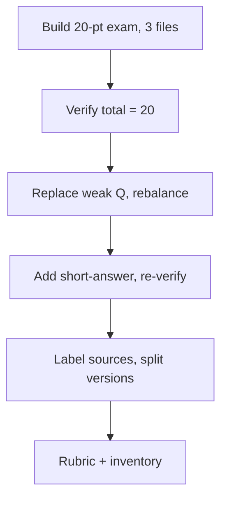

# S030 — Multi-file 20-point exam: build, verify, rebalance, split versions

## Tests

Sustained multi-turn workflow on ONE 20-point exam across three decks: Fazah builds it, verifies the
total twice, replaces a weak question, rebalances coverage, adds a short-answer section, labels sources,
splits into student/teacher versions with no answer leakage, and closes with an honest inventory.

## Setup

- Start: New chat
- Select files: `Ch2 SW Processes.pptx`, `Ch3 Req Eng.pptx`, `Ch4 Testing.pptx`
- Do not select: `Ch1 Introduction.pptx`, `Ch5 Agile SW Dev.pptx`
- Turns: 12
- Auditor variation: Not allowed

## Workflow



---

## Turn 1

### Enter

```text
need a 20 point exam, 3 sections, mix of question types. balance the coverage across the 3 selected
files n include a teacher answer key
```

### Expect

- The exam is worth 20 points total across three sections.
- Question types are mixed (not all one format).
- Coverage spans Software Processes, Requirements Engineering, and Testing.
- A teacher answer key is included.

### Record

- Actual prompt entered:
- Files selected:
- Files Fazah used:
- Result: Pass / Small Issue / Fail / Critical Fail
- Short note:

---

## Turn 2   (continue the same chat; keep the three files selected)

### Enter

```text
verify the total adds up to 20 points
```

### Expect

- Fazah checks the point totals and confirms 20, or corrects the exam so it totals 20.
- The section/point breakdown is shown so the total is auditable.
- No unrelated changes to question content are introduced by the check.

### Record

- Actual prompt entered:
- Files selected:
- Files Fazah used:
- Result: Pass / Small Issue / Fail / Critical Fail
- Short note:

---

## Turn 3   (continue the same chat)

### Enter

```text
replace 1 weak question
```

### Expect

- Exactly one question is replaced; the replacement stays grounded in the selected decks.
- The total is still 20 points after the swap.
- All other questions and sections are unchanged; this is a new version of the same exam.

### Record

- Actual prompt entered:
- Files selected:
- Files Fazah used:
- Result: Pass / Small Issue / Fail / Critical Fail
- Short note:

---

## Turn 4   (continue the same chat)

### Enter

```text
rebalance the coverage so all 3 files are represented evenly
```

### Expect

- Coverage is adjusted toward an even split across the three files.
- The exam still totals 20 points and keeps three sections.
- Only coverage/topic balance shifts; unrelated formatting is preserved.

### Record

- Actual prompt entered:
- Files selected:
- Files Fazah used:
- Result: Pass / Small Issue / Fail / Critical Fail
- Short note:

---

## Turn 5   (continue the same chat)

### Enter

```text
add a short answer section but keep the total at 20 points
```

### Expect

- A short-answer section is added and points are redistributed to still total 20.
- Existing questions from earlier turns are preserved (not discarded to make room).
- Short-answer items stay grounded in the three selected decks.

### Record

- Actual prompt entered:
- Files selected:
- Files Fazah used:
- Result: Pass / Small Issue / Fail / Critical Fail
- Short note:

---

## Turn 6   (continue the same chat)

### Enter

```text
verify the total is still 20
```

### Expect

- Fazah re-checks and confirms 20 after the short-answer addition, or corrects it.
- The updated section/point breakdown is shown and adds to 20.
- No question content changes beyond any needed point correction.

### Record

- Actual prompt entered:
- Files selected:
- Files Fazah used:
- Result: Pass / Small Issue / Fail / Critical Fail
- Short note:

---

## Turn 7   (continue the same chat)

### Enter

```text
label each question w the source file it came from
```

### Expect

- Each question is tagged with `Ch2`, `Ch3`, or `Ch4` (or the full file name).
- Labels match the actual topic (e.g. a waterfall item → Ch2, an NFR item → Ch3, a TDD item → Ch4).
- No question is attributed to a deck that does not cover it.

### Record

- Actual prompt entered:
- Files selected:
- Files Fazah used:
- Result: Pass / Small Issue / Fail / Critical Fail
- Short note:

---

## Turn 8   (continue the same chat)

### Enter

```text
now make a student version, no answers
```

### Expect

- A student version has all questions, sections, point values, and source labels but NO answers.
- Answers/answer key do not appear in the student version (answer-leakage check).
- The student version matches the current 20-point exam.

### Record

- Actual prompt entered:
- Files selected:
- Files Fazah used:
- Result: Pass / Small Issue / Fail / Critical Fail
- Short note:

---

## Turn 9   (continue the same chat)

### Enter

```text
produce the teacher answer key as a separate doc
```

### Expect

- A separate teacher answer key document is produced with the answers.
- The key is consistent with the 20-point exam (same questions, sections, points).
- The student version from Turn 8 remains answer-free.

### Record

- Actual prompt entered:
- Files selected:
- Files Fazah used:
- Result: Pass / Small Issue / Fail / Critical Fail
- Short note:

---

## Turn 10   (continue the same chat)

### Enter

```text
make a rubric for the short answer section
```

### Expect

- A rubric is produced covering the short-answer section's criteria.
- Rubric point weighting is consistent with that section's share of the 20 points.
- Earlier documents (exam, student version, teacher key) are not disturbed.

### Record

- Actual prompt entered:
- Files selected:
- Files Fazah used:
- Result: Pass / Small Issue / Fail / Critical Fail
- Short note:

---

## Turn 11   (continue the same chat)

### Enter

```text
confirm the coverage is balanced across the 3 files
```

### Expect

- Fazah reports the per-file distribution and states whether it is balanced.
- The report reflects the actual labeled questions from Turn 7, not a fabricated split.
- If any file is under-represented, Fazah says so rather than claiming false balance.

### Record

- Actual prompt entered:
- Files selected:
- Files Fazah used:
- Result: Pass / Small Issue / Fail / Critical Fail
- Short note:

---

## Turn 12   (continue the same chat)

### Enter

```text
give me a final inventory of everything you produced
```

### Expect

- Fazah lists the exam, student version, teacher key, and short-answer rubric.
- It names the three source files and does not invent artifacts that were not made.
- The inventory matches the actual conversation history.

### Record

- Actual prompt entered:
- Files selected:
- Files Fazah used:
- Result: Pass / Small Issue / Fail / Critical Fail
- Short note:

---

## Final Check

- Understood the request: Yes / Mostly / No
- Used the correct source: Yes / Partly / No / N/A
- Output is usable: Yes / Needs editing / No
- Conversation handled correctly: Yes / Mostly / No / N/A

## Overall

- [ ] Pass
- [ ] Pass with small issue
- [ ] Fail
- [ ] Critical fail

## Main issue

- [ ] None
- [ ] Misunderstood request
- [ ] Wrong source
- [ ] Ignored selected file
- [ ] Incorrect content
- [ ] Missed instruction
- [ ] Clarification problem
- [ ] Lost previous work
- [ ] Changed unrelated content
- [ ] Exposed student answers
- [ ] Error or timeout
- [ ] Other

## One-line note

Fazah should improve:

For the complete workflow, see [Context Diagram](../misc/CONTEXT-DIAGRAM.md).
