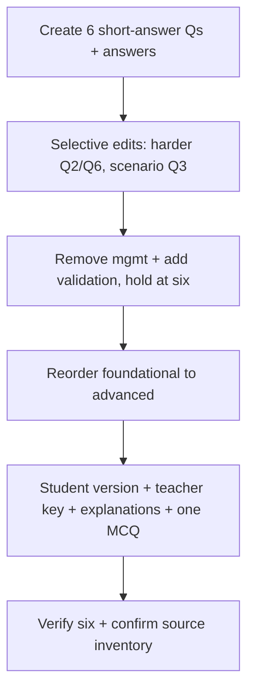

# S035 — Requirements assessment, full editing lifecycle

## Tests

Across twelve turns on one assessment, Fazah performs selective edits, holds the question count at six,
removes and adds by topic, reorders, converts a question to multiple-choice, and separates a no-answers
student version from a teacher key with explanations — all grounded in the Requirements deck.

## Setup

- Start: New chat
- Select files: `Ch3 Req Eng.pptx`
- Do not select: any other deck
- Turns: 12
- Auditor variation: Not allowed

## Workflow



---

## Turn 1

### Enter

```text
make 6 short answer qs on requirements engineering, w answers
```

### Expect

- Exactly six short-answer questions, each with an answer.
- Content is grounded in the Requirements deck (e.g. functional vs non-functional, elicitation,
  validation checks), used source = `Ch3 Req Eng.pptx`.
- No fabricated citation to a deck that was not selected.

### Record

- Actual prompt entered:
- Files selected:
- Files Fazah used:
- Result: Pass / Small Issue / Fail / Critical Fail
- Short note:

---

## Turn 2   (continue the same chat)

### Enter

```text
make qs 2 and 6 harder
```

### Expect

- Only Q2 and Q6 change and become harder.
- The other four questions (Q1, Q3, Q4, Q5) are unchanged.
- Still exactly six questions; a new version of the same set.

### Record

- Actual prompt entered:
- Files selected:
- Files Fazah used:
- Result: Pass / Small Issue / Fail / Critical Fail
- Short note:

---

## Turn 3   (continue the same chat)

### Enter

```text
swap q3 for a scenario question
```

### Expect

- Only Q3 is replaced, now a scenario-style question (e.g. a Mentcare / insulin-pump / iLearn situation).
- Q1, Q2, Q4, Q5, Q6 are unchanged from Turn 2.
- Still exactly six questions.

### Record

- Actual prompt entered:
- Files selected:
- Files Fazah used:
- Result: Pass / Small Issue / Fail / Critical Fail
- Short note:

---

## Turn 4   (continue the same chat)

### Enter

```text
drop any q about requirements management
```

### Expect

- Any requirements-management question is removed (count may drop below six here).
- The remaining questions are otherwise preserved, not rewritten.
- Fazah does not silently backfill without saying so.

### Record

- Actual prompt entered:
- Files selected:
- Files Fazah used:
- Result: Pass / Small Issue / Fail / Critical Fail
- Short note:

---

## Turn 5   (continue the same chat)

### Enter

```text
add one requirements validation q, keep it at 6 total
```

### Expect

- A requirements-validation question is added (e.g. validity / consistency / completeness / realism / verifiability).
- The total is back to exactly six questions.
- Previously kept questions are unchanged.

### Record

- Actual prompt entered:
- Files selected:
- Files Fazah used:
- Result: Pass / Small Issue / Fail / Critical Fail
- Short note:

---

## Turn 6   (continue the same chat)

### Enter

```text
reorder them foundational to advanced
```

### Expect

- The same six questions are reordered foundational → advanced.
- No question is added, dropped, or reworded; only the order changes.

### Record

- Actual prompt entered:
- Files selected:
- Files Fazah used:
- Result: Pass / Small Issue / Fail / Critical Fail
- Short note:

---

## Turn 7   (continue the same chat)

### Enter

```text
now a clean student version, no answers
```

### Expect

- A student version of the same six questions with NO answers shown (answer-leakage check —
  leaked answers = Critical fail).
- Question order and wording match Turn 6.

### Record

- Actual prompt entered:
- Files selected:
- Files Fazah used:
- Result: Pass / Small Issue / Fail / Critical Fail
- Short note:

---

## Turn 8   (continue the same chat)

### Enter

```text
make a separate teacher answer key, dont touch the student version
```

### Expect

- A separate teacher answer key with the answers for the same six questions.
- The student version from Turn 7 is untouched (still no answers).
- Both refer to the same six questions in the same order.

### Record

- Actual prompt entered:
- Files selected:
- Files Fazah used:
- Result: Pass / Small Issue / Fail / Critical Fail
- Short note:

---

## Turn 9   (continue the same chat)

### Enter

```text
add a short explanation to each answer in the key
```

### Expect

- Each answer in the teacher key gains a short explanation.
- Explanations are grounded in the Requirements deck (not fabricated outside facts).
- The student version still shows no answers or explanations.

### Record

- Actual prompt entered:
- Files selected:
- Files Fazah used:
- Result: Pass / Small Issue / Fail / Critical Fail
- Short note:

---

## Turn 10   (continue the same chat)

### Enter

```text
turn one of them into multiple choice
```

### Expect

- Exactly one question becomes multiple-choice (options + one correct answer marked in the key).
- The other five questions stay short-answer.
- Still exactly six questions overall.

### Record

- Actual prompt entered:
- Files selected:
- Files Fazah used:
- Result: Pass / Small Issue / Fail / Critical Fail
- Short note:

---

## Turn 11   (continue the same chat)

### Enter

```text
how many qs are there now?
```

### Expect

- Fazah reports exactly six questions.
- The count is consistent across the student version and the teacher key.
- No drift introduced by the earlier remove/add/convert edits.

### Record

- Actual prompt entered:
- Files selected:
- Files Fazah used:
- Result: Pass / Small Issue / Fail / Critical Fail
- Short note:

---

## Turn 12   (continue the same chat)

### Enter

```text
which file did u use, and list everything we made
```

### Expect

- Fazah names `Ch3 Req Eng.pptx` as the single source used throughout.
- Inventory covers the student version and the teacher key (with explanations and the one MCQ).
- No fabricated artifacts and no source that was never selected.

### Record

- Actual prompt entered:
- Files selected:
- Files Fazah used:
- Result: Pass / Small Issue / Fail / Critical Fail
- Short note:

---

## Final Check

- Understood the request: Yes / Mostly / No
- Used the correct source: Yes / Partly / No / N/A
- Output is usable: Yes / Needs editing / No
- Conversation handled correctly: Yes / Mostly / No / N/A

## Overall

- [ ] Pass
- [ ] Pass with small issue
- [ ] Fail
- [ ] Critical fail

## Main issue

- [ ] None
- [ ] Misunderstood request
- [ ] Wrong source
- [ ] Ignored selected file
- [ ] Incorrect content
- [ ] Missed instruction
- [ ] Clarification problem
- [ ] Lost previous work
- [ ] Changed unrelated content
- [ ] Exposed student answers
- [ ] Error or timeout
- [ ] Other

## One-line note

Fazah should improve:

For the complete workflow, see [Context Diagram](../misc/CONTEXT-DIAGRAM.md).
