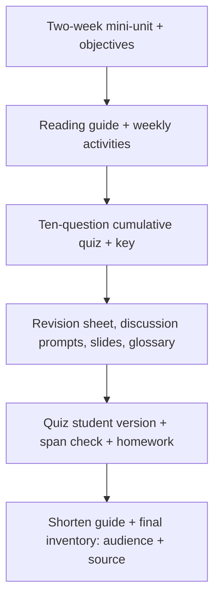

# S040 — Complete course package across a long conversation

## Tests

Over sixteen turns Fazah holds long-range context across three decks, produces many connected artifact
types with correct audiences, keeps each edit selective, verifies the quiz spans all three decks, and ends
with an accurate inventory of every artifact, its audience, and its source.

## Setup

- Start: New chat
- Select files: `Ch1 Introduction.pptx` + `Ch2 SW Processes.pptx` + `Ch5 Agile SW Dev.pptx`
- Do not select: `Ch3 Req Eng.pptx`, `Ch4 Testing.pptx`
- Turns: 16
- Auditor variation: Allowed — see the Auditor variation section

## Workflow



---

## Turn 1

### Enter

```text
ok can u make a 2 week mini unit plan that connects these 3 lectures
```

### Expect

- A two-week mini-unit plan connecting Introduction, Software Processes, and Agile.
- Grounded across the three selected decks (e.g. SE basics → process models → agile), with used
  sources listing all three; no invented citation.

### Record

- Actual prompt entered:
- Files selected:
- Files Fazah used:
- Result: Pass / Small Issue / Fail / Critical Fail
- Short note:

---

## Turn 2   (continue the same chat)

### Enter

```text
add learning objectives for each week
```

### Expect

- Learning objectives are added for each of the two weeks.
- The Turn 1 plan structure is preserved.

### Record

- Actual prompt entered:
- Files selected:
- Files Fazah used:
- Result: Pass / Small Issue / Fail / Critical Fail
- Short note:

---

## Turn 3   (continue the same chat)

### Enter

```text
now make a student reading guide
```

### Expect

- A student-facing reading guide spanning the three decks.
- Consistent with the unit plan; grounded in the selected files.

### Record

- Actual prompt entered:
- Files selected:
- Files Fazah used:
- Result: Pass / Small Issue / Fail / Critical Fail
- Short note:

---

## Turn 4   (continue the same chat)

### Enter

```text
one in-class activity per week pls
```

### Expect

- Exactly one in-class activity per week (two total).
- Each activity ties to that week's material.

### Record

- Actual prompt entered:
- Files selected:
- Files Fazah used:
- Result: Pass / Small Issue / Fail / Critical Fail
- Short note:

---

## Turn 5   (continue the same chat)

### Enter

```text
lets do a 10 question cumulative quiz
```

### Expect

- Exactly ten questions spanning the three decks (Introduction, Processes, Agile).
- Grounded; no content pulled from unselected decks (Requirements / Testing).

### Record

- Actual prompt entered:
- Files selected:
- Files Fazah used:
- Result: Pass / Small Issue / Fail / Critical Fail
- Short note:

---

## Turn 6   (continue the same chat)

### Enter

```text
now the teacher answer key
```

### Expect

- A teacher answer key for the ten-question quiz.
- Answers are consistent with the quiz questions from Turn 5.

### Record

- Actual prompt entered:
- Files selected:
- Files Fazah used:
- Result: Pass / Small Issue / Fail / Critical Fail
- Short note:

---

## Turn 7   (continue the same chat)

### Enter

```text
can u make a short student revision sheet
```

### Expect

- A short student-facing revision sheet across the three decks.
- No answers to the quiz leak into it (answer-leakage check — leaked answers = Critical fail).

### Record

- Actual prompt entered:
- Files selected:
- Files Fazah used:
- Result: Pass / Small Issue / Fail / Critical Fail
- Short note:

---

## Turn 8   (continue the same chat)

### Enter

```text
can u summarize everything we made so far, who its for, and the sources used
```

### Expect

- An accurate inventory of every artifact so far (unit plan + objectives, reading guide, activities,
  quiz, teacher key, revision sheet).
- Each is labelled with its audience (student or teacher).
- Sources are correctly given as the three selected decks; no fabricated artifacts or sources.

### Record

- Actual prompt entered:
- Files selected:
- Files Fazah used:
- Result: Pass / Small Issue / Fail / Critical Fail
- Short note:

---

## Turn 9   (continue the same chat)

### Enter

```text
add a discussion prompt for each week
```

### Expect

- One discussion prompt per week (two total) is added.
- Each ties to that week's material.
- Prior unit-plan content is preserved.

### Record

- Actual prompt entered:
- Files selected:
- Files Fazah used:
- Result: Pass / Small Issue / Fail / Critical Fail
- Short note:

---

## Turn 10   (continue the same chat)

### Enter

```text
make a 6 slide overview deck
```

### Expect

- Exactly six overview slides across the three decks.
- Grounded; no new topics beyond Introduction / Processes / Agile.
- No content from the unselected decks (Requirements / Testing).

### Record

- Actual prompt entered:
- Files selected:
- Files Fazah used:
- Result: Pass / Small Issue / Fail / Critical Fail
- Short note:

---

## Turn 11   (continue the same chat)

### Enter

```text
add a glossary
```

### Expect

- A glossary of key terms from the three decks (e.g. software engineering, waterfall / incremental,
  Agile Manifesto values).
- Definitions are grounded in the decks; no invented terms.

### Record

- Actual prompt entered:
- Files selected:
- Files Fazah used:
- Result: Pass / Small Issue / Fail / Critical Fail
- Short note:

---

## Turn 12   (continue the same chat)

### Enter

```text
make the quiz student version, no answers
```

### Expect

- A student version of the ten-question quiz with NO answers shown (answer-leakage check —
  leaked answers = Critical fail).
- The teacher key from Turn 6 is not overwritten.

### Record

- Actual prompt entered:
- Files selected:
- Files Fazah used:
- Result: Pass / Small Issue / Fail / Critical Fail
- Short note:

---

## Turn 13   (continue the same chat)

### Enter

```text
does the quiz cover all 3 lectures? can u check
```

### Expect

- Fazah confirms the ten questions draw on all three decks (Introduction, Processes, Agile).
- If a deck is under- or over-represented, it notes this and rebalances.
- No content from the Requirements / Testing decks.

### Record

- Actual prompt entered:
- Files selected:
- Files Fazah used:
- Result: Pass / Small Issue / Fail / Critical Fail
- Short note:

---

## Turn 14   (continue the same chat)

### Enter

```text
add a homework assignment
```

### Expect

- A homework assignment tied to the unit's three decks.
- The audience is clearly student-facing.
- Grounded and consistent with the unit scope.

### Record

- Actual prompt entered:
- Files selected:
- Files Fazah used:
- Result: Pass / Small Issue / Fail / Critical Fail
- Short note:

---

## Turn 15   (continue the same chat)

### Enter

```text
shorten the reading guide
```

### Expect

- The reading guide from Turn 3 is made shorter.
- It stays student-facing and spanning the three decks.
- Only its length changes; other assets are unchanged.

### Record

- Actual prompt entered:
- Files selected:
- Files Fazah used:
- Result: Pass / Small Issue / Fail / Critical Fail
- Short note:

---

## Turn 16   (continue the same chat)

### Enter

```text
ok final inventory pls, every artifact, who its for, and its source
```

### Expect

- A complete inventory: unit plan + objectives, reading guide (shortened), activities, quiz
  (+ student version), teacher key, revision sheet, discussion prompts, six-slide deck, glossary, homework.
- Each is labelled with its audience (student or teacher) and its source.
- Sources are the three selected decks; no fabricated artifacts or sources.

### Record

- Actual prompt entered:
- Files selected:
- Files Fazah used:
- Result: Pass / Small Issue / Fail / Critical Fail
- Short note:

---

## Auditor variation

Add or change one realistic instruction. Record exactly what you entered. Do not change the
scenario's main goal.

- Change the unit length (e.g. make it a three-week mini-unit).
- Change the quiz size (e.g. a fifteen-question cumulative quiz).
- Ask for a formal tone in the reading guide and revision sheet.
- Target first-year students.

---

## Final Check

- Understood the request: Yes / Mostly / No
- Used the correct source: Yes / Partly / No / N/A
- Output is usable: Yes / Needs editing / No
- Conversation handled correctly: Yes / Mostly / No / N/A

## Overall

- [ ] Pass
- [ ] Pass with small issue
- [ ] Fail
- [ ] Critical fail

## Main issue

- [ ] None
- [ ] Misunderstood request
- [ ] Wrong source
- [ ] Ignored selected file
- [ ] Incorrect content
- [ ] Missed instruction
- [ ] Clarification problem
- [ ] Lost previous work
- [ ] Changed unrelated content
- [ ] Exposed student answers
- [ ] Error or timeout
- [ ] Other

## One-line note

Fazah should improve:

For the complete workflow, see [Context Diagram](../misc/CONTEXT-DIAGRAM.md).
