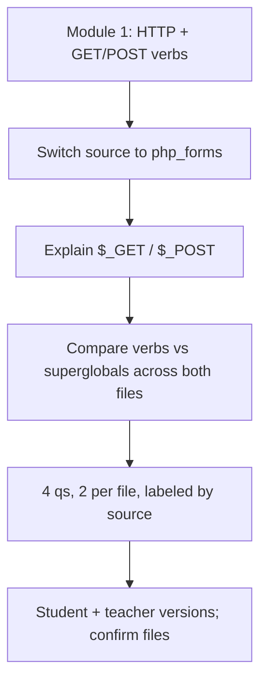

# S006 — Source changes mid-chat (Module 1 → forms)

## Tests

The conversation starts on Module 1 (HTTP), then the selected source is changed mid-chat to the forms
deck. Fazah should follow the switch — grounding new answers in the forms deck — keep each fact tied to
the file it came from, honour a "second file only" scope, and later attribute HTTP verbs to Module 1
and `$_GET`/`$_POST` to the forms deck without conflating them.

## Setup

- Start: New chat
- Select files: `Module 1 - Computer Network for Web Developer.pptx` (start); switched to
  `php_forms_presentation.pptx` at Turn 3
- Do not select: `php_forms_presentation.pptx` at the start
- Turns: 16
- Auditor variation: Not allowed

## Workflow



---

## Turn 1

### Enter

```text
explain http request/response and the get/post verbs
```

### Expect

- HTTP is stateless and works in request/response pairs (client → request → server → response); GET =
  fetch a resource, POST = submit a form / payload — matching Module 1.
- Grounded in `Module 1 - Computer Network for Web Developer.pptx`.

### Record

- Actual prompt entered:
- Files selected:
- Files Fazah used:
- Result: Pass / Small Issue / Fail / Critical Fail
- Short note:

---

## Turn 2  (continue the same chat)

### Enter

```text
add the status code categories too
```

### Expect

- 1xx informational, 2xx success, 3xx redirection, 4xx client-side errors, 5xx server-side errors
  (first digit = category) — matching Module 1.
- Still grounded in Module 1.

### Record

- Actual prompt entered:
- Files selected:
- Files Fazah used:
- Result: Pass / Small Issue / Fail / Critical Fail
- Short note:

---

## Turn 3  (continue the same chat — now select php_forms and deselect Module 1)

### Enter

```text
ok switched to the forms deck. explain $_GET and $_POST
```

### Expect

- `$_GET` = URL params, `$_POST` = form data (superglobals) — matching the forms deck.
- Now grounded in `php_forms_presentation.pptx`, not Module 1.

### Record

- Actual prompt entered:
- Files selected:
- Files Fazah used:
- Result: Pass / Small Issue / Fail / Critical Fail
- Short note:

---

## Turn 4  (continue the same chat)

### Enter

```text
summarize only what we covered from this second file
```

### Expect

- Summary limited to the forms deck content covered (`$_GET`/`$_POST`); excludes the Module 1 HTTP
  material.
- Honours the "only the second file" scope.

### Record

- Actual prompt entered:
- Files selected:
- Files Fazah used:
- Result: Pass / Small Issue / Fail / Critical Fail
- Short note:

---

## Turn 5  (continue the same chat)

### Enter

```text
now compare the http verbs vs the php superglobals across both files
```

### Expect

- Contrasts HTTP GET/POST verbs (Module 1, protocol level) with `$_GET`/`$_POST` superglobals (forms
  deck, server-side access to submitted data); notes the connection between them.
- Both files attributed correctly; no conflation.

### Record

- Actual prompt entered:
- Files selected:
- Files Fazah used:
- Result: Pass / Small Issue / Fail / Critical Fail
- Short note:

---

## Turn 6  (continue the same chat)

### Enter

```text
give a code example tying them together — a form that posts
```

### Expect

- Valid HTML form using `method="POST"` whose data is read via `$_POST`; consistent with both decks
  (verb from Module 1, superglobal from the forms deck).
- No fabrication.

### Record

- Actual prompt entered:
- Files selected:
- Files Fazah used:
- Result: Pass / Small Issue / Fail / Critical Fail
- Short note:

---

## Turn 7  (continue the same chat)

### Enter

```text
make 4 qs, 2 per file
```

### Expect

- Exactly 4 questions: 2 grounded in Module 1 (HTTP verbs / status codes) and 2 in the forms deck
  (`$_GET`/`$_POST`); each with a correct answer.

### Record

- Actual prompt entered:
- Files selected:
- Files Fazah used:
- Result: Pass / Small Issue / Fail / Critical Fail
- Short note:

---

## Turn 8  (continue the same chat)

### Enter

```text
label each q with the file its from
```

### Expect

- Each of the 4 questions labelled with its source file (Module 1 or php_forms); labels accurate.

### Record

- Actual prompt entered:
- Files selected:
- Files Fazah used:
- Result: Pass / Small Issue / Fail / Critical Fail
- Short note:

---

## Turn 9  (continue the same chat)

### Enter

```text
make one of them scenario based
```

### Expect

- Exactly one of the 4 becomes a scenario question; the 2-per-file balance preserved.
- Still 4, still grounded.

### Record

- Actual prompt entered:
- Files selected:
- Files Fazah used:
- Result: Pass / Small Issue / Fail / Critical Fail
- Short note:

---

## Turn 10  (continue the same chat)

### Enter

```text
check each has exactly 1 right answer
```

### Expect

- Confirms each of the 4 has a single correct answer; fixes any ambiguity.
- Count stays at 4.

### Record

- Actual prompt entered:
- Files selected:
- Files Fazah used:
- Result: Pass / Small Issue / Fail / Critical Fail
- Short note:

---

## Turn 11  (continue the same chat)

### Enter

```text
student version, no answers
```

### Expect

- The same 4 questions, student-facing, with NO answers shown
  (answer-leakage check — leaked answers = Critical fail); file labels may remain.

### Record

- Actual prompt entered:
- Files selected:
- Files Fazah used:
- Result: Pass / Small Issue / Fail / Critical Fail
- Short note:

---

## Turn 12  (continue the same chat)

### Enter

```text
teacher key w explanations
```

### Expect

- Teacher key: correct answer + short explanation per question; the student version stays answer-free.

### Record

- Actual prompt entered:
- Files selected:
- Files Fazah used:
- Result: Pass / Small Issue / Fail / Critical Fail
- Short note:

---

## Turn 13  (continue the same chat)

### Enter

```text
reorder easiest to hardest
```

### Expect

- The same 4 questions reordered easiest → hardest; still 2 per file, none added or dropped.

### Record

- Actual prompt entered:
- Files selected:
- Files Fazah used:
- Result: Pass / Small Issue / Fail / Critical Fail
- Short note:

---

## Turn 14  (continue the same chat)

### Enter

```text
swap the weakest module 1 q for a status-code one
```

### Expect

- Replaces one Module 1 question with a status-code question (1xx-5xx categories); keeps 2 per file,
  total 4.
- Status-code content grounded in Module 1.

### Record

- Actual prompt entered:
- Files selected:
- Files Fazah used:
- Result: Pass / Small Issue / Fail / Critical Fail
- Short note:

---

## Turn 15  (continue the same chat)

### Enter

```text
which files did you use overall
```

### Expect

- Names both: `Module 1 - Computer Network for Web Developer.pptx` and `php_forms_presentation.pptx`.
- No extra or invented files.

### Record

- Actual prompt entered:
- Files selected:
- Files Fazah used:
- Result: Pass / Small Issue / Fail / Critical Fail
- Short note:

---

## Turn 16  (continue the same chat)

### Enter

```text
confirm each fact is from the right file, no mixups
```

### Expect

- Confirms HTTP verbs / status codes → Module 1, and `$_GET`/`$_POST` → the forms deck.
- No cross-attribution or fabrication.

### Record

- Actual prompt entered:
- Files selected:
- Files Fazah used:
- Result: Pass / Small Issue / Fail / Critical Fail
- Short note:

---

## Final Check

- Understood the request: Yes / Mostly / No
- Used the correct source: Yes / Partly / No / N/A
- Output is usable: Yes / Needs editing / No
- Conversation handled correctly: Yes / Mostly / No / N/A

## Overall

- [ ] Pass
- [ ] Pass with small issue
- [ ] Fail
- [ ] Critical fail

## Main issue

- [ ] None
- [ ] Misunderstood request
- [ ] Wrong source
- [ ] Ignored selected file
- [ ] Incorrect content
- [ ] Missed instruction
- [ ] Clarification problem
- [ ] Lost previous work
- [ ] Changed unrelated content
- [ ] Exposed student answers
- [ ] Error or timeout
- [ ] Other

## One-line note

Fazah should improve:

For the complete workflow, see [Context Diagram](../misc/CONTEXT-DIAGRAM.md).
