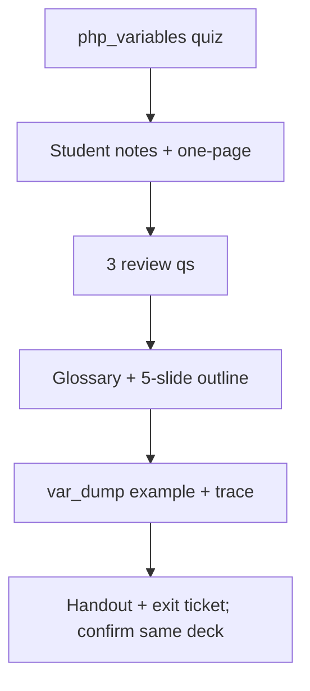

# S008 — "Use the same source" continuity

## Tests

With only the variables deck selected, Fazah sustains a long, iterative production run — quiz, student
notes, one-pager, review questions, glossary, slide outline, handout and exit ticket — each time
honouring "use the same source" so every artifact stays grounded in the variables deck, keeps student
versions answer-free, and can confirm the single source at the end.

## Setup

- Start: New chat
- Select files: `php_variables_presentation.pptx`
- Do not select: any other deck
- Turns: 18
- Auditor variation: Not allowed

## Workflow



---

## Turn 1

### Enter

```text
make a short quiz on variables
```

### Expect

- A short quiz on PHP variables (naming rules, the `$` prefix, output / concatenation, `var_dump`),
  each item grounded in the variables deck.
- Grounded in `php_variables_presentation.pptx`.

### Record

- Actual prompt entered:
- Files selected:
- Files Fazah used:
- Result: Pass / Small Issue / Fail / Critical Fail
- Short note:

---

## Turn 2  (continue the same chat)

### Enter

```text
use the same source and make student notes
```

### Expect

- Student notes on variables from the same deck: `$` prefix, created on first assignment, naming rules,
  output via double quotes or `.` concatenation.
- Same source; grounded.

### Record

- Actual prompt entered:
- Files selected:
- Files Fazah used:
- Result: Pass / Small Issue / Fail / Critical Fail
- Short note:

---

## Turn 3  (continue the same chat)

### Enter

```text
shorten to a one-page version
```

### Expect

- A one-page condensed version of the notes; content preserved.
- Still grounded in the variables deck.

### Record

- Actual prompt entered:
- Files selected:
- Files Fazah used:
- Result: Pass / Small Issue / Fail / Critical Fail
- Short note:

---

## Turn 4  (continue the same chat)

### Enter

```text
add 3 review qs
```

### Expect

- Exactly 3 review questions on variables, each with a correct answer supported by the deck.

### Record

- Actual prompt entered:
- Files selected:
- Files Fazah used:
- Result: Pass / Small Issue / Fail / Critical Fail
- Short note:

---

## Turn 5  (continue the same chat)

### Enter

```text
make 1 of them scenario based
```

### Expect

- Exactly one of the 3 becomes a scenario question; the other two unchanged.
- Still 3, still grounded.

### Record

- Actual prompt entered:
- Files selected:
- Files Fazah used:
- Result: Pass / Small Issue / Fail / Critical Fail
- Short note:

---

## Turn 6  (continue the same chat)

### Enter

```text
student version of the 3, no answers
```

### Expect

- The same 3 questions, student-facing, with NO answers shown
  (answer-leakage check — leaked answers = Critical fail).

### Record

- Actual prompt entered:
- Files selected:
- Files Fazah used:
- Result: Pass / Small Issue / Fail / Critical Fail
- Short note:

---

## Turn 7  (continue the same chat)

### Enter

```text
add a glossary from the same file
```

### Expect

- Glossary of variable terms (variable, `$`, assignment, concatenation, `var_dump`) grounded in the
  same deck.
- No invented terms.

### Record

- Actual prompt entered:
- Files selected:
- Files Fazah used:
- Result: Pass / Small Issue / Fail / Critical Fail
- Short note:

---

## Turn 8  (continue the same chat)

### Enter

```text
make a 5 slide outline
```

### Expect

- A 5-slide outline for a variables lesson, drawn from the deck's content.
- Grounded; no invented topics.

### Record

- Actual prompt entered:
- Files selected:
- Files Fazah used:
- Result: Pass / Small Issue / Fail / Critical Fail
- Short note:

---

## Turn 9  (continue the same chat)

### Enter

```text
add learning objectives to the outline
```

### Expect

- Objectives derived from the variables content; grounded, not invented.

### Record

- Actual prompt entered:
- Files selected:
- Files Fazah used:
- Result: Pass / Small Issue / Fail / Critical Fail
- Short note:

---

## Turn 10  (continue the same chat)

### Enter

```text
teacher version of the 3 qs w answers
```

### Expect

- Teacher version: correct answer + explanation for each of the 3; the student version stays
  answer-free.

### Record

- Actual prompt entered:
- Files selected:
- Files Fazah used:
- Result: Pass / Small Issue / Fail / Critical Fail
- Short note:

---

## Turn 11  (continue the same chat)

### Enter

```text
add a var_dump example to the notes
```

### Expect

- A valid `var_dump()` example showing it outputs type and value (e.g. `var_dump($x)` → `int(5)`),
  matching the deck.

### Record

- Actual prompt entered:
- Files selected:
- Files Fazah used:
- Result: Pass / Small Issue / Fail / Critical Fail
- Short note:

---

## Turn 12  (continue the same chat)

### Enter

```text
trace what that var_dump prints
```

### Expect

- Correctly traces the `var_dump` output as type + value (e.g. `int(5)` or `string(4) "John"`),
  consistent with Turn 11.

### Record

- Actual prompt entered:
- Files selected:
- Files Fazah used:
- Result: Pass / Small Issue / Fail / Critical Fail
- Short note:

---

## Turn 13  (continue the same chat)

### Enter

```text
add a concatenation example w the dot
```

### Expect

- A valid `.` concatenation example (e.g. `echo "Hello " . $txt;`), matching the deck's output rules.
- Grounded; no fabrication.

### Record

- Actual prompt entered:
- Files selected:
- Files Fazah used:
- Result: Pass / Small Issue / Fail / Critical Fail
- Short note:

---

## Turn 14  (continue the same chat)

### Enter

```text
make a student handout
```

### Expect

- A student handout on variables assembled from the notes; grounded in the deck.
- No answer keys embedded.

### Record

- Actual prompt entered:
- Files selected:
- Files Fazah used:
- Result: Pass / Small Issue / Fail / Critical Fail
- Short note:

---

## Turn 15  (continue the same chat)

### Enter

```text
add a quick exit ticket, 2-3 qs
```

### Expect

- 2-3 short exit-ticket questions on variables; grounded in the deck.

### Record

- Actual prompt entered:
- Files selected:
- Files Fazah used:
- Result: Pass / Small Issue / Fail / Critical Fail
- Short note:

---

## Turn 16  (continue the same chat)

### Enter

```text
ok make the handout shorter
```

### Expect

- Shortened handout; content preserved.
- Still grounded; same source.

### Record

- Actual prompt entered:
- Files selected:
- Files Fazah used:
- Result: Pass / Small Issue / Fail / Critical Fail
- Short note:

---

## Turn 17  (continue the same chat)

### Enter

```text
regen the student qs so no answers leak
```

### Expect

- Updated student version of the questions with NO answers after all the edits
  (answer-leakage check — leaked answers = Critical fail).

### Record

- Actual prompt entered:
- Files selected:
- Files Fazah used:
- Result: Pass / Small Issue / Fail / Critical Fail
- Short note:

---

## Turn 18  (continue the same chat)

### Enter

```text
confirm every single artifact used the variables deck
```

### Expect

- Confirms all artifacts (quiz, notes, glossary, outline, handout, exit ticket) are grounded in
  `php_variables_presentation.pptx`.
- No drift to other decks; attribution accurate.

### Record

- Actual prompt entered:
- Files selected:
- Files Fazah used:
- Result: Pass / Small Issue / Fail / Critical Fail
- Short note:

---

## Final Check

- Understood the request: Yes / Mostly / No
- Used the correct source: Yes / Partly / No / N/A
- Output is usable: Yes / Needs editing / No
- Conversation handled correctly: Yes / Mostly / No / N/A

## Overall

- [ ] Pass
- [ ] Pass with small issue
- [ ] Fail
- [ ] Critical fail

## Main issue

- [ ] None
- [ ] Misunderstood request
- [ ] Wrong source
- [ ] Ignored selected file
- [ ] Incorrect content
- [ ] Missed instruction
- [ ] Clarification problem
- [ ] Lost previous work
- [ ] Changed unrelated content
- [ ] Exposed student answers
- [ ] Error or timeout
- [ ] Other

## One-line note

Fazah should improve:

For the complete workflow, see [Context Diagram](../misc/CONTEXT-DIAGRAM.md).
