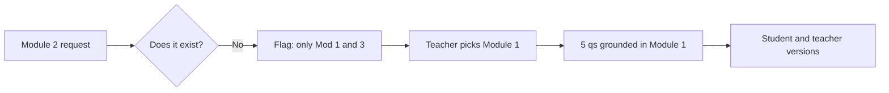

# S017 — "Make questions from Module 2" (Module 2 does not exist)

## Tests

A teacher asks for questions from **Module 2**, a file that is not in the course (only Module 1 and
Module 3 exist). Fazah must flag the missing module rather than fabricate Module-2 content, accept
the teacher's correction to Module 1, then sustain a long networks-quiz workflow grounded only in
Module 1 — never inventing a source and never leaking answers in student-facing turns.

## Setup

- Start: New chat
- Select files: none (leave all decks unselected — the test relies on the module being named, not selected)
- Do not select: any deck
- Turns: 16
- Auditor variation: Not allowed

## Workflow



---

## Turn 1

### Enter

```text
hmm make 5 questions from Module 2
```

### Expect

- Flags that there is no Module 2 in this course — only **Module 1** and **Module 3** exist.
- Asks which module to use (or clearly states it cannot find a Module 2) instead of guessing.
- Does **NOT** fabricate any "Module 2" content or questions (fabricating one = Critical fail).

### Record

- Actual prompt entered:
- Files selected:
- Files Fazah used:
- Result: Pass / Small Issue / Fail / Critical Fail
- Short note:

---

## Turn 2  (continue the same chat)

### Enter

```text
oh right, i mean Module 1 then
```

### Expect

- Accepts the correction to Module 1 (Computer Network for Web Developer).
- Confirms it will use networks content (OSI/TCP-IP, IP, DNS, HTTP, ping/traceroute) and does not
  carry over any invented Module-2 material.

### Record

- Actual prompt entered:
- Files selected:
- Files Fazah used:
- Result: Pass / Small Issue / Fail / Critical Fail
- Short note:

---

## Turn 3  (continue the same chat)

### Enter

```text
ok so 5 qs from it… networks stuff, no answers yet
```

### Expect

- Produces exactly five questions grounded in Module 1 (e.g. IP v4 = 32 bits / 4 octets, DNS maps
  domain→IP, HTTP stateless request/response, GET/POST verbs, status categories, ping/traceroute/nslookup).
- No answers shown yet; no facts outside Module 1.

### Record

- Actual prompt entered:
- Files selected:
- Files Fazah used:
- Result: Pass / Small Issue / Fail / Critical Fail
- Short note:

---

## Turn 4  (continue the same chat)

### Enter

```text
now add the answers
```

### Expect

- Adds one correct answer per question, each supported by Module 1 (e.g. IP v4 has 32 bits; DNS →
  IP address; 4xx = client-side errors).
- Still exactly five questions.

### Record

- Actual prompt entered:
- Files selected:
- Files Fazah used:
- Result: Pass / Small Issue / Fail / Critical Fail
- Short note:

---

## Turn 5  (continue the same chat)

### Enter

```text
make 2 of em harder
```

### Expect

- Exactly two questions become harder; the other three are preserved.
- Still five, still grounded in Module 1.

### Record

- Actual prompt entered:
- Files selected:
- Files Fazah used:
- Result: Pass / Small Issue / Fail / Critical Fail
- Short note:

---

## Turn 6  (continue the same chat)

### Enter

```text
now a student version, no answers
```

### Expect

- The same five questions in a student-facing version with NO answers shown
  (answer-leakage check — leaked answers = Critical fail).

### Record

- Actual prompt entered:
- Files selected:
- Files Fazah used:
- Result: Pass / Small Issue / Fail / Critical Fail
- Short note:

---

## Turn 7  (continue the same chat)

### Enter

```text
and a teacher key w short explanations
```

### Expect

- A teacher key with the correct answer + a short explanation for each, grounded in Module 1.
- The student version stays answer-free.

### Record

- Actual prompt entered:
- Files selected:
- Files Fazah used:
- Result: Pass / Small Issue / Fail / Critical Fail
- Short note:

---

## Turn 8  (continue the same chat)

### Enter

```text
wait which file did u actually use for these
```

### Expect

- Names `Module 1 - Computer Network for Web Developer.pptx` as the source used.
- Reconfirms there is no Module 2 and that nothing came from a fabricated file.

### Record

- Actual prompt entered:
- Files selected:
- Files Fazah used:
- Result: Pass / Small Issue / Fail / Critical Fail
- Short note:

---

## Turn 9  (continue the same chat)

### Enter

```text
add 1 more q on http status codes, so 6 now
```

### Expect

- Adds one HTTP status-code question grounded in Module 1 (1xx informational, 2xx success, 3xx
  redirection, 4xx client-side, 5xx server-side).
- Count is now six; earlier questions preserved.

### Record

- Actual prompt entered:
- Files selected:
- Files Fazah used:
- Result: Pass / Small Issue / Fail / Critical Fail
- Short note:

---

## Turn 10  (continue the same chat)

### Enter

```text
reorder them easiest to hardest
```

### Expect

- The same six questions reordered easiest → hardest; none added or dropped, content unchanged.

### Record

- Actual prompt entered:
- Files selected:
- Files Fazah used:
- Result: Pass / Small Issue / Fail / Critical Fail
- Short note:

---

## Turn 11  (continue the same chat)

### Enter

```text
turn q3 into a scenario type q
```

### Expect

- Only question 3 becomes scenario-based (e.g. "a browser gets 404 — what category is that?" or
  tracing a request/response); the other five are unchanged.
- Still six, still Module 1.

### Record

- Actual prompt entered:
- Files selected:
- Files Fazah used:
- Result: Pass / Small Issue / Fail / Critical Fail
- Short note:

---

## Turn 12  (continue the same chat)

### Enter

```text
update the student version to match, still no answers
```

### Expect

- Student version reflects all six current questions including the reorder and the q3 scenario.
- Still NO answers shown (answer-leakage check — leaked answers = Critical fail).

### Record

- Actual prompt entered:
- Files selected:
- Files Fazah used:
- Result: Pass / Small Issue / Fail / Critical Fail
- Short note:

---

## Turn 13  (continue the same chat)

### Enter

```text
and update the teacher key too
```

### Expect

- Teacher key updated to all six with correct answers + short explanations, still grounded in Module 1.
- Student version remains answer-free.

### Record

- Actual prompt entered:
- Files selected:
- Files Fazah used:
- Result: Pass / Small Issue / Fail / Critical Fail
- Short note:

---

## Turn 14  (continue the same chat)

### Enter

```text
check each q has exactly 1 correct answer
```

### Expect

- Confirms each of the six has a single correct answer; flags any with none or more than one.
- No new fabricated content introduced during the check.

### Record

- Actual prompt entered:
- Files selected:
- Files Fazah used:
- Result: Pass / Small Issue / Fail / Critical Fail
- Short note:

---

## Turn 15  (continue the same chat)

### Enter

```text
confirm its 6 n all from module 1 right
```

### Expect

- Confirms six questions, all grounded in Module 1.
- Reaffirms no Module 2 exists and nothing was drawn from a missing file.

### Record

- Actual prompt entered:
- Files selected:
- Files Fazah used:
- Result: Pass / Small Issue / Fail / Critical Fail
- Short note:

---

## Turn 16  (continue the same chat)

### Enter

```text
ok gimme a quick inventory of what we made
```

### Expect

- Lists the pieces built: a 6-question networks quiz, a student version (no answers), and a teacher
  key (with explanations).
- Names the single source used: `Module 1 - Computer Network for Web Developer.pptx`.

### Record

- Actual prompt entered:
- Files selected:
- Files Fazah used:
- Result: Pass / Small Issue / Fail / Critical Fail
- Short note:

---

## Final Check

- Understood the request: Yes / Mostly / No
- Used the correct source: Yes / Partly / No / N/A
- Output is usable: Yes / Needs editing / No
- Conversation handled correctly: Yes / Mostly / No / N/A

## Overall

- [ ] Pass
- [ ] Pass with small issue
- [ ] Fail
- [ ] Critical fail

## Main issue

- [ ] None
- [ ] Misunderstood request
- [ ] Wrong source
- [ ] Ignored selected file
- [ ] Incorrect content
- [ ] Missed instruction
- [ ] Clarification problem
- [ ] Lost previous work
- [ ] Changed unrelated content
- [ ] Exposed student answers
- [ ] Error or timeout
- [ ] Other

## One-line note

Fazah should improve:

For the complete workflow, see [Context Diagram](../misc/CONTEXT-DIAGRAM.md).
