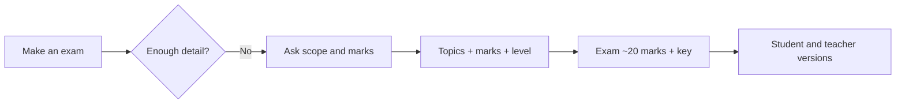

# S020 — Underspecified exam built through clarification

## Tests

A teacher opens with an almost content-free request ("hmm can u make an exam"). Fazah must gather the
missing scope through minimal clarification rather than fabricating an exam or inventing sources, then
build a ~20-mark undergraduate exam on PHP basics, keeping totals honest, sources grounded, and the
student version free of the answer key.

## Setup

- Start: New chat
- Select files: none (topics named as "variables, operators, loops" → map to `php_variables`,
  `php_operators`, `php_loops`)
- Do not select: any deck (do not pre-select the mapping)
- Turns: 18
- Auditor variation: Allowed (see "Auditor variation" below)

## Workflow



---

## Turn 1

### Enter

```text
hmm can u make an exam
```

### Expect

- Treats the request as too vague and asks what to cover (topics / length / marks / level), or states
  one safe minimal assumption and asks the teacher to confirm.
- Does **NOT** invent a full exam or attribute questions to a source out of nothing.

### Record

- Actual prompt entered:
- Files selected:
- Files Fazah used:
- Result: Pass / Small Issue / Fail / Critical Fail
- Short note:

---

## Turn 2  (continue the same chat)

### Enter

```text
cover PHP basics — variables, operators, loops
```

### Expect

- Maps the scope to `php_variables`, `php_operators`, and `php_loops` and grounds there.
- May still ask for the remaining details (marks / audience) rather than guessing them.

### Record

- Actual prompt entered:
- Files selected:
- Files Fazah used:
- Result: Pass / Small Issue / Fail / Critical Fail
- Short note:

---

## Turn 3  (continue the same chat)

### Enter

```text
for undergraduate students
```

### Expect

- Records the audience as undergraduate and reflects it in difficulty/tone.
- Still holds the variables/operators/loops scope from Turn 2.

### Record

- Actual prompt entered:
- Files selected:
- Files Fazah used:
- Result: Pass / Small Issue / Fail / Critical Fail
- Short note:

---

## Turn 4  (continue the same chat)

### Enter

```text
about 20 marks, n include a teacher answer key
```

### Expect

- Confirms a ~20-mark target and that a teacher answer key is required (kept separate from the exam).
- Restates the plan or proceeds; no fabricated content yet.

### Record

- Actual prompt entered:
- Files selected:
- Files Fazah used:
- Result: Pass / Small Issue / Fail / Critical Fail
- Short note:

---

## Turn 5  (continue the same chat)

### Enter

```text
ok go ahead
```

### Expect

- Produces an undergraduate exam of ~20 marks covering variables (`$`, naming rules, concatenation),
  operators (`+ - * / %`, `**`, `==` vs `===`), and loops (while / do…while / for / foreach).
- Marks sum to about 20; a teacher answer key is included separately; all grounded in the three decks.

### Record

- Actual prompt entered:
- Files selected:
- Files Fazah used:
- Result: Pass / Small Issue / Fail / Critical Fail
- Short note:

---

## Turn 6  (continue the same chat)

### Enter

```text
one of the variable qs is too easy, replace it
```

### Expect

- Replaces one variables question with a harder variables question; other questions preserved.
- Grounded in php_variables; total marks kept at ~20 (or the change to the total is stated).

### Record

- Actual prompt entered:
- Files selected:
- Files Fazah used:
- Result: Pass / Small Issue / Fail / Critical Fail
- Short note:

---

## Turn 7  (continue the same chat)

### Enter

```text
verify it still adds to 20 marks
```

### Expect

- Reports the actual mark total with a per-question or per-section breakdown.
- If it is not 20, says so honestly rather than claiming 20 — no invented arithmetic.

### Record

- Actual prompt entered:
- Files selected:
- Files Fazah used:
- Result: Pass / Small Issue / Fail / Critical Fail
- Short note:

---

## Turn 8  (continue the same chat)

### Enter

```text
now a student version, no answers or key
```

### Expect

- A student-facing exam with NO answers and NO teacher key shown
  (answer-leakage check — leaked answers = Critical fail).
- Marks per question still visible; audience notes not leaked into the sheet.

### Record

- Actual prompt entered:
- Files selected:
- Files Fazah used:
- Result: Pass / Small Issue / Fail / Critical Fail
- Short note:

---

## Turn 9  (continue the same chat)

### Enter

```text
n the teacher key separately w explanations
```

### Expect

- A separate teacher key with the correct answer + a short explanation per question, grounded in the decks.
- The student version stays answer-free.

### Record

- Actual prompt entered:
- Files selected:
- Files Fazah used:
- Result: Pass / Small Issue / Fail / Critical Fail
- Short note:

---

## Turn 10  (continue the same chat)

### Enter

```text
add a scenario question on loops
```

### Expect

- Adds one loop scenario/trace question (e.g. a do…while starting at 6 with `i<=5` prints 6, or a
  `for` counting by 2) grounded in php_loops.
- Notes that adding marks changes the total (so it can be rebalanced next).

### Record

- Actual prompt entered:
- Files selected:
- Files Fazah used:
- Result: Pass / Small Issue / Fail / Critical Fail
- Short note:

---

## Turn 11  (continue the same chat)

### Enter

```text
re-verify the total marks
```

### Expect

- Reports the new total honestly (now above 20 after the added question), with the breakdown.
- Does not claim 20 if the maths says otherwise.

### Record

- Actual prompt entered:
- Files selected:
- Files Fazah used:
- Result: Pass / Small Issue / Fail / Critical Fail
- Short note:

---

## Turn 12  (continue the same chat)

### Enter

```text
rebalance so its back to 20
```

### Expect

- Adjusts mark allocations so the exam sums to exactly 20 again; keeps all questions.
- Shows the corrected breakdown = 20.

### Record

- Actual prompt entered:
- Files selected:
- Files Fazah used:
- Result: Pass / Small Issue / Fail / Critical Fail
- Short note:

---

## Turn 13  (continue the same chat)

### Enter

```text
label which topic each q comes from
```

### Expect

- Labels each question with its topic/deck (php_variables / php_operators / php_loops).
- No invented sources; labels match where each question is actually grounded.

### Record

- Actual prompt entered:
- Files selected:
- Files Fazah used:
- Result: Pass / Small Issue / Fail / Critical Fail
- Short note:

---

## Turn 14  (continue the same chat)

### Enter

```text
add a rubric for the loops section
```

### Expect

- A rubric for the loops questions (criteria + points that fit their marks), grounded in php_loops.
- Other sections unchanged; total marks still 20.

### Record

- Actual prompt entered:
- Files selected:
- Files Fazah used:
- Result: Pass / Small Issue / Fail / Critical Fail
- Short note:

---

## Turn 15  (continue the same chat)

### Enter

```text
update the student exam sheet, no answers
```

### Expect

- Student sheet reflects the current exam (rebalanced marks, scenario question, labels).
- Still NO answers or teacher key shown (answer-leakage check — leaked answers = Critical fail).

### Record

- Actual prompt entered:
- Files selected:
- Files Fazah used:
- Result: Pass / Small Issue / Fail / Critical Fail
- Short note:

---

## Turn 16  (continue the same chat)

### Enter

```text
check each q has exactly one correct answer
```

### Expect

- Confirms each objective question has a single correct answer; flags open/scenario items as graded by rubric.
- No new fabricated content introduced during the check.

### Record

- Actual prompt entered:
- Files selected:
- Files Fazah used:
- Result: Pass / Small Issue / Fail / Critical Fail
- Short note:

---

## Turn 17  (continue the same chat)

### Enter

```text
confirm final: 20 marks, undergrad, key included
```

### Expect

- Confirms all constraints held: total = 20 marks, undergraduate level, separate teacher key exists.
- No drift from the variables/operators/loops scope.

### Record

- Actual prompt entered:
- Files selected:
- Files Fazah used:
- Result: Pass / Small Issue / Fail / Critical Fail
- Short note:

---

## Turn 18  (continue the same chat)

### Enter

```text
give me an inventory of the whole exam package
```

### Expect

- Lists the package: the 20-mark exam, the student version (no answers), the teacher key, the loops
  rubric, and the per-question topic labels.
- Names the three sources used: `php_variables`, `php_operators`, `php_loops`.

### Record

- Actual prompt entered:
- Files selected:
- Files Fazah used:
- Result: Pass / Small Issue / Fail / Critical Fail
- Short note:

---

## Auditor variation

Re-run this scenario with **one** of the swaps below; the underspecified-then-clarify behaviour under
test (asks for scope, keeps totals honest, no invented sources, student sheet answer-free) must still
hold. Change only the one parameter noted, keep every other turn as written.

- **Change the marks:** at Turn 4 ask for "40 marks" instead of ~20 (later verify turns must track 40).
- **Change the level:** at Turn 3 say "first-year students" instead of undergraduate (audience must
  not leak into the student sheet).
- **Add a time limit:** at Turn 4 add "make it a 60-minute exam" (the limit must appear on the exam,
  not be invented elsewhere).
- **One topic only:** at Turn 2 narrow to "just loops" (the whole exam must stay grounded in `php_loops`).

---

## Final Check

- Understood the request: Yes / Mostly / No
- Used the correct source: Yes / Partly / No / N/A
- Output is usable: Yes / Needs editing / No
- Conversation handled correctly: Yes / Mostly / No / N/A

## Overall

- [ ] Pass
- [ ] Pass with small issue
- [ ] Fail
- [ ] Critical fail

## Main issue

- [ ] None
- [ ] Misunderstood request
- [ ] Wrong source
- [ ] Ignored selected file
- [ ] Incorrect content
- [ ] Missed instruction
- [ ] Clarification problem
- [ ] Lost previous work
- [ ] Changed unrelated content
- [ ] Exposed student answers
- [ ] Error or timeout
- [ ] Other

## One-line note

Fazah should improve:

For the complete workflow, see [Context Diagram](../misc/CONTEXT-DIAGRAM.md).
