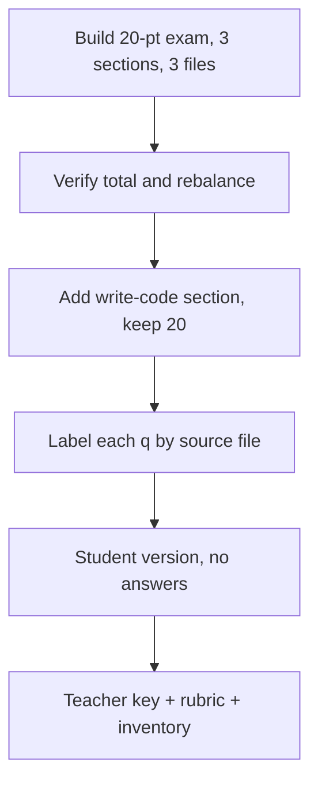

# S030 — 20-point exam across three files, demanding build

## Tests

With loops, arrays, and forms all selected, Fazah builds a balanced 20-point exam in 3 sections with
a mix of types plus a teacher key, then survives a demanding 24-turn refinement — repeated point
recounts, rebalancing, a write-code section with a rubric, source labels per question, harder
distractors, and split student/teacher deliverables — always holding the 20-point total, keeping the
three files balanced, and never leaking answers into the student version.

## Setup

- Start: New chat
- Select files: `php_loops_presentation.pptx`, `php_arrays_presentation.pptx`, `php_forms_presentation.pptx`
- Do not select: any other deck
- Turns: 24
- Auditor variation: Not allowed

---

## Workflow



---

## Turn 1

### Enter

```text
need a 20 point exam, 3 sections, mix of question types, balanced across the 3 files i selected, w/ a teacher key
```

### Expect

- Produces a 20-point exam in 3 sections with a mix of types (e.g. MCQ, trace-output, short answer) plus a teacher key.
- Draws roughly evenly on the 3 selected decks (loops, arrays, forms); no other deck used.
- All content grounded in the 3 selected files.

### Record

- Actual prompt entered:
- Files selected:
- Files Fazah used:
- Result: Pass / Small Issue / Fail / Critical Fail
- Short note:

---

## Turn 2  (continue the same chat)

### Enter

```text
add up the points, is it exactly 20
```

### Expect

- Confirms the section points sum to exactly 20 (or corrects them to 20).
- Shows the per-section point breakdown.

### Record

- Actual prompt entered:
- Files selected:
- Files Fazah used:
- Result: Pass / Small Issue / Fail / Critical Fail
- Short note:

---

## Turn 3  (continue the same chat)

### Enter

```text
swap out the weakest q for a better one
```

### Expect

- Replaces one question with a stronger one on the same file/topic; the total stays 20 points.
- The other questions are preserved.

### Record

- Actual prompt entered:
- Files selected:
- Files Fazah used:
- Result: Pass / Small Issue / Fail / Critical Fail
- Short note:

---

## Turn 4  (continue the same chat)

### Enter

```text
make sure its balanced across loops arrays and forms
```

### Expect

- Rebalances coverage so loops, arrays, and forms are represented roughly evenly.
- Total remains 20 points; content grounded in the 3 decks.

### Record

- Actual prompt entered:
- Files selected:
- Files Fazah used:
- Result: Pass / Small Issue / Fail / Critical Fail
- Short note:

---

## Turn 5  (continue the same chat)

### Enter

```text
add a 'write the code' section but keep the total at 20 pts
```

### Expect

- Adds a write-the-code section; redistributes points so the exam still totals exactly 20.
- Write-code tasks are valid PHP consistent with loops/arrays/forms.

### Record

- Actual prompt entered:
- Files selected:
- Files Fazah used:
- Result: Pass / Small Issue / Fail / Critical Fail
- Short note:

---

## Turn 6  (continue the same chat)

### Enter

```text
still 20 right
```

### Expect

- Confirms the total is still exactly 20 after adding the section; shows the breakdown.

### Record

- Actual prompt entered:
- Files selected:
- Files Fazah used:
- Result: Pass / Small Issue / Fail / Critical Fail
- Short note:

---

## Turn 7  (continue the same chat)

### Enter

```text
label every q w/ which file it came from
```

### Expect

- Each question tagged with its source deck (php_loops / php_arrays / php_forms).
- Tags accurate to the content; no question attributed to an unselected deck.

### Record

- Actual prompt entered:
- Files selected:
- Files Fazah used:
- Result: Pass / Small Issue / Fail / Critical Fail
- Short note:

---

## Turn 8  (continue the same chat)

### Enter

```text
gimme a student version, no answers
```

### Expect

- Student-facing exam with NO answers or key (answer-leakage check — leaked answers = Critical fail).
- Same questions/points as the current exam; grounded in the 3 decks.

### Record

- Actual prompt entered:
- Files selected:
- Files Fazah used:
- Result: Pass / Small Issue / Fail / Critical Fail
- Short note:

---

## Turn 9  (continue the same chat)

### Enter

```text
put the teacher key in a separate doc
```

### Expect

- Teacher key delivered as a separate document from the student version.
- Student version stays answer-free; the key covers all questions.

### Record

- Actual prompt entered:
- Files selected:
- Files Fazah used:
- Result: Pass / Small Issue / Fail / Critical Fail
- Short note:

---

## Turn 10  (continue the same chat)

### Enter

```text
need a rubric for the write-the-code section
```

### Expect

- Provides a rubric for the write-code section (criteria/levels) consistent with those tasks.
- Does not alter the 20-point total or the other sections.

### Record

- Actual prompt entered:
- Files selected:
- Files Fazah used:
- Result: Pass / Small Issue / Fail / Critical Fail
- Short note:

---

## Turn 11  (continue the same chat)

### Enter

```text
confirm its still balanced across the 3 files
```

### Expect

- Confirms loops/arrays/forms coverage is still balanced; reports counts or points per file.
- Nothing silently dropped.

### Record

- Actual prompt entered:
- Files selected:
- Files Fazah used:
- Result: Pass / Small Issue / Fail / Critical Fail
- Short note:

---

## Turn 12  (continue the same chat)

### Enter

```text
ok list everything we have so far
```

### Expect

- Inventory: the 3 sections + write-code section, student version, separate teacher key, rubric — with a point breakdown totalling 20.
- Matches produced content; no invented items.

### Record

- Actual prompt entered:
- Files selected:
- Files Fazah used:
- Result: Pass / Small Issue / Fail / Critical Fail
- Short note:

---

## Turn 13  (continue the same chat)

### Enter

```text
add a foreach q
```

### Expect

- Adds a `foreach` question grounded in the loops/arrays decks (foreach iterates each array element).
- Keeps the exam coherent; notes the running point total.

### Record

- Actual prompt entered:
- Files selected:
- Files Fazah used:
- Result: Pass / Small Issue / Fail / Critical Fail
- Short note:

---

## Turn 14  (continue the same chat)

### Enter

```text
recount the points, must be 20
```

### Expect

- Reconfirms or corrects the total to exactly 20 after the foreach addition; shows the breakdown.

### Record

- Actual prompt entered:
- Files selected:
- Files Fazah used:
- Result: Pass / Small Issue / Fail / Critical Fail
- Short note:

---

## Turn 15  (continue the same chat)

### Enter

```text
make the mcq distractors harder, less obvious
```

### Expect

- Improves MCQ distractors to be plausible but clearly wrong; each MCQ keeps exactly one correct answer.
- Grounded facts unchanged; still 20 points.

### Record

- Actual prompt entered:
- Files selected:
- Files Fazah used:
- Result: Pass / Small Issue / Fail / Critical Fail
- Short note:

---

## Turn 16  (continue the same chat)

### Enter

```text
add a $_POST question
```

### Expect

- Adds a `$_POST` question grounded in php_forms ($_POST = form data, not in URL, POST recommended for forms).
- Total kept at 20 (redistribute or replace as needed).

### Record

- Actual prompt entered:
- Files selected:
- Files Fazah used:
- Result: Pass / Small Issue / Fail / Critical Fail
- Short note:

---

## Turn 17  (continue the same chat)

### Enter

```text
reorder the questions inside section 2 easiest to hardest
```

### Expect

- Only section 2 is reordered easiest → hardest; other sections and all content are unchanged.
- No questions added or dropped.

### Record

- Actual prompt entered:
- Files selected:
- Files Fazah used:
- Result: Pass / Small Issue / Fail / Critical Fail
- Short note:

---

## Turn 18  (continue the same chat)

### Enter

```text
redo the student version, no answers leaking
```

### Expect

- Updated student version reflecting all edits, with NO answers
  (answer-leakage check — leaked answers = Critical fail).

### Record

- Actual prompt entered:
- Files selected:
- Files Fazah used:
- Result: Pass / Small Issue / Fail / Critical Fail
- Short note:

---

## Turn 19  (continue the same chat)

### Enter

```text
double check the student copy has zero answers
```

### Expect

- Verifies the student version contains no answers, key, or rubric solutions (answer-leakage check).
- Confirms the teacher key remains the separate doc.

### Record

- Actual prompt entered:
- Files selected:
- Files Fazah used:
- Result: Pass / Small Issue / Fail / Critical Fail
- Short note:

---

## Turn 20  (continue the same chat)

### Enter

```text
add a trace-output q, keep it 20 pts
```

### Expect

- Adds a trace-output question (e.g. a `while`/`for` loop from php_loops) with correct expected output; total stays 20.
- Valid PHP consistent with the loops deck (e.g. `while $i<=5` → `1 2 3 4 5`).

### Record

- Actual prompt entered:
- Files selected:
- Files Fazah used:
- Result: Pass / Small Issue / Fail / Critical Fail
- Short note:

---

## Turn 21  (continue the same chat)

### Enter

```text
which files did u use for this exam
```

### Expect

- Names the 3 selected decks (php_loops, php_arrays, php_forms) as the sources.
- Does not claim any unselected deck; no hedge about having no source.

### Record

- Actual prompt entered:
- Files selected:
- Files Fazah used:
- Result: Pass / Small Issue / Fail / Critical Fail
- Short note:

---

## Turn 22  (continue the same chat)

### Enter

```text
show the point value next to each q so the sections add to 20
```

### Expect

- Each question shows its point value; section subtotals and the grand total = 20.
- No content changed beyond adding the point labels.

### Record

- Actual prompt entered:
- Files selected:
- Files Fazah used:
- Result: Pass / Small Issue / Fail / Critical Fail
- Short note:

---

## Turn 23  (continue the same chat)

### Enter

```text
add 1 GET vs POST q, still 20 total
```

### Expect

- Adds a GET vs POST question grounded in php_forms (GET visible in URL/bookmarkable/~2000-char limit;
  POST not in URL/secure/recommended for forms).
- Total kept at exactly 20.

### Record

- Actual prompt entered:
- Files selected:
- Files Fazah used:
- Result: Pass / Small Issue / Fail / Critical Fail
- Short note:

---

## Turn 24  (continue the same chat)

### Enter

```text
final check — full inventory, confirm 20 pts, balanced, student + teacher separate, no leaks
```

### Expect

- Final inventory: all sections + write-code, student version (no answers), separate teacher key, rubric;
  total exactly 20; balanced across the 3 files.
- Confirms no answers leaked into the student version (answer-leakage check — leaked answers = Critical fail).

### Record

- Actual prompt entered:
- Files selected:
- Files Fazah used:
- Result: Pass / Small Issue / Fail / Critical Fail
- Short note:

---

## Final Check

- Understood the request: Yes / Mostly / No
- Used the correct source: Yes / Partly / No / N/A
- Output is usable: Yes / Needs editing / No
- Conversation handled correctly: Yes / Mostly / No / N/A

## Overall

- [ ] Pass
- [ ] Pass with small issue
- [ ] Fail
- [ ] Critical fail

## Main issue

- [ ] None
- [ ] Misunderstood request
- [ ] Wrong source
- [ ] Ignored selected file
- [ ] Incorrect content
- [ ] Missed instruction
- [ ] Clarification problem
- [ ] Lost previous work
- [ ] Changed unrelated content
- [ ] Exposed student answers
- [ ] Error or timeout
- [ ] Other

## One-line note

Fazah should improve:

For the complete workflow, see [Context Diagram](../misc/CONTEXT-DIAGRAM.md).
