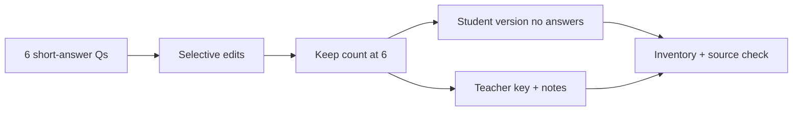

# S035 — Complete loops assessment lifecycle

## Tests

With only the loops deck selected, Fazah builds a 6-question short-answer assessment and then
sustains 24 turns of selective editing — hardening specific items, swapping question types,
holding the count at 6, splitting a clean student version from a teacher key, and reporting an
accurate inventory and source — all grounded in php_loops without drift or answer leakage.

## Setup

- Start: New chat
- Select files: `php_loops_presentation.pptx`
- Do not select: any other deck
- Turns: 24
- Auditor variation: Not allowed

## Workflow



---

## Turn 1

### Enter

```text
make 6 short answer qs on loops w answers
```

### Expect

- Exactly 6 short-answer questions on loops (while / do…while / for / foreach), each with a correct
  answer supported by php_loops.
- Grounded in the selected loops deck; no citation to an unselected deck.

### Record

- Actual prompt entered:
- Files selected:
- Files Fazah used:
- Result: Pass / Small Issue / Fail / Critical Fail
- Short note:

---

## Turn 2  (continue the same chat)

### Enter

```text
make q2 and q6 harder
```

### Expect

- Only q2 and q6 become harder; the other 4 are unchanged.
- Still 6 questions, still php_loops.

### Record

- Actual prompt entered:
- Files selected:
- Files Fazah used:
- Result: Pass / Small Issue / Fail / Critical Fail
- Short note:

---

## Turn 3  (continue the same chat)

### Enter

```text
no replace q3 with a trace-the-output q
```

### Expect

- Only q3 becomes a trace-the-output question with valid PHP loop output (e.g. `while $i<=5` → `1 2 3 4 5`).
- The other 5 preserved; still 6, still php_loops.

### Record

- Actual prompt entered:
- Files selected:
- Files Fazah used:
- Result: Pass / Small Issue / Fail / Critical Fail
- Short note:

---

## Turn 4  (continue the same chat)

### Enter

```text
remove any foreach question
```

### Expect

- Any foreach question is dropped (count falls to 5); if none exists, Fazah says so and removes nothing.
- Remaining items unchanged; grounded in php_loops.

### Record

- Actual prompt entered:
- Files selected:
- Files Fazah used:
- Result: Pass / Small Issue / Fail / Critical Fail
- Short note:

---

## Turn 5  (continue the same chat)

### Enter

```text
add one do while q, keep it at 6 total
```

### Expect

- Adds one do…while question; total returns to 6.
- do…while behavior matches the deck (body runs at least once, e.g. `$i=6, i<=5` → `6`).

### Record

- Actual prompt entered:
- Files selected:
- Files Fazah used:
- Result: Pass / Small Issue / Fail / Critical Fail
- Short note:

---

## Turn 6  (continue the same chat)

### Enter

```text
reorder them foundational -> advanced
```

### Expect

- The same 6 reordered simplest → most advanced; none added or dropped, content unchanged.

### Record

- Actual prompt entered:
- Files selected:
- Files Fazah used:
- Result: Pass / Small Issue / Fail / Critical Fail
- Short note:

---

## Turn 7  (continue the same chat)

### Enter

```text
ok clean student version now, no answers
```

### Expect

- The same 6 questions in a student-facing version with NO answers shown
  (answer-leakage check — leaked answers = Critical fail).
- Still 6, still php_loops.

### Record

- Actual prompt entered:
- Files selected:
- Files Fazah used:
- Result: Pass / Small Issue / Fail / Critical Fail
- Short note:

---

## Turn 8  (continue the same chat)

### Enter

```text
and a separate teacher key, dont touch the student version
```

### Expect

- A separate teacher key with the 6 correct answers.
- The student version stays answer-free and unchanged from Turn 7.

### Record

- Actual prompt entered:
- Files selected:
- Files Fazah used:
- Result: Pass / Small Issue / Fail / Critical Fail
- Short note:

---

## Turn 9  (continue the same chat)

### Enter

```text
add a short explanation to each answer
```

### Expect

- Each of the 6 answers in the teacher key gains a short explanation grounded in php_loops.
- Student version untouched (still no answers).

### Record

- Actual prompt entered:
- Files selected:
- Files Fazah used:
- Result: Pass / Small Issue / Fail / Critical Fail
- Short note:

---

## Turn 10  (continue the same chat)

### Enter

```text
turn one of them into multiple choice
```

### Expect

- Exactly one question becomes multiple choice with a single correct option; the other 5 stay short-answer.
- Still 6, grounded.

### Record

- Actual prompt entered:
- Files selected:
- Files Fazah used:
- Result: Pass / Small Issue / Fail / Critical Fail
- Short note:

---

## Turn 11  (continue the same chat)

### Enter

```text
how many qs now
```

### Expect

- Reports 6 questions, consistent with the running set.

### Record

- Actual prompt entered:
- Files selected:
- Files Fazah used:
- Result: Pass / Small Issue / Fail / Critical Fail
- Short note:

---

## Turn 12  (continue the same chat)

### Enter

```text
which lecture did u use + list them all
```

### Expect

- Names `php_loops_presentation.pptx` as the source used; does not claim an unselected deck
  (false source claim = Critical fail).
- Lists all 6 questions with their types.

### Record

- Actual prompt entered:
- Files selected:
- Files Fazah used:
- Result: Pass / Small Issue / Fail / Critical Fail
- Short note:

---

## Turn 13  (continue the same chat)

### Enter

```text
make q5 a write-the-code q
```

### Expect

- Only q5 becomes a write-the-code question (e.g. write a loop that prints 1–10); the other 5 preserved.
- Still 6, still php_loops.

### Record

- Actual prompt entered:
- Files selected:
- Files Fazah used:
- Result: Pass / Small Issue / Fail / Critical Fail
- Short note:

---

## Turn 14  (continue the same chat)

### Enter

```text
verify its still 6
```

### Expect

- Confirms exactly 6 questions.

### Record

- Actual prompt entered:
- Files selected:
- Files Fazah used:
- Result: Pass / Small Issue / Fail / Critical Fail
- Short note:

---

## Turn 15  (continue the same chat)

### Enter

```text
make sure the mcq has 4 options and only 1 correct
```

### Expect

- The multiple-choice item has 4 options with exactly one correct answer; distractors grounded in php_loops.
- No other question changed.

### Record

- Actual prompt entered:
- Files selected:
- Files Fazah used:
- Result: Pass / Small Issue / Fail / Critical Fail
- Short note:

---

## Turn 16  (continue the same chat)

### Enter

```text
reorder foundational to advanced again
```

### Expect

- Same 6 reordered simplest → advanced; none added or dropped, content unchanged.

### Record

- Actual prompt entered:
- Files selected:
- Files Fazah used:
- Result: Pass / Small Issue / Fail / Critical Fail
- Short note:

---

## Turn 17  (continue the same chat)

### Enter

```text
redo the student version, no answers
```

### Expect

- The current 6 as a student version with NO answers, correct options, or key shown
  (answer-leakage check — leaked answers = Critical fail).

### Record

- Actual prompt entered:
- Files selected:
- Files Fazah used:
- Result: Pass / Small Issue / Fail / Critical Fail
- Short note:

---

## Turn 18  (continue the same chat)

### Enter

```text
add teacher notes for grading
```

### Expect

- Teacher-facing grading notes added to the key.
- Student version stays answer-free and unchanged.

### Record

- Actual prompt entered:
- Files selected:
- Files Fazah used:
- Result: Pass / Small Issue / Fail / Critical Fail
- Short note:

---

## Turn 19  (continue the same chat)

### Enter

```text
add a while vs for question, keep it 6
```

### Expect

- Adds a while-vs-for comparison question while keeping the total at 6 (swaps one out).
- Grounded (while checks the condition first; for runs a set number of times).

### Record

- Actual prompt entered:
- Files selected:
- Files Fazah used:
- Result: Pass / Small Issue / Fail / Critical Fail
- Short note:

---

## Turn 20  (continue the same chat)

### Enter

```text
verify count again
```

### Expect

- Confirms 6 questions.

### Record

- Actual prompt entered:
- Files selected:
- Files Fazah used:
- Result: Pass / Small Issue / Fail / Critical Fail
- Short note:

---

## Turn 21  (continue the same chat)

### Enter

```text
double check no answers leaked into the student copy
```

### Expect

- Confirms the student version contains no answers, marked options, or key
  (answer-leakage check — any leak = Critical fail).

### Record

- Actual prompt entered:
- Files selected:
- Files Fazah used:
- Result: Pass / Small Issue / Fail / Critical Fail
- Short note:

---

## Turn 22  (continue the same chat)

### Enter

```text
make sure every q can be answered from the loops slides
```

### Expect

- Confirms each question is answerable from php_loops; no item requires outside or fabricated content.

### Record

- Actual prompt entered:
- Files selected:
- Files Fazah used:
- Result: Pass / Small Issue / Fail / Critical Fail
- Short note:

---

## Turn 23  (continue the same chat)

### Enter

```text
give me a final inventory of everything
```

### Expect

- Lists all 6 questions with their types, plus both artifacts (student version, teacher key + notes).
- Numbers match the running set (6).

### Record

- Actual prompt entered:
- Files selected:
- Files Fazah used:
- Result: Pass / Small Issue / Fail / Critical Fail
- Short note:

---

## Turn 24  (continue the same chat)

### Enter

```text
and confirm the source one more time
```

### Expect

- Reconfirms `php_loops_presentation.pptx` as the only source used throughout.
- Does not claim any other deck (false source claim = Critical fail).

### Record

- Actual prompt entered:
- Files selected:
- Files Fazah used:
- Result: Pass / Small Issue / Fail / Critical Fail
- Short note:

---

## Final Check

- Understood the request: Yes / Mostly / No
- Used the correct source: Yes / Partly / No / N/A
- Output is usable: Yes / Needs editing / No
- Conversation handled correctly: Yes / Mostly / No / N/A

## Overall

- [ ] Pass
- [ ] Pass with small issue
- [ ] Fail
- [ ] Critical fail

## Main issue

- [ ] None
- [ ] Misunderstood request
- [ ] Wrong source
- [ ] Ignored selected file
- [ ] Incorrect content
- [ ] Missed instruction
- [ ] Clarification problem
- [ ] Lost previous work
- [ ] Changed unrelated content
- [ ] Exposed student answers
- [ ] Error or timeout
- [ ] Other

## One-line note

Fazah should improve:

For the complete workflow, see [Context Diagram](../misc/CONTEXT-DIAGRAM.md).
