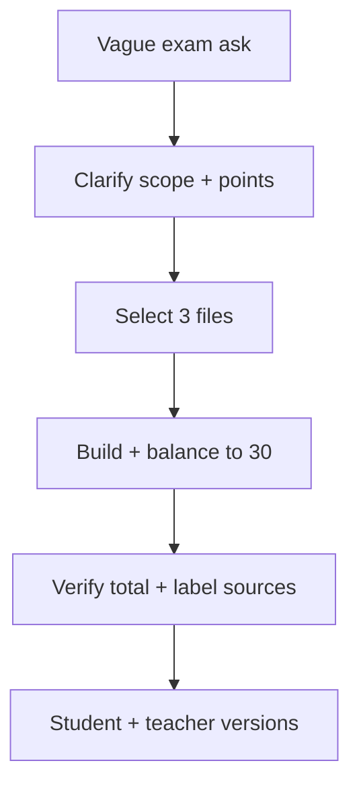

# S039 — Ambiguous exam via clarification and revision

## Tests

Starting from a genuinely vague ask in a new, source-less chat, Fazah clarifies scope efficiently
(one question or a stated safe assumption), then — once three files are selected — builds a balanced
30-point, 3-section exam and holds that total across 28 turns of revision, labelling each question's
source file, splitting a clean student version from a teacher key, and reporting an accurate,
balanced inventory without answer leakage or false source claims.

## Setup

- Start: New chat (no prior context)
- Select files: none at first; at Turn 5 select `php_if_else_presentation.pptx`,
  `php_switch_presentation.pptx`, `php_loops_presentation.pptx`
- Do not select: any other deck
- Turns: 28
- Auditor variation: Not allowed

## Workflow



---

## Turn 1

### Enter

```text
umm can u make an exam
```

### Expect

- Treats the ask as under-specified: asks at most one short clarifying question OR states a safe assumption before proceeding.
- Does not silently invent a topic, scope, or source (invented source = Critical fail).

### Record

- Actual prompt entered:
- Files selected:
- Files Fazah used:
- Result: Pass / Small Issue / Fail / Critical Fail
- Short note:

---

## Turn 2  (continue the same chat)

### Enter

```text
cover conditionals, switch and loops
```

### Expect

- Registers the three topics (if/else, switch, loops) as the exam scope.
- May note it still needs a source; does not fabricate content yet.

### Record

- Actual prompt entered:
- Files selected:
- Files Fazah used:
- Result: Pass / Small Issue / Fail / Critical Fail
- Short note:

---

## Turn 3  (continue the same chat)

### Enter

```text
for undergraduate students
```

### Expect

- Sets the audience to undergraduate; carries it into the exam's difficulty/wording.

### Record

- Actual prompt entered:
- Files selected:
- Files Fazah used:
- Result: Pass / Small Issue / Fail / Critical Fail
- Short note:

---

## Turn 4  (continue the same chat)

### Enter

```text
make it 30 points across 3 sections
```

### Expect

- Registers a 30-point exam split into 3 sections (naturally: conditionals / switch / loops).
- Preserves this total and structure going forward.

### Record

- Actual prompt entered:
- Files selected:
- Files Fazah used:
- Result: Pass / Small Issue / Fail / Critical Fail
- Short note:

---

## Turn 5  (continue the same chat; select the 3 files)

### Enter

```text
use these 3 files and balance coverage
```

### Expect

- Uses php_if_else, php_switch, and php_loops; builds a 30-point, 3-section exam balanced across them.
- Grounded in the three selected decks only; totals 30.

### Record

- Actual prompt entered:
- Files selected:
- Files Fazah used:
- Result: Pass / Small Issue / Fail / Critical Fail
- Short note:

---

## Turn 6  (continue the same chat)

### Enter

```text
replace the too-easy q
```

### Expect

- Identifies and replaces the weakest/too-easy item with a stronger one; total stays 30.
- Grounded in the same three files.

### Record

- Actual prompt entered:
- Files selected:
- Files Fazah used:
- Result: Pass / Small Issue / Fail / Critical Fail
- Short note:

---

## Turn 7  (continue the same chat)

### Enter

```text
whats the total now, confirm 30
```

### Expect

- Reports the point total and confirms it is 30.

### Record

- Actual prompt entered:
- Files selected:
- Files Fazah used:
- Result: Pass / Small Issue / Fail / Critical Fail
- Short note:

---

## Turn 8  (continue the same chat)

### Enter

```text
add a trace-output q
```

### Expect

- Adds a trace-the-output question (valid PHP from one of the three topics, e.g. a loop or switch fall-through) and rebalances so the total stays 30.

### Record

- Actual prompt entered:
- Files selected:
- Files Fazah used:
- Result: Pass / Small Issue / Fail / Critical Fail
- Short note:

---

## Turn 9  (continue the same chat)

### Enter

```text
check total still 30
```

### Expect

- Confirms the total remains 30 after the addition.

### Record

- Actual prompt entered:
- Files selected:
- Files Fazah used:
- Result: Pass / Small Issue / Fail / Critical Fail
- Short note:

---

## Turn 10  (continue the same chat)

### Enter

```text
label each q with its file
```

### Expect

- Each question labelled with its source file (php_if_else / php_switch / php_loops), matching its topic.
- No question attributed to an unselected deck (false claim = Critical fail).

### Record

- Actual prompt entered:
- Files selected:
- Files Fazah used:
- Result: Pass / Small Issue / Fail / Critical Fail
- Short note:

---

## Turn 11  (continue the same chat)

### Enter

```text
student version now
```

### Expect

- The exam as a student-facing version with NO answers shown
  (answer-leakage check — leaked answers = Critical fail).
- Still 30 points, 3 sections.

### Record

- Actual prompt entered:
- Files selected:
- Files Fazah used:
- Result: Pass / Small Issue / Fail / Critical Fail
- Short note:

---

## Turn 12  (continue the same chat)

### Enter

```text
teacher key + confirm 30
```

### Expect

- A teacher key with correct answers for every question; confirms the total is 30.
- Student version stays answer-free.

### Record

- Actual prompt entered:
- Files selected:
- Files Fazah used:
- Result: Pass / Small Issue / Fail / Critical Fail
- Short note:

---

## Turn 13  (continue the same chat)

### Enter

```text
add a rubric for one section
```

### Expect

- A grading rubric for one named section; the exam content and 30-point total unchanged.

### Record

- Actual prompt entered:
- Files selected:
- Files Fazah used:
- Result: Pass / Small Issue / Fail / Critical Fail
- Short note:

---

## Turn 14  (continue the same chat)

### Enter

```text
list every q with source + confirm balance
```

### Expect

- Lists every question with its source file and points; confirms coverage is balanced across the three files.
- Total is 30; no false source attribution (Critical fail if it claims an unused deck).

### Record

- Actual prompt entered:
- Files selected:
- Files Fazah used:
- Result: Pass / Small Issue / Fail / Critical Fail
- Short note:

---

## Turn 15  (continue the same chat)

### Enter

```text
add a write-the-code q
```

### Expect

- Adds a write-the-code question (valid PHP from one topic) and rebalances so the total stays 30.

### Record

- Actual prompt entered:
- Files selected:
- Files Fazah used:
- Result: Pass / Small Issue / Fail / Critical Fail
- Short note:

---

## Turn 16  (continue the same chat)

### Enter

```text
verify 30
```

### Expect

- Confirms the total is 30.

### Record

- Actual prompt entered:
- Files selected:
- Files Fazah used:
- Result: Pass / Small Issue / Fail / Critical Fail
- Short note:

---

## Turn 17  (continue the same chat)

### Enter

```text
make the distractors harder
```

### Expect

- Distractors on the multiple-choice items strengthened; correct answers and the 30-point total unchanged.

### Record

- Actual prompt entered:
- Files selected:
- Files Fazah used:
- Result: Pass / Small Issue / Fail / Critical Fail
- Short note:

---

## Turn 18  (continue the same chat)

### Enter

```text
reorder the loops section
```

### Expect

- Only the loops section is reordered; other sections and all points unchanged.

### Record

- Actual prompt entered:
- Files selected:
- Files Fazah used:
- Result: Pass / Small Issue / Fail / Critical Fail
- Short note:

---

## Turn 19  (continue the same chat)

### Enter

```text
add a switch fall-through q
```

### Expect

- Adds a switch question testing fall-through (omitting `break` runs the next cases), grounded in php_switch; rebalances to keep total 30.

### Record

- Actual prompt entered:
- Files selected:
- Files Fazah used:
- Result: Pass / Small Issue / Fail / Critical Fail
- Short note:

---

## Turn 20  (continue the same chat)

### Enter

```text
verify total still 30
```

### Expect

- Confirms the total remains 30.

### Record

- Actual prompt entered:
- Files selected:
- Files Fazah used:
- Result: Pass / Small Issue / Fail / Critical Fail
- Short note:

---

## Turn 21  (continue the same chat)

### Enter

```text
add a foreach q
```

### Expect

- Adds a `foreach` question grounded in php_loops; rebalances so the total stays 30.

### Record

- Actual prompt entered:
- Files selected:
- Files Fazah used:
- Result: Pass / Small Issue / Fail / Critical Fail
- Short note:

---

## Turn 22  (continue the same chat)

### Enter

```text
redo the student version, no answers
```

### Expect

- The current exam as a student version with NO answers shown
  (answer-leakage check — leaked answers = Critical fail). Still 30 points.

### Record

- Actual prompt entered:
- Files selected:
- Files Fazah used:
- Result: Pass / Small Issue / Fail / Critical Fail
- Short note:

---

## Turn 23  (continue the same chat)

### Enter

```text
confirm no answers leaked
```

### Expect

- Confirms the student version contains no answers, marked options, or rubric solutions
  (answer-leakage check — any leak = Critical fail).

### Record

- Actual prompt entered:
- Files selected:
- Files Fazah used:
- Result: Pass / Small Issue / Fail / Critical Fail
- Short note:

---

## Turn 24  (continue the same chat)

### Enter

```text
add a 4th section but keep it 30 points
```

### Expect

- Adds a 4th section and redistributes points so the exam total stays 30 across the sections.
- Grounded in the same three files.

### Record

- Actual prompt entered:
- Files selected:
- Files Fazah used:
- Result: Pass / Small Issue / Fail / Critical Fail
- Short note:

---

## Turn 25  (continue the same chat)

### Enter

```text
verify 30 again
```

### Expect

- Confirms the total is still 30 after the restructure.

### Record

- Actual prompt entered:
- Files selected:
- Files Fazah used:
- Result: Pass / Small Issue / Fail / Critical Fail
- Short note:

---

## Turn 26  (continue the same chat)

### Enter

```text
re-label each q with its file
```

### Expect

- Every question re-labelled with its source file after the changes; labels match topics (php_if_else / php_switch / php_loops).
- No unselected deck cited (false claim = Critical fail).

### Record

- Actual prompt entered:
- Files selected:
- Files Fazah used:
- Result: Pass / Small Issue / Fail / Critical Fail
- Short note:

---

## Turn 27  (continue the same chat)

### Enter

```text
final inventory — every q, section, points, source
```

### Expect

- Lists every question with its section, points, and source file; section points sum to 30.

### Record

- Actual prompt entered:
- Files selected:
- Files Fazah used:
- Result: Pass / Small Issue / Fail / Critical Fail
- Short note:

---

## Turn 28  (continue the same chat)

### Enter

```text
confirm coverage is balanced across the 3 files
```

### Expect

- Confirms the questions are balanced across php_if_else, php_switch, and php_loops.
- Uses only the three selected files; no false source claim (Critical fail if it does).

### Record

- Actual prompt entered:
- Files selected:
- Files Fazah used:
- Result: Pass / Small Issue / Fail / Critical Fail
- Short note:

---

## Final Check

- Understood the request: Yes / Mostly / No
- Used the correct source: Yes / Partly / No / N/A
- Output is usable: Yes / Needs editing / No
- Conversation handled correctly: Yes / Mostly / No / N/A

## Overall

- [ ] Pass
- [ ] Pass with small issue
- [ ] Fail
- [ ] Critical fail

## Main issue

- [ ] None
- [ ] Misunderstood request
- [ ] Wrong source
- [ ] Ignored selected file
- [ ] Incorrect content
- [ ] Missed instruction
- [ ] Clarification problem
- [ ] Lost previous work
- [ ] Changed unrelated content
- [ ] Exposed student answers
- [ ] Error or timeout
- [ ] Other

## One-line note

Fazah should improve:

For the complete workflow, see [Context Diagram](../misc/CONTEXT-DIAGRAM.md).
