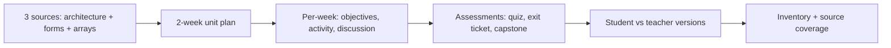

# S040 — Complete mini course package

## Tests

The longest arc: from three selected files (Module 3 architecture, php_forms, php_arrays), Fazah
builds a connected 2-week mini-unit and, across 30 conversational turns, layers on objectives,
activities, a cumulative quiz, slides, glossary, homework, and a capstone — keeping every artifact
grounded in the right source, tracking each artifact's audience, splitting student-facing material
from teacher keys, and reporting an accurate multi-source inventory with no answer leakage or false
attribution.

## Setup

- Start: New chat
- Select files: `Module 3- Understanding Web Application Architecture.pptx`,
  `php_forms_presentation.pptx`, `php_arrays_presentation.pptx`
- Do not select: any other deck
- Turns: 30
- Auditor variation: Allowed (see Auditor variation below)

## Workflow



---

## Turn 1

### Enter

```text
ok so can u make a 2-week mini-unit plan connecting these 3 — architecture, forms, arrays
```

### Expect

- A 2-week mini-unit plan tying together web architecture (Module 3), forms (php_forms), and arrays (php_arrays).
- Facts match the decks (e.g. dynamic pages add an interpreter + DB; $_GET/$_POST; indexed/associative arrays).
- Grounded in the three selected files only; no unselected deck cited.

### Record

- Actual prompt entered:
- Files selected:
- Files Fazah used:
- Result: Pass / Small Issue / Fail / Critical Fail
- Short note:

---

## Turn 2  (continue the same chat)

### Enter

```text
add learning objectives per week
```

### Expect

- Per-week learning objectives added, matching each week's topics; plan structure preserved.

### Record

- Actual prompt entered:
- Files selected:
- Files Fazah used:
- Result: Pass / Small Issue / Fail / Critical Fail
- Short note:

---

## Turn 3  (continue the same chat)

### Enter

```text
gimme a student reading guide
```

### Expect

- A student-facing reading guide covering the unit topics (no teacher notes or answers).
- Grounded in the three files (answer-leakage check — leaked answers = Critical fail).

### Record

- Actual prompt entered:
- Files selected:
- Files Fazah used:
- Result: Pass / Small Issue / Fail / Critical Fail
- Short note:

---

## Turn 4  (continue the same chat)

### Enter

```text
one coding activity per week
```

### Expect

- One coding activity per week, each grounded in that week's topic (e.g. a form handler; an array iteration).
- Valid PHP consistent with the decks.

### Record

- Actual prompt entered:
- Files selected:
- Files Fazah used:
- Result: Pass / Small Issue / Fail / Critical Fail
- Short note:

---

## Turn 5  (continue the same chat)

### Enter

```text
make a 10-question cumulative quiz
```

### Expect

- Exactly 10 questions spanning the three topics (architecture, forms, arrays), answerable from the decks.

### Record

- Actual prompt entered:
- Files selected:
- Files Fazah used:
- Result: Pass / Small Issue / Fail / Critical Fail
- Short note:

---

## Turn 6  (continue the same chat)

### Enter

```text
teacher key for the quiz
```

### Expect

- A teacher key with correct answers for all 10 questions, grounded in the three files.

### Record

- Actual prompt entered:
- Files selected:
- Files Fazah used:
- Result: Pass / Small Issue / Fail / Critical Fail
- Short note:

---

## Turn 7  (continue the same chat)

### Enter

```text
short student revision sheet
```

### Expect

- A concise student-facing revision sheet with no quiz answers
  (answer-leakage check — leaked answers = Critical fail).

### Record

- Actual prompt entered:
- Files selected:
- Files Fazah used:
- Result: Pass / Small Issue / Fail / Critical Fail
- Short note:

---

## Turn 8  (continue the same chat)

### Enter

```text
summarize the artifacts so far + who each is for + which source
```

### Expect

- Lists artifacts to date, each with its audience (student/teacher) and source file(s).
- Attribution accurate across the three files; no false source claim (Critical fail if it does).

### Record

- Actual prompt entered:
- Files selected:
- Files Fazah used:
- Result: Pass / Small Issue / Fail / Critical Fail
- Short note:

---

## Turn 9  (continue the same chat)

### Enter

```text
add a discussion prompt per week
```

### Expect

- One discussion prompt per week, grounded in that week's topic; existing artifacts preserved.

### Record

- Actual prompt entered:
- Files selected:
- Files Fazah used:
- Result: Pass / Small Issue / Fail / Critical Fail
- Short note:

---

## Turn 10  (continue the same chat)

### Enter

```text
6-slide overview deck
```

### Expect

- A 6-slide overview deck covering the unit (architecture → forms → arrays), grounded in the three files.

### Record

- Actual prompt entered:
- Files selected:
- Files Fazah used:
- Result: Pass / Small Issue / Fail / Critical Fail
- Short note:

---

## Turn 11  (continue the same chat)

### Enter

```text
add a glossary
```

### Expect

- A glossary of the unit's key terms (e.g. static vs dynamic, MVC, $_GET/$_POST, associative array) consistent with the decks.

### Record

- Actual prompt entered:
- Files selected:
- Files Fazah used:
- Result: Pass / Small Issue / Fail / Critical Fail
- Short note:

---

## Turn 12  (continue the same chat)

### Enter

```text
quiz student version, no answers
```

### Expect

- The 10-question quiz as a student version with NO answers shown
  (answer-leakage check — leaked answers = Critical fail).

### Record

- Actual prompt entered:
- Files selected:
- Files Fazah used:
- Result: Pass / Small Issue / Fail / Critical Fail
- Short note:

---

## Turn 13  (continue the same chat)

### Enter

```text
verify the quiz spans all 3 files
```

### Expect

- Confirms the 10 questions draw on Module 3, php_forms, and php_arrays.
- Attribution accurate; no unselected deck cited (false claim = Critical fail).

### Record

- Actual prompt entered:
- Files selected:
- Files Fazah used:
- Result: Pass / Small Issue / Fail / Critical Fail
- Short note:

---

## Turn 14  (continue the same chat)

### Enter

```text
add a homework assignment
```

### Expect

- A homework assignment grounded in the unit topics (e.g. build a form that stores input in an array).

### Record

- Actual prompt entered:
- Files selected:
- Files Fazah used:
- Result: Pass / Small Issue / Fail / Critical Fail
- Short note:

---

## Turn 15  (continue the same chat)

### Enter

```text
shorten the reading guide
```

### Expect

- Only the student reading guide is shortened; other artifacts untouched.
- Still student-facing, still no answers.

### Record

- Actual prompt entered:
- Files selected:
- Files Fazah used:
- Result: Pass / Small Issue / Fail / Critical Fail
- Short note:

---

## Turn 16  (continue the same chat)

### Enter

```text
add a 'build a dynamic page' capstone
```

### Expect

- A capstone project: build a dynamic page, grounded in Module 3 (dynamic = interpreter + DB) plus forms and arrays.
- Valid, consistent with the decks.

### Record

- Actual prompt entered:
- Files selected:
- Files Fazah used:
- Result: Pass / Small Issue / Fail / Critical Fail
- Short note:

---

## Turn 17  (continue the same chat)

### Enter

```text
rubric for the capstone
```

### Expect

- A grading rubric for the capstone; capstone content unchanged.

### Record

- Actual prompt entered:
- Files selected:
- Files Fazah used:
- Result: Pass / Small Issue / Fail / Critical Fail
- Short note:

---

## Turn 18  (continue the same chat)

### Enter

```text
add an MVC role-matching activity
```

### Expect

- An activity matching MVC roles to functions, grounded in Module 3 (Model = data logic INSERT/UPDATE/LIST/DELETE; View = HTML/CSS; Controller = business logic).

### Record

- Actual prompt entered:
- Files selected:
- Files Fazah used:
- Result: Pass / Small Issue / Fail / Critical Fail
- Short note:

---

## Turn 19  (continue the same chat)

### Enter

```text
verify each artifact's audience
```

### Expect

- Correctly tags each artifact by audience (reading guide/revision sheet/quiz student version = student; teacher key/rubric = teacher).
- No audience mix-up.

### Record

- Actual prompt entered:
- Files selected:
- Files Fazah used:
- Result: Pass / Small Issue / Fail / Critical Fail
- Short note:

---

## Turn 20  (continue the same chat)

### Enter

```text
add an exit ticket
```

### Expect

- A short exit ticket on the unit topics, answerable from the three decks; student-facing wording.

### Record

- Actual prompt entered:
- Files selected:
- Files Fazah used:
- Result: Pass / Small Issue / Fail / Critical Fail
- Short note:

---

## Turn 21  (continue the same chat)

### Enter

```text
check the teacher key still matches the quiz
```

### Expect

- Confirms the teacher key corresponds to the current 10 quiz questions (no drift after edits).

### Record

- Actual prompt entered:
- Files selected:
- Files Fazah used:
- Result: Pass / Small Issue / Fail / Critical Fail
- Short note:

---

## Turn 22  (continue the same chat)

### Enter

```text
shorten the overview deck
```

### Expect

- Only the 6-slide overview deck is trimmed; other artifacts untouched. Still covers all three topics.

### Record

- Actual prompt entered:
- Files selected:
- Files Fazah used:
- Result: Pass / Small Issue / Fail / Critical Fail
- Short note:

---

## Turn 23  (continue the same chat)

### Enter

```text
add a GET vs POST note
```

### Expect

- A note contrasting GET (visible in URL, ~2000-char limit, bookmarkable, not for sensitive data) vs POST (not in URL, no size limit, file uploads, recommended for forms), grounded in php_forms.

### Record

- Actual prompt entered:
- Files selected:
- Files Fazah used:
- Result: Pass / Small Issue / Fail / Critical Fail
- Short note:

---

## Turn 24  (continue the same chat)

### Enter

```text
verify sources for each artifact
```

### Expect

- Reports the source file(s) behind each artifact; attribution accurate across the three files.
- No artifact attributed to an unselected deck (false claim = Critical fail).

### Record

- Actual prompt entered:
- Files selected:
- Files Fazah used:
- Result: Pass / Small Issue / Fail / Critical Fail
- Short note:

---

## Turn 25  (continue the same chat)

### Enter

```text
add a foreach activity
```

### Expect

- An activity using `foreach` over an array, grounded in php_arrays (`foreach ($arr as $value)` / `as $key => $value`).

### Record

- Actual prompt entered:
- Files selected:
- Files Fazah used:
- Result: Pass / Small Issue / Fail / Critical Fail
- Short note:

---

## Turn 26  (continue the same chat)

### Enter

```text
teacher key for the exit ticket too
```

### Expect

- A separate teacher key for the exit ticket; the exit ticket itself stays answer-free.

### Record

- Actual prompt entered:
- Files selected:
- Files Fazah used:
- Result: Pass / Small Issue / Fail / Critical Fail
- Short note:

---

## Turn 27  (continue the same chat)

### Enter

```text
does the capstone rubric cover all 3 topics
```

### Expect

- Confirms the capstone rubric addresses architecture, forms, and arrays; if a topic is missing, says so honestly.

### Record

- Actual prompt entered:
- Files selected:
- Files Fazah used:
- Result: Pass / Small Issue / Fail / Critical Fail
- Short note:

---

## Turn 28  (continue the same chat)

### Enter

```text
re-check the student stuff — revision sheet and quiz, no answers
```

### Expect

- Confirms the revision sheet and student quiz version are answer-free
  (answer-leakage check — any leak = Critical fail).

### Record

- Actual prompt entered:
- Files selected:
- Files Fazah used:
- Result: Pass / Small Issue / Fail / Critical Fail
- Short note:

---

## Turn 29  (continue the same chat)

### Enter

```text
final inventory of every artifact
```

### Expect

- Lists every artifact with its audience and source; counts (e.g. 10 quiz questions, 6 slides) match the running set.

### Record

- Actual prompt entered:
- Files selected:
- Files Fazah used:
- Result: Pass / Small Issue / Fail / Critical Fail
- Short note:

---

## Turn 30  (continue the same chat)

### Enter

```text
confirm every one of the 3 sources got used
```

### Expect

- Confirms Module 3, php_forms, and php_arrays were each used across the package.
- Uses only the three selected files; no false source claim (Critical fail if it does).

### Record

- Actual prompt entered:
- Files selected:
- Files Fazah used:
- Result: Pass / Small Issue / Fail / Critical Fail
- Short note:

---

## Auditor variation

Allowed: change exactly one instruction and keep the rest of the run identical. Apply it consistently
in later turns (per-week items, counts, and audience must follow it), and record which one you used.
Pick one:

- Turn 1: ask for a **3-week** unit instead of 2 weeks (per-week objectives, activities, and
  discussion prompts then span 3 weeks).
- Turn 5: change the quiz size (e.g. **12** or **15** questions instead of 10) — later count checks
  must match.
- Anywhere: require a **formal tone** for all student-facing text.
- Turn 3: set the audience to **first-year students** instead of undergraduate generally.

---

## Final Check

- Understood the request: Yes / Mostly / No
- Used the correct source: Yes / Partly / No / N/A
- Output is usable: Yes / Needs editing / No
- Conversation handled correctly: Yes / Mostly / No / N/A

## Overall

- [ ] Pass
- [ ] Pass with small issue
- [ ] Fail
- [ ] Critical fail

## Main issue

- [ ] None
- [ ] Misunderstood request
- [ ] Wrong source
- [ ] Ignored selected file
- [ ] Incorrect content
- [ ] Missed instruction
- [ ] Clarification problem
- [ ] Lost previous work
- [ ] Changed unrelated content
- [ ] Exposed student answers
- [ ] Error or timeout
- [ ] Other

## One-line note

Fazah should improve:

For the complete workflow, see [Context Diagram](../misc/CONTEXT-DIAGRAM.md).
