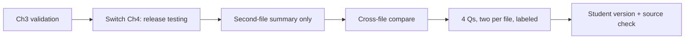

# S006 — Source changes mid-chat, resolving "the second file"

## Tests

Fazah follows an explicit source switch mid-chat, correctly resolves "the second file" to the Testing
deck, and then sustains a two-file workflow — cross-file comparison, per-file-labeled questions, and a
student version — keeping each fact attributed to the file it came from.

## Setup

- Start: New chat
- Select files: `Ch3 Req Eng.pptx` first (Turn 1), then switch to `Ch4 Testing.pptx` (Turn 2)
- Do not select: any other deck
- Turns: 8
- Auditor variation: Not allowed

## Workflow



---

## Turn 1  (select `Ch3 Req Eng.pptx`)

### Enter

```text
Explain requirements validation.
```

### Expect

- Grounded in the Requirements deck (`Ch3 Req Eng.pptx`).
- Validation checks named correctly: validity, consistency, completeness, realism, verifiability.
- Techniques mentioned: reviews, prototyping, test-case generation.

### Record

- Actual prompt entered:
- Files selected:
- Files Fazah used:
- Result: Pass / Small Issue / Fail / Critical Fail
- Short note:

---

## Turn 2  (before entering: switch selection to `Ch4 Testing.pptx`; continue the same chat)

### Enter

```text
Now explain release testing.
```

### Expect

- Grounded in the Testing deck (`Ch4 Testing.pptx`); used sources reflect Testing.
- Release testing = a separate team tests a release intended for use outside the dev team, usually
  black-box, before release.

### Record

- Actual prompt entered:
- Files selected:
- Files Fazah used:
- Result: Pass / Small Issue / Fail / Critical Fail
- Short note:

---

## Turn 3  (continue the same chat)

### Enter

```text
Summarize only what we discussed from the second file.
```

### Expect

- Fazah resolves "the second file" = `Ch4 Testing.pptx`.
- The summary covers only the release-testing / Testing content, not requirements validation.
- No requirements-validation material leaks into the summary.

### Record

- Actual prompt entered:
- Files selected:
- Files Fazah used:
- Result: Pass / Small Issue / Fail / Critical Fail
- Short note:

---

## Turn 4  (continue the same chat)

### Enter

```text
Compare requirements validation and release testing across both files.
```

### Expect

- A comparison that draws requirements validation from `Ch3 Req Eng.pptx` and release testing from
  `Ch4 Testing.pptx`, keeping each concept attributed to its own file.
- Content stays within these two decks; no third chapter is introduced.

### Record

- Actual prompt entered:
- Files selected:
- Files Fazah used:
- Result: Pass / Small Issue / Fail / Critical Fail
- Short note:

---

## Turn 5  (continue the same chat)

### Enter

```text
Make four questions — two from each file.
```

### Expect

- Exactly four questions: two on requirements validation (Ch3) and two on release testing (Ch4).
- Each question is grounded in the file it maps to; no cross-attribution errors.

### Record

- Actual prompt entered:
- Files selected:
- Files Fazah used:
- Result: Pass / Small Issue / Fail / Critical Fail
- Short note:

---

## Turn 6  (continue the same chat)

### Enter

```text
Label each question with the file it came from.
```

### Expect

- Each of the four questions is tagged with its source file (`Ch3 Req Eng.pptx` or `Ch4 Testing.pptx`).
- Labels match content correctly (validation → Ch3, release testing → Ch4); the four questions are
  unchanged otherwise.

### Record

- Actual prompt entered:
- Files selected:
- Files Fazah used:
- Result: Pass / Small Issue / Fail / Critical Fail
- Short note:

---

## Turn 7  (continue the same chat)

### Enter

```text
Give me a student version with no answers.
```

### Expect

- The same four labeled questions in a student-facing version with NO answers shown
  (answer-leakage check — leaked answers = Critical fail).
- The file labels may remain; the answers do not.

### Record

- Actual prompt entered:
- Files selected:
- Files Fazah used:
- Result: Pass / Small Issue / Fail / Critical Fail
- Short note:

---

## Turn 8  (continue the same chat)

### Enter

```text
Confirm which files you used across this chat.
```

### Expect

- Fazah names both `Ch3 Req Eng.pptx` (validation) and `Ch4 Testing.pptx` (release testing).
- It does not claim any other deck and does not misattribute either concept.

### Record

- Actual prompt entered:
- Files selected:
- Files Fazah used:
- Result: Pass / Small Issue / Fail / Critical Fail
- Short note:

---

## Final Check

- Understood the request: Yes / Mostly / No
- Used the correct source: Yes / Partly / No / N/A
- Output is usable: Yes / Needs editing / No
- Conversation handled correctly: Yes / Mostly / No / N/A

## Overall

- [ ] Pass
- [ ] Pass with small issue
- [ ] Fail
- [ ] Critical fail

## Main issue

- [ ] None
- [ ] Misunderstood request
- [ ] Wrong source
- [ ] Ignored selected file
- [ ] Incorrect content
- [ ] Missed instruction
- [ ] Clarification problem
- [ ] Lost previous work
- [ ] Changed unrelated content
- [ ] Exposed student answers
- [ ] Error or timeout
- [ ] Other

## One-line note

Fazah should improve:

For the complete workflow, see [Context Diagram](../CONTEXT-DIAGRAM.md).
