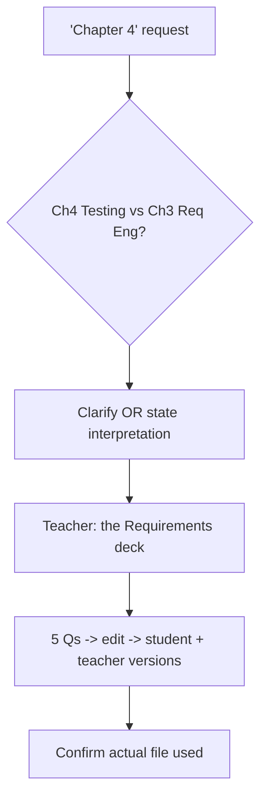

# S017 — Ambiguous "Chapter 4"

## Tests

Fazah handles the filename-vs-internal chapter-number ambiguity ("Chapter 4" = the 4th file
`Ch4 Testing.pptx` or the deck whose title slide reads "Chapter 4" = `Ch3 Req Eng.pptx`), then
carries the resolved source through a sustained build-questions workflow without drifting back to
the wrong deck.

## Setup

- Start: New chat
- Select files: none
- Do not select: any deck (leave sources empty so the ambiguity is not resolved for Fazah)
- Turns: 8
- Auditor variation: Not allowed

## Workflow



---

## Turn 1

### Enter

```text
Create five questions using Chapter 4.
```

### Expect

- Recognizes "Chapter 4" is ambiguous: the 4th file (`Ch4 Testing.pptx`) or the deck whose internal
  title slide says "Chapter 4" (`Ch3 Req Eng.pptx`).
- Either asks which is meant OR clearly states which interpretation it will use before proceeding.
- Does NOT silently pick a reading with no statement, and does not fabricate slide content.

### Record

- Actual prompt entered:
- Files selected:
- Files Fazah used:
- Result: Pass / Small Issue / Fail / Critical Fail
- Short note:

---

## Turn 2   (continue the same chat)

### Enter

```text
I mean the Requirements Engineering slides — the deck whose title says Chapter 4.
```

### Expect

- Acknowledges the clarification and targets the Requirements deck (`Ch3 Req Eng.pptx`).
- Does not switch to the Testing deck or re-ask which chapter is meant.

### Record

- Actual prompt entered:
- Files selected:
- Files Fazah used:
- Result: Pass / Small Issue / Fail / Critical Fail
- Short note:

---

## Turn 3   (continue the same chat)

### Enter

```text
Go ahead and create them.
```

### Expect

- Exactly five questions, grounded in the Requirements deck (e.g. functional vs non-functional
  requirements, elicitation techniques, validation checks) — supported by the content map.
- The Requirements file (`Ch3 Req Eng.pptx`) is shown as the used source; no Testing content.
- No fabricated facts or citations to a deck that was not chosen.

### Record

- Actual prompt entered:
- Files selected:
- Files Fazah used:
- Result: Pass / Small Issue / Fail / Critical Fail
- Short note:

---

## Turn 4   (continue the same chat)

### Enter

```text
Add answers to each of those five.
```

### Expect

- Adds a correct answer to each of the same five questions; the questions themselves are unchanged.
- Answers stay grounded in the Requirements deck (no Testing facts introduced).
- Still five questions — none added or dropped.

### Record

- Actual prompt entered:
- Files selected:
- Files Fazah used:
- Result: Pass / Small Issue / Fail / Critical Fail
- Short note:

---

## Turn 5   (continue the same chat)

### Enter

```text
Make two of them harder.
```

### Expect

- Only two of the five questions become more demanding; the other three are preserved.
- Still exactly five questions, still Requirements-grounded, answers kept in step.
- Updates the active artifact as a new version rather than starting a fresh set.

### Record

- Actual prompt entered:
- Files selected:
- Files Fazah used:
- Result: Pass / Small Issue / Fail / Critical Fail
- Short note:

---

## Turn 6   (continue the same chat)

### Enter

```text
Give me a student version with no answers.
```

### Expect

- Produces a student version of the same five questions (two harder) with the answer space but NO
  answers shown.
- No correct answers or answer key leak into the student version (leakage = Critical fail).
- Same Requirements content and question set as the teacher-facing version.

### Record

- Actual prompt entered:
- Files selected:
- Files Fazah used:
- Result: Pass / Small Issue / Fail / Critical Fail
- Short note:

---

## Turn 7   (continue the same chat)

### Enter

```text
Now the teacher key for those.
```

### Expect

- Produces a teacher key with the correct answer for each of the same five questions.
- Answers match the student version's questions one-to-one; no new questions invented.
- Still grounded in the Requirements deck.

### Record

- Actual prompt entered:
- Files selected:
- Files Fazah used:
- Result: Pass / Small Issue / Fail / Critical Fail
- Short note:

---

## Turn 8   (continue the same chat)

### Enter

```text
Just to confirm — which actual file did you use for all of this?
```

### Expect

- States the Requirements deck (`Ch3 Req Eng.pptx`, internally titled "Chapter 4") as the source.
- Does NOT claim it used `Ch4 Testing.pptx` or both decks; the answer is honest and consistent with
  Turns 2–7.

### Record

- Actual prompt entered:
- Files selected:
- Files Fazah used:
- Result: Pass / Small Issue / Fail / Critical Fail
- Short note:

---

## Final Check

- Understood the request: Yes / Mostly / No
- Used the correct source: Yes / Partly / No / N/A
- Output is usable: Yes / Needs editing / No
- Conversation handled correctly: Yes / Mostly / No / N/A

## Overall

- [ ] Pass
- [ ] Pass with small issue
- [ ] Fail
- [ ] Critical fail

## Main issue

- [ ] None
- [ ] Misunderstood request
- [ ] Wrong source
- [ ] Ignored selected file
- [ ] Incorrect content
- [ ] Missed instruction
- [ ] Clarification problem
- [ ] Lost previous work
- [ ] Changed unrelated content
- [ ] Exposed student answers
- [ ] Error or timeout
- [ ] Other

## One-line note

Fazah should improve:

For the complete workflow, see [Context Diagram](../CONTEXT-DIAGRAM.md).
