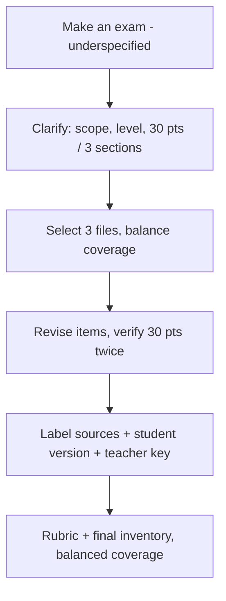

# S039 — Ambiguous exam request, clarify then build and verify

## Tests

From a bare "make an exam", Fazah clarifies efficiently, accepts scope / level / points across turns,
uses three selected decks with balanced coverage, revises items, repeatedly verifies the 30-point total,
labels sources, adds a rubric, and separates a no-answers student version from a teacher key — sustained
over fourteen turns.

## Setup

- Start: New chat (start fresh — this scenario tests a cold start)
- Select files: none at first; select `Ch2 SW Processes.pptx` + `Ch3 Req Eng.pptx` + `Ch4 Testing.pptx` at Turn 5
- Do not select: `Ch1 Introduction.pptx`, `Ch5 Agile SW Dev.pptx`
- Turns: 14
- Auditor variation: Not allowed

## Workflow



---

## Turn 1

### Enter

```text
Make an exam.
```

### Expect

- Fazah recognizes the request is underspecified.
- It asks the essentials OR states safe assumptions before proceeding (at most one short clarifying question).
- It does not dump a full exam as if the request were fully specified.

### Record

- Actual prompt entered:
- Files selected:
- Files Fazah used:
- Result: Pass / Small Issue / Fail / Critical Fail
- Short note:

---

## Turn 2   (continue the same chat)

### Enter

```text
Cover software processes, requirements engineering, and testing.
```

### Expect

- Fazah accepts the three topics.
- It does not re-ask for the topic scope.

### Record

- Actual prompt entered:
- Files selected:
- Files Fazah used:
- Result: Pass / Small Issue / Fail / Critical Fail
- Short note:

---

## Turn 3   (continue the same chat)

### Enter

```text
For undergraduate students.
```

### Expect

- Fazah accepts the undergraduate level and carries it forward.
- No re-ask of already-answered details.

### Record

- Actual prompt entered:
- Files selected:
- Files Fazah used:
- Result: Pass / Small Issue / Fail / Critical Fail
- Short note:

---

## Turn 4   (continue the same chat)

### Enter

```text
Make it 30 points across three sections.
```

### Expect

- Fazah accepts 30 total points across three sections.
- It carries scope + level + points together without re-asking.

### Record

- Actual prompt entered:
- Files selected:
- Files Fazah used:
- Result: Pass / Small Issue / Fail / Critical Fail
- Short note:

---

## Turn 5   (continue the same chat; NOW select `Ch2 SW Processes.pptx` + `Ch3 Req Eng.pptx` + `Ch4 Testing.pptx`)

### Enter

```text
Use these three files and balance the coverage across them.
```

### Expect

- The exam draws on all three selected decks (Processes, Requirements, Testing) with balanced coverage.
- Used sources list the three selected files; no invented citation.
- Content matches the topics (waterfall / incremental, FR vs NFR, V&V / testing levels).

### Record

- Actual prompt entered:
- Files selected:
- Files Fazah used:
- Result: Pass / Small Issue / Fail / Critical Fail
- Short note:

---

## Turn 6   (continue the same chat)

### Enter

```text
Replace one question that's too easy with something harder.
```

### Expect

- Exactly one too-easy question is replaced with a harder one.
- The total is still 30 points (points rebalanced if needed).
- Other questions are unchanged.

### Record

- Actual prompt entered:
- Files selected:
- Files Fazah used:
- Result: Pass / Small Issue / Fail / Critical Fail
- Short note:

---

## Turn 7   (continue the same chat)

### Enter

```text
What's the point total now — confirm it adds up to 30.
```

### Expect

- Fazah confirms the points sum to exactly 30.
- A per-section point breakdown is shown.
- No silent change to the questions.

### Record

- Actual prompt entered:
- Files selected:
- Files Fazah used:
- Result: Pass / Small Issue / Fail / Critical Fail
- Short note:

---

## Turn 8   (continue the same chat)

### Enter

```text
Add a scenario-based question.
```

### Expect

- One scenario question is added (e.g. Mentcare / weather-station / waterfall-project situation matching a covered topic).
- Coverage stays balanced across the three decks.
- Points are re-tallied to account for the addition.

### Record

- Actual prompt entered:
- Files selected:
- Files Fazah used:
- Result: Pass / Small Issue / Fail / Critical Fail
- Short note:

---

## Turn 9   (continue the same chat)

### Enter

```text
Check the total is still 30 points.
```

### Expect

- Fazah re-verifies the total equals exactly 30 after the addition.
- If the new question changed the sum, it adjusts the allocation to hold 30.
- Questions are otherwise preserved.

### Record

- Actual prompt entered:
- Files selected:
- Files Fazah used:
- Result: Pass / Small Issue / Fail / Critical Fail
- Short note:

---

## Turn 10   (continue the same chat)

### Enter

```text
Label each question with the file it came from.
```

### Expect

- Each question is tagged with its source file (Ch2 / Ch3 / Ch4).
- Labels match the question content.
- No question is attributed to an unselected deck (Ch1 / Ch5).

### Record

- Actual prompt entered:
- Files selected:
- Files Fazah used:
- Result: Pass / Small Issue / Fail / Critical Fail
- Short note:

---

## Turn 11   (continue the same chat)

### Enter

```text
Give me the student version.
```

### Expect

- A student version of the exam with NO answers shown (answer-leakage check — leaked answers = Critical fail).
- Points / sections match the built exam.

### Record

- Actual prompt entered:
- Files selected:
- Files Fazah used:
- Result: Pass / Small Issue / Fail / Critical Fail
- Short note:

---

## Turn 12   (continue the same chat)

### Enter

```text
Now the teacher key, and confirm the total is 30 points.
```

### Expect

- A teacher key with answers for the same exam.
- A verification that the points sum to exactly 30.
- The student version from Turn 11 is not overwritten with answers.

### Record

- Actual prompt entered:
- Files selected:
- Files Fazah used:
- Result: Pass / Small Issue / Fail / Critical Fail
- Short note:

---

## Turn 13   (continue the same chat)

### Enter

```text
Make a rubric for one section.
```

### Expect

- A rubric for one section (marking criteria / point allocation).
- Consistent with that section's questions and its point total.
- Grounded in the relevant deck (Ch2, Ch3, or Ch4).

### Record

- Actual prompt entered:
- Files selected:
- Files Fazah used:
- Result: Pass / Small Issue / Fail / Critical Fail
- Short note:

---

## Turn 14   (continue the same chat)

### Enter

```text
List every question with its source and confirm coverage is balanced across the three files.
```

### Expect

- An inventory listing each question with its source file.
- A confirmation that coverage is roughly balanced across Ch2 / Ch3 / Ch4.
- The total is still 30 points; no fabricated source.

### Record

- Actual prompt entered:
- Files selected:
- Files Fazah used:
- Result: Pass / Small Issue / Fail / Critical Fail
- Short note:

---

## Final Check

- Understood the request: Yes / Mostly / No
- Used the correct source: Yes / Partly / No / N/A
- Output is usable: Yes / Needs editing / No
- Conversation handled correctly: Yes / Mostly / No / N/A

## Overall

- [ ] Pass
- [ ] Pass with small issue
- [ ] Fail
- [ ] Critical fail

## Main issue

- [ ] None
- [ ] Misunderstood request
- [ ] Wrong source
- [ ] Ignored selected file
- [ ] Incorrect content
- [ ] Missed instruction
- [ ] Clarification problem
- [ ] Lost previous work
- [ ] Changed unrelated content
- [ ] Exposed student answers
- [ ] Error or timeout
- [ ] Other

## One-line note

Fazah should improve:

For the complete workflow, see [Context Diagram](../CONTEXT-DIAGRAM.md).
